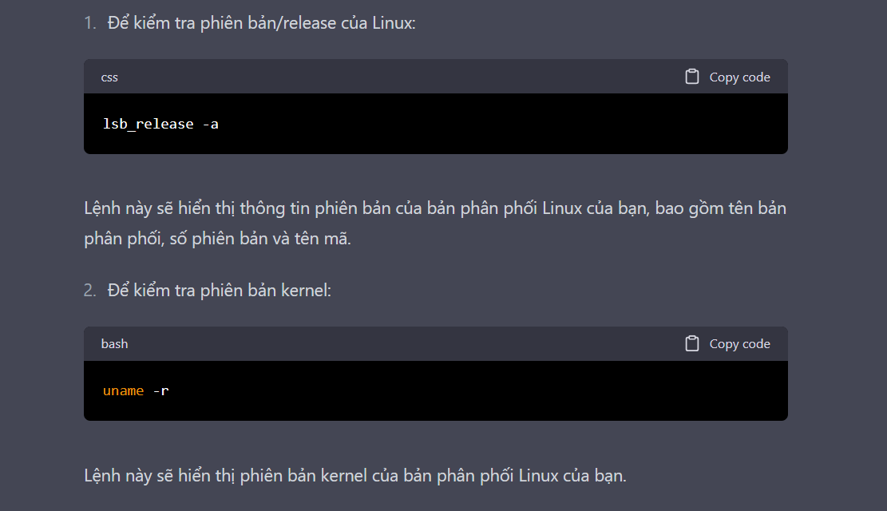
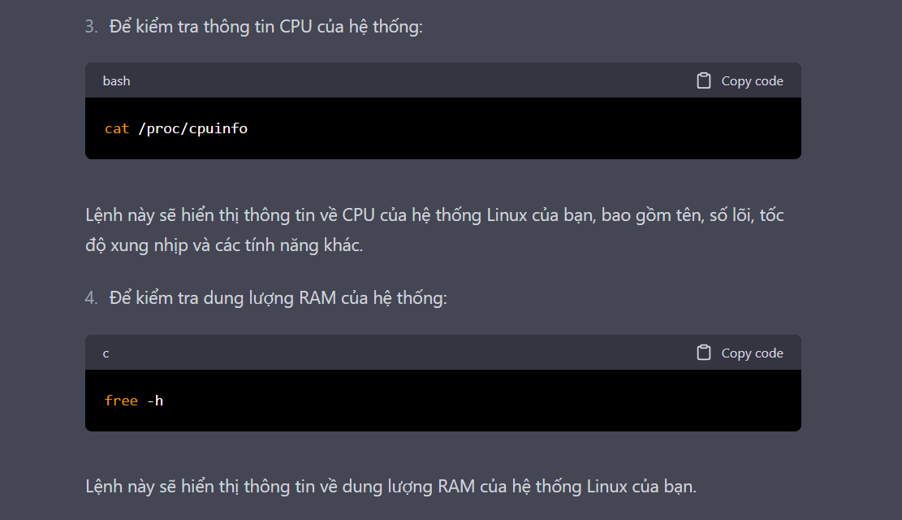
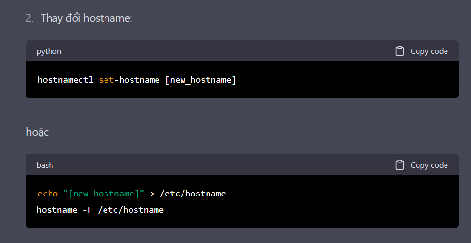
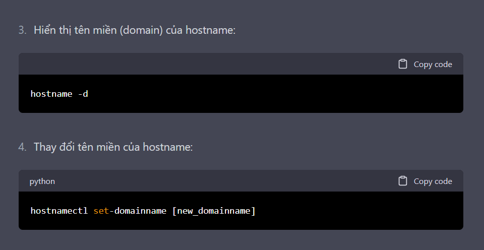
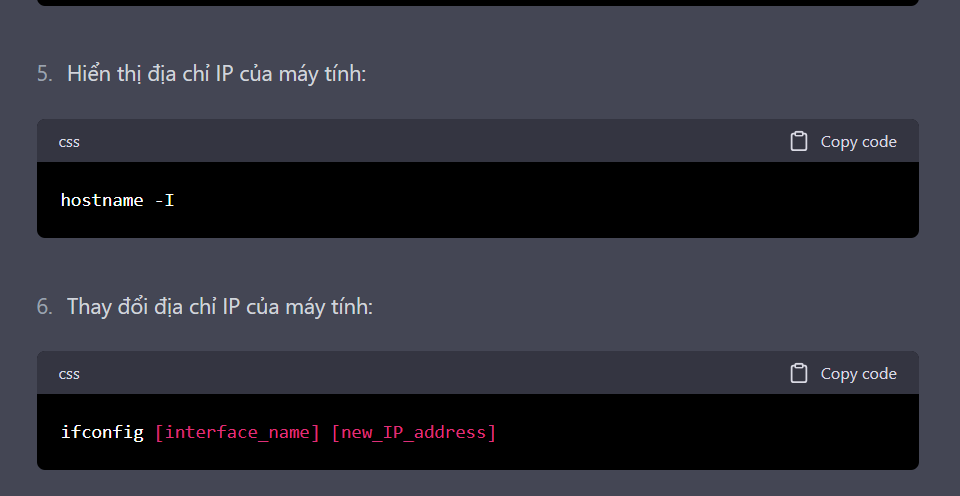

# ***Linux release and system info***
Linux là một hệ điều hành mã nguồn mở có sẵn trên nhiều bản phân phối khác nhau, còn được gọi là distros. Mỗi bản phân phối có lịch phát hành riêng và tính năng độc đáo riêng.

Để tìm hiểu thông tin phiên bản và hệ thống của bản phân phối Linux của bạn, bạn có thể sử dụng các lệnh sau:

Ngoài ra còn có lệnh
Lệnh "`head /proc/meminfo`" trong Linux được sử dụng để hiển thị thông tin chi tiết về bộ nhớ của hệ thống. Khi chạy lệnh này, nó sẽ hiển thị 10 dòng đầu tiên của tệp /proc/meminfo, chứa thông tin về bộ nhớ hệ thống bao gồm:

MemTotal: Tổng dung lượng bộ nhớ của hệ thống.
MemFree: Dung lượng bộ nhớ đang không được sử dụng.
MemAvailable: Dung lượng bộ nhớ hiện đang có sẵn để sử dụng.
Buffers: Dung lượng bộ đệm được sử dụng bởi hệ thống.
Cached: Dung lượng bộ nhớ đệm được sử dụng bởi hệ thống.
SwapCached: Dung lượng bộ nhớ đệm trên đĩa swap.
Active: Dung lượng bộ nhớ đang được sử dụng hiện tại.
Inactive: Dung lượng bộ nhớ không được sử dụng hiện tại.
SwapTotal: Tổng dung lượng đĩa swap của hệ thống.
SwapFree: Dung lượng đĩa swap đang không được sử dụng.
Thông tin này có thể hữu ích cho việc giám sát tình trạng bộ nhớ của hệ thống và phát hiện các vấn đề liên quan đến bộ nhớ
# ***Khái niệm***
## ***Linux release and distribution***
Linux release và distribution là hai khái niệm liên quan đến hệ điều hành Linux.

Linux release là phiên bản của hệ điều hành Linux, bao gồm tất cả các phần mềm, driver và công cụ hệ thống được cài đặt trên hệ thống. Mỗi phiên bản của Linux release có một tên gọi và số hiệu riêng, ví dụ như Ubuntu 20.04 hoặc CentOS 7.

Linux distribution (còn được gọi là distro) là một bản phân phối Linux, tức là một phiên bản cụ thể của hệ điều hành Linux, với các ứng dụng và tính năng riêng biệt. Các bản phân phối Linux có thể được tùy chỉnh cho mục đích sử dụng cụ thể, ví dụ như máy chủ, máy tính để bàn hoặc thiết bị nhúng. Một số bản phân phối Linux phổ biến bao gồm Ubuntu, Fedora, Debian, CentOS, Red Hat Enterprise Linux, SUSE Linux và Arch Linux.

Vì vậy, Linux release là phiên bản cụ thể của hệ điều hành Linux, trong khi Linux distribution là một bản phân phối Linux cụ thể với các tính năng và ứng dụng riêng biệt.
`cat /etc/*release`
## ***Kernel version***
Kernel version là phiên bản của kernel được sử dụng trên hệ thống Linux. Kernel là một phần rất quan trọng của hệ thống Linux, nó có nhiệm vụ quản lý tài nguyên phần cứng và cung cấp các dịch vụ cơ bản cho hệ thống.

Để xem kernel version trên Linux, bạn có thể sử dụng lệnh sau:`uname -r`
## ***Memory Info***
Memory Info là thông tin về bộ nhớ của hệ thống Linux, bao gồm các thông tin về bộ nhớ tổng thể, bộ nhớ sử dụng, bộ nhớ khả dụng, bộ nhớ đệm, bộ nhớ đệm swap và các thông tin liên quan khác. Các thông tin này có thể được xem thông qua file /proc/meminfo trên hệ thống Linux.

Bạn có thể sử dụng lệnh sau để xem thông tin về bộ nhớ trên hệ thống Linux:`cat /proc/meminfo`
Lệnh này sẽ hiển thị một loạt các thông tin liên quan đến bộ nhớ, bao gồm:

*MemTotal*: tổng số bộ nhớ của hệ thống
*MemFree*: số lượng bộ nhớ không được sử dụng
*MemAvailable*: số lượng bộ nhớ hiện có sẵn cho quá trình sử dụng
*Buffers*: bộ nhớ dành cho các buffer (đệm) của hệ thống
*Cached*: bộ nhớ đệm (cache) của hệ thống
*SwapCached*: bộ nhớ đệm swap (được sử dụng khi không đủ bộ nhớ RAM)
*SwapTotal*: tổng dung lượng bộ nhớ swap
*SwapFree*: số lượng bộ nhớ swap không được sử dụng
*Dirty*: số lượng trang bộ nhớ đang chờ được ghi ra ổ đĩa
*Writeback*: số lượng trang bộ nhớ đang được ghi lại trên ổ đĩa
*AnonPages*: bộ nhớ không được lưu trữ trong bất kỳ tệp nào trên ổ đĩa
*Mapped*: bộ nhớ được đặt vào không gian địa chỉ của quá trình
*Shmem*: bộ nhớ được sử dụng để chia sẻ thông tin giữa các tiến trình
*Slab*: bộ nhớ được sử dụng bởi kernel để quản lý cấu trúc dữ liệu kernel
*SReclaimable*: phần của bộ nhớ slab có thể được giải phóng khi cần thiết
*SUnreclaim*: phần của bộ nhớ slab không thể được giải phóng khi cần thiết
Các thông tin này rất hữu ích để giúp bạn theo dõi việc sử dụng bộ nhớ trên hệ thống Linux và quản lý tài nguyên của mình một cách tốt nhất.
## ***File system***
File system trong Linux là cách thức tổ chức và quản lý các tệp tin và thư mục trên ổ đĩa của hệ thống. Linux hỗ trợ nhiều loại file system khác nhau, bao gồm các file system phổ biến như Ext2, Ext3, Ext4, XFS, Btrfs và NTFS (được sử dụng trên hệ điều hành Windows).

File system cung cấp cách thức đánh dấu các vị trí trên ổ đĩa để lưu trữ các tệp tin và thư mục. Nó đảm bảo rằng các tệp tin và thư mục được lưu trữ đúng cách, có thể được tìm thấy và truy cập một cách nhanh chóng và hiệu quả. Ngoài ra, file system cũng đảm bảo tính toàn vẹn của dữ liệu, ngăn chặn mất mát dữ liệu do hỏng hóc phần cứng hoặc phần mềm.

Mỗi file system trên Linux có các đặc tính và tính năng khác nhau. Ví dụ, Ext4 là file system phổ biến được sử dụng trên hầu hết các bản phát hành Linux hiện nay. Nó hỗ trợ các tính năng như journaling (giúp khôi phục dữ liệu sau khi hệ thống bị khởi động lại không đúng cách), tối ưu hoá hiệu suất và kích thước tệp tin lên tới 1 exabyte.

Tùy thuộc vào nhu cầu sử dụng và tính chất của dữ liệu, người quản trị có thể lựa chọn file system phù hợp nhất để sử dụng trên hệ thống Linux của mình.
***Một số lệnh để xem thông tin***
Lệnh để thực hiện việc kiểm tra và hiển thị các file system hiện có trên hệ thống Linux là `df`. Để hiển thị thông tin chi tiết về một file system cụ thể, bạn có thể sử dụng lệnh `mount` hoặc `lsblk`. Sau đây là mô tả ngắn gọn về mỗi lệnh:

- Lệnh `df`: hiển thị thông tin về dung lượng đĩa, dung lượng sử dụng và dung lượng trống của các file system đang được sử dụng trên hệ thống. Để thực thi lệnh này, hãy mở terminal và gõ lệnh sau đây:`df -h`
Lệnh này sẽ hiển thị thông tin chi tiết về dung lượng và sử dụng của các file system được hiển thị ở đơn vị "hữu cơ", dễ đọc hơn so với đơn vị byte.

- Lệnh `mount`: hiển thị thông tin về các file system được gắn kết và được sử dụng trên hệ thống. Để thực thi lệnh này, hãy mở terminal và gõ lệnh sau đây:`mount`
Lệnh này sẽ hiển thị thông tin chi tiết về các file system được gắn kết với các thư mục trên hệ thống.

- Lệnh `lsblk`: hiển thị thông tin về các thiết bị lưu trữ và các file system đang được sử dụng trên hệ thống. Để thực thi lệnh này, hãy mở terminal và gõ lệnh sau đây:`lsblk`
Lệnh này sẽ hiển thị thông tin chi tiết về các thiết bị lưu trữ trên hệ thống, các phân vùng và các file system được sử dụng trên các phân vùng đó.

## ***Count the number of CPU***
- Lệnh nproc: hiển thị số lượng CPU hiện đang được sử dụng trên hệ thống. Để thực thi lệnh này, hãy mở terminal và gõ lệnh sau đây:`nproc`
Lệnh này sẽ hiển thị số lượng CPU hiện đang được sử dụng trên hệ thống.

- Lệnh lscpu: hiển thị thông tin chi tiết về các CPU đang được sử dụng trên hệ thống, bao gồm tên CPU, số lượng CPU, tốc độ, kiến trúc, các chế độ hỗ trợ và các thông số khác. Để thực thi lệnh này, hãy mở terminal và gõ lệnh sau đây:`lscpu`
Lệnh này sẽ hiển thị thông tin chi tiết về các CPU đang được sử dụng trên hệ thống.
- Lệnh `cat /proc/cpuinfo | grep model | uniq -c` là một lệnh trong Linux dùng để hiển thị số lượng CPU trên hệ thống và thông tin về chúng.

Lệnh `cat /proc/cpuinfo` sẽ hiển thị tất cả thông tin liên quan đến CPU trên hệ thống.
Lệnh `grep model` sẽ lọc ra thông tin chỉ liên quan đến tên mô hình (model name) của CPU.
Lệnh `uniq -c` sẽ đếm số lần xuất hiện của mỗi tên mô hình và hiển thị số lượng đó.
Với lệnh này, khi thực thi, bạn sẽ được hiển thị số lượng CPU trên hệ thống và thông tin về chúng theo từng mô hình. Ví dụ, đối với hệ thống có 4 CPU, mỗi CPU là Intel Core i7, lệnh sẽ hiển thị kết quả là "4 Intel Core i7".
# ***The proc Filesystem***
The `/proc` filesystem trong Linux là một hệ thống file ảo (virtual filesystem) được sử dụng để hiển thị thông tin về các tiến trình đang chạy trên hệ thống và các thông tin về kernel. Các tệp tin và thư mục trong `/proc` không được lưu trữ trên ổ đĩa mà được tạo ra khi kernel khởi động và hiển thị dưới dạng các tập tin ảo.
**Một số thư mục và tệp tin quan trọng trong /proc gồm:**
- `/proc/cpuinfo`: Hiển thị thông tin chi tiết về CPU như mô hình, tốc độ, cache size, số lượng cores, threads, ...
- `/proc/interrupts`: Hiển thị số lượng interrupt đã được xử lý bởi mỗi CPU trong hệ thống.
`/proc/meminfo`: Hiển thị thông tin về bộ nhớ, bao gồm bộ nhớ tổng, bộ nhớ được sử dụng, bộ nhớ trống, ...
- `/proc/mounts`: Liệt kê tất cả các file system được mount trong hệ thống, bao gồm tên file system, mount point, và các thông tin khác.
- `/proc/partitions`: Hiển thị thông tin về phân vùng đĩa trong hệ thống, bao gồm kích thước, số lượng block, và thông tin khác.
- `/proc/version`: Hiển thị thông tin về phiên bản của kernel đang chạy trong hệ thống.
- `/proc/<process-id-#>`: Hiển thị thông tin liên quan đến tiến trình có ID là - `<process-id-#>`, bao gồm thông tin về bộ nhớ, các file mở, trạng thái của tiến trình, ...
- `/proc/sys`: Chứa các thông tin liên quan đến thiết lập kernel của hệ thống như quản lý bộ nhớ, quản lý mạng, quản lý tiến trình, ...
Các lệnh này được sử dụng để truy xuất và hiển thị thông tin liên quan đến các thành phần khác nhau của hệ thống Linux. Ngoài ra, các lệnh khác như `ps, top, free, cat, grep`,... cũng có thể được sử dụng để truy xuất và hiển thị các thông tin trong các tệp tin trong `/proc`
# ***Hostname***
Hostname là một thuật ngữ được sử dụng để chỉ tên của máy tính trên một mạng hoặc hệ thống. Trong Linux, hostname được lưu trữ trong một tập tin có tên là `/etc/hostname`.

Hostname có thể được thiết lập và sửa đổi bằng cách sử dụng lệnh `hostname` trong terminal. Ví dụ, để đặt tên hostname của hệ thống thành "myhost", ta có thể chạy lệnh `hostnamectl set-hostname myhost`.

Hostname có thể được sử dụng để định danh các máy tính trong một mạng, cho phép chúng có thể truy cập và liên lạc với nhau. Trong các hệ thống có nhiều máy tính kết nối với nhau, hostname cũng được sử dụng để định danh các máy tính khác nhau, và tạo ra các kết nối giữa chúng.

Hostname cũng được sử dụng trong cấu hình mạng, các dịch vụ mạng và hệ thống bảo mật, và có thể được đọc và sửa đổi thông qua các tệp cấu hình của hệ thống Linux.

**Dưới đây là một số lệnh để thực hiện với hostname trong Linux:**
- Hiển thị hostname hiện tại:
  
  
  
  
  
Lưu ý rằng để thực hiện các lệnh trên, bạn cần quyền root hoặc quyền sudo trên hệ thống của mình.

`hostnamectl` là một công cụ trong Linux được sử dụng để quản lý thông tin hostname của hệ thống. Với `hostnamectl`, người dùng có thể xem và cấu hình các thông tin liên quan đến hostname của hệ thống, bao gồm tên hostname, tên miền, vùng múi giờ, v.v.