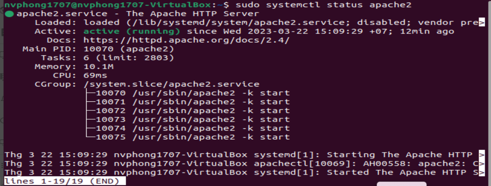
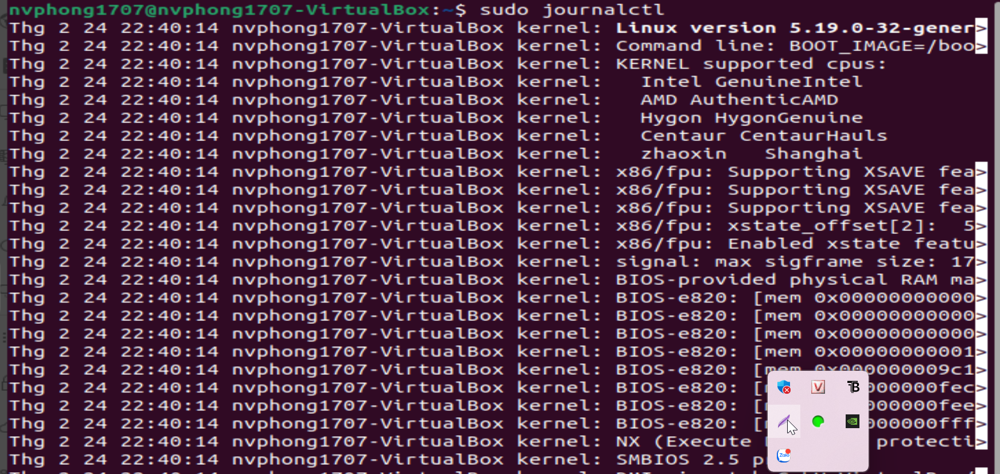

# ***Khái niệm***
Systemd là một hệ thống quản lý dịch vụ và tiến trình được phát triển để thay thế các hệ thống khởi động cũ trên các hệ điều hành Linux. Nó được giới thiệu vào năm 2010 bởi Lennart Poettering và Kai Sievers và được sử dụng bởi các hệ điều hành như Fedora, Debian, Ubuntu, Arch Linux, Red Hat Enterprise Linux và CentOS.
Nó bao gồm nhiều tính năng, bao gồm một hệ thống bootstrapping được sử dụng để khởi động và quản lý các tiến trình (proccess) trong hệ thống. Nó hiện là hệ thống khởi tạo mặc định trên hầu hết các bản phân phối Linux.

- d có ý nghĩa là `daemon`, có ý chỉ một cái gì đó âm thầm lặng lẽ hoạt động mà bình thường ta không biết được, và ở trong hệ thống Linux thì nó chính là các tiến trình chạy dưới nền (background process). Các tiến trình này cần phải hoạt động liên tục nhưng cũng không thể để người dùng ngồi nhìn nó chạy mãi được. Chính vì vậy, nó được chạy một cách "âm thầm", thuật ngữ gọi là chạy ngầm. Người dùng nếu không để ý hoặc tìm hiểu về nó thì không thể biết được tiến trình đó đang hoạt động. Nhưng `systemd` cũng không phải là để chỉ các tiến trình chạy ngầm đó, mà nó là một nhóm các chương trình đặc biệt sẽ quản lý, vận hành và theo dõi các tiến trình khác hoạt động.
# ***Các tính năng***
- Quản lý tiến trình: Systemd có thể quản lý các tiến trình của hệ thống, bao gồm khởi động, tắt và quản lý quá trình truyền thông giữa các tiến trình.

- Quản lý dịch vụ: Systemd cho phép quản lý các dịch vụ trên hệ thống, cung cấp khả năng khởi động, dừng và khởi động lại các dịch vụ.

- Quản lý tài nguyên: Systemd giúp quản lý tài nguyên trên hệ thống bằng cách cấp phát các tài nguyên cho các tiến trình và giám sát tài nguyên được sử dụng.

- Quản lý khởi động: Systemd có khả năng quản lý quá trình khởi động của hệ thống và khởi động các dịch vụ và tiến trình theo thứ tự nhất định.

- Ghi nhật ký: Systemd ghi nhật ký của hệ thống và các tiến trình trong các tệp nhật ký cho phép dễ dàng quản lý và phân tích.

Systemd có thể được cấu hình bằng cách sử dụng các tệp cấu hình, các công cụ dòng lệnh và các lệnh systemctl để quản lý dịch vụ. Systemd cũng có thể tích hợp với các công cụ quản lý như Puppet và Ansible để quản lý hệ thống.
# ***Ưu, nhược điểm của systemd***
## ***Ưu điểm***
- Khởi động nhanh hơn: Systemd cho phép khởi động hệ thống đồng thời các dịch vụ, tăng tốc độ khởi động so với hệ thống init trước đây.
- Quản lý dịch vụ tốt hơn: Systemd cung cấp các công cụ để quản lý dịch vụ như systemctl, cho phép người dùng dễ dàng quản lý, khởi động và dừng các dịch vụ.
- Thông tin debug chi tiết: Systemd cung cấp thông tin debug chi tiết hơn so với hệ thống init truyền thống, giúp người dùng tìm hiểu và sửa lỗi dễ dàng hơn.
- Cấu hình linh hoạt: Systemd cung cấp cấu hình linh hoạt và dễ dàng để tùy chỉnh các cài đặt dịch vụ.

## ***Nhược điểm***
- Phụ thuộc cao: Systemd phụ thuộc nhiều vào các thư viện và các phần mềm khác, khiến cho hệ thống phải tải thêm nhiều phần mềm liên quan để hoạt động.
- Không tương thích ngược với hệ thống init trước đây: Systemd không tương thích ngược với hệ thống init trước đây, khiến cho việc nâng cấp từ các phiên bản cũ khó khăn hơn.
- Không có tính di động cao: Systemd được phát triển để hoạt động trên các bản phân phối Linux, nhưng không phải trên các hệ điều hành khác, khiến cho tính di động của nó hạn chế hơn.
- Điều khiển quyền truy cập quá mức: Systemd có quyền điều khiển truy cập quá mức, khiến cho người dùng phải cẩn trọng trong việc cấu hình và sử dụng nó.

## ***Các thành phần của Systemd***
Về cơ bản thì systemd tương đương với một chương trình quản lý hệ thống và các dịch vụ trong Linux. Nó cung cấp một số các tiện ích như sau

- `systemctl` dùng để quản lý trạng thái của các dịch vụ hệ thống (bắt đầu, kết thúc, khởi động lại hoặc kiểm tra trạng thái hiện tại)
- `journald` dùng để quản lý nhật ký hoạt động của hệ thống (hay còn gọi là ghi log)
- `logind` dùng để quản lý và theo dõi việc đăng nhập/đăng xuất của người dùng
- `networkd` dùng để quản lý các kết nối mạng thông qua các cấu hình mạng
- `timedated` dùng để quản lý thời gian hệ thống hoặc thời gian mạng
- `udev` dùng để quản lý các thiết bị và firmware

# ***Unit file***
Tất cả các chương trình được quản lý bởi systemd đều được thực thi dưới dạng daemon hay background bên dưới nền và được cấu hình thành 1 file configuration gọi là unit file. Các unit file này sẽ bao gồm 12 loại:

- `service` (các file quản lý hoạt động của 1 số chương trình)
- `socket` (quản lý các kết nối)
- `device` (quản lý thiết bị)
- `mount` (gắn thiết bị)
- `automount` (tự đống gắn thiết bị)
- `swap` (vùng không gian bộ nhớ trên đĩa cứng)
- `target` (quản lý tạo liên kết)
- `path` (quản lý các đường dẫn)
- `timer` (dùng cho cron-job để lập lịch)
- `snapshot` (sao lưu)
- `slice` (dùng cho quản lý tiến trình)
- `scope` (quy định không gian hoạt động)

# ***Service***
Mặc dù là có 12 loại unit file trong systemd, tuy nhiên có lẽ `service` là loại thường được quan tâm nhất. Loại này sẽ được khởi động khi bật máy và luôn chạy ở chế độ nền (`daemon` hoặc `background`) Các service thường sẽ được cấu hình trong các file riêng biệt và được quản lý thông qua câu lệnh systemctl Ta có thể sử dụng câu lệnh sau để xem các service đã được kích hoạt bởi hệ thống: `systemctl list-units | grep -e '.service'` hoặc `systemctl -t service` Bộ ba tùy chọn quen thuộc của systemctl sẽ dùng khi muốn bật/tắt một service

- `start`: bật service
- `stop`: tắt service
- `restart`: tắt service rồi bật lại (ngoài ra còn có reload để tải lại file cấu hình tuy nhiên chỉ có 1 số chương trình hỗ trợ như Apache/Nginx ...) 
Ba tùy chọn trên sẽ được sử dụng khi hệ thống đang hoạt động, tuy nhiên `systemctl `cũng cung cấp 2 tùy chọn khác để điều khiển việc hoạt động của service từ lúc khởi động hệ thống
- `enable`: service sẽ được khởi động cùng hệ thống
- `disable`: service sẽ không được khởi động cùng hệ thống

# ***Các hệ thống tương tự Systemd***
Systemd mới chỉ xuất hiện từ 30-3-2010, còn trước đó có 2 hệ thống khác đã từng được sử dụng

- `Upstart`: hệ thống init được phát triển bởi Canonical và được sử dụng trong Ubuntu Linux giai đoạn đầu.
- `SysV`: hệ thống init cổ điển của UNIX BSD System V, được viết bằng shell script và đã quá lâu đời.
# ***Các câu lệnh thực hiện***
- Khởi động dịch vụ Apache trên Ubuntu:***
`sudo systemctl start apache2`
- Dừng dịch vụ Apache trên Ubuntu:
`sudo systemctl stop apache2`
- Khởi động lại dịch vụ Apache trên Ubuntu:
`sudo systemctl restart apache2`
- Cho phép dịch vụ Apache khởi động cùng với hệ thống trên Ubuntu:
`sudo systemctl enable apache2`

- Ngăn chặn dịch vụ Apache khởi động cùng với hệ thống trên Ubuntu:
`sudo systemctl disable apache2`

- Xem trạng thái của dịch vụ Apache trên Ubuntu:
`sudo systemctl status apache2`

- Liệt kê tất cả các dịch vụ đã được đăng ký với systemd trên Ubuntu:
`sudo systemctl list-units`

- Xem nhật ký hệ thống trên Ubuntu:
`sudo journalctl`

- Thay đổi múi giờ trên hệ thống Ubuntu:
`sudo timedatectl set-timezone Asia/Ho_Chi_Minh`
- Thay đổi hostname trên hệ thống Ubuntu:
`sudo hostnamectl set-hostname new-hostname`

# ***Tài liệu tham khảo***
<https://viblo.asia/p/tim-hieu-va-van-dung-systemd-de-quan-ly-he-thong-linux-phan-co-ban-WAyK8kN65xX>

<https://www.techsupportpk.com/2015/05/linux-systemd-essentials-working-with-services-units-and-the-journal.html>
