# ***Các lệnh cơ bản***
## ***Lệnh `man`***
Nếu bạn đang ở terminal của mình và muốn tìm hiểu các tùy chọn cho một lệnh cụ thể, chúng ta có trang `man` viết tắt cho manual (hướng dẫn sử dụng). Sử dụng câu lệnh này để xem qua từng lệnh,để biết thêm các tùy chọn cho từng lệnh. Chúng ta có thể chạy **man man**** để được trợ giúp. Nhập `q` để thoát khỏi các trang đó.
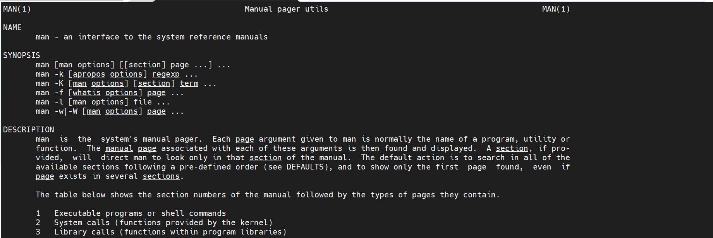

## ***Lệnh `sudo`***
`sudo` nếu bạn đã quen thuộc với Windows và nhấp chuột phải, chọn `Run as administrator`, chúng ta có thể coi `sudo` tương tự với hành động đó. Khi bạn chạy một lệnh với lệnh này, bạn sẽ chạy nó dưới quyền `root`, nó sẽ yêu cầu mật khẩu trước khi chạy lệnh.
Đối với một công việc thực hiện một lần như cài đặt ứng dụng hoặc dịch vụ, bạn có thể cần lệnh `sudo` đó nhưng nếu bạn có một số nhiệm vụ cần giải quyết và bạn muốn được thực hiện dưới quyền `sudo` một lúc? Đây là nơi bạn có thể sử dụng `sudo su`, giống như `sudo`, bạn sẽ được yêu cầu nhập mật khẩu root của mình. Trong một máy ảo thử nghiệm như của chúng ta, điều này có thể chấp nhật được nhưng tôi thấy không ổn nếu chúng ta ở dưới quyền `root` quá lâu, những điều tồi tệ có thể xảy ra. Để thoát khỏi quyền này, bạn chỉ cần gõ vào `exit`

## ***Lệnh `clear`***
Tôi thấy mình luôn sử dụng lệnh `clear`, lệnh `clear` thực hiện chính xác những gì nó nói, nó sẽ xóa màn hình của tất cả các lệnh trước đó, đưa dấu nhắc lệnh của bạn lên đầu và trả lại cho bạn một không gian làm việc sạch.

## ***Lệnh `mkdir`***
Bây giờ chúng ta hãy xem xét một số lệnh giúp chúng ta có thể tạo một thứ trong hệ thống của mình và có thể quan sát được chúng trong terminal. Trước hết, chúng ta có mkdir cho phép chúng ta tạo một thư mục trong hệ thống của mình
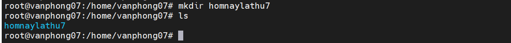

## ***Lệnh `cd`***
Với `cd`, chúng ta có thể thay đổi thư mục. Để di chuyển vào thư mục mới tạo của mình, chúng ta có thể thực hiện việc này với lệnh `cd homnaylathu7` cũng có thể sử dụng tab để tự động hoàn thành câu lệnh với thư mục có sẵn. Chúng ta có thể quay lại vị trí lúc mới bắt đầu bằng câu lệnh `cd` .
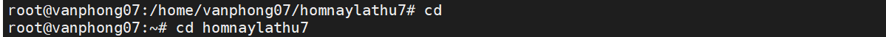

## ***Lệnh `pwd`***
Chắc hẳn chúng ta ai cũng đã từng đi vào rất sâu trong hệ thống tệp của mình đến một thư mục mà không biết chúng ta đang ở đâu. `pwd` cung cấp cho chúng ta địa chỉ của thư mục làm việc, `pwd` có vẻ như là viết tắt của mật khẩu (password) nhưng nó là viết tắt của print working directory (in ra thư mục làm việc).
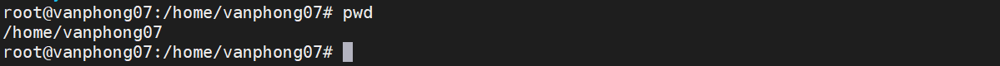

## ***Lệnh `touch`***
Chúng ta đã biết cách tạo thư mục nhưng làm thế nào để có thể tạo một tệp? Chúng ta có thể tạo tệp bằng cách sử dụng lệnh `touch`. Nếu chúng ta dùng lệnh `touch ngay13`, thao tác này sẽ tạo một tệp có tên là `ngay13`
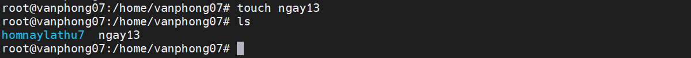

## ***Lệnh `ls`***
Câu lệnh này sẽ liệt kê tất cả các tệp trong thư mục hiện tại. Hãy xem liệu chúng ta có thể thấy tệp mà chúng ta vừa tạo không.
## ***Lệnh `locate`***
Làm cách nào chúng ta có thể tìm tệp trong Linux? `locate` sẽ cho phép chúng ta tìm kiếm hệ thống tệp của mình. Nếu chúng ta sử dụng `locate ngay13`, nó sẽ báo lại vị trí của tệp. Nếu bạn biết rằng tệp tồn tại nhưng bạn nhận được kết quả tìm kiếm rỗng thì hãy chạy lệnh `sudo updatedb` để lập chỉ mục tất cả các tệp trong hệ thống tệp, sau đó chạy lại lệnh `locate`. Nếu bạn không có sẵn gói lệnh `locate`, bạn có thể cài đặt nó bằng lệnh sau sudo `apt install mlocate`
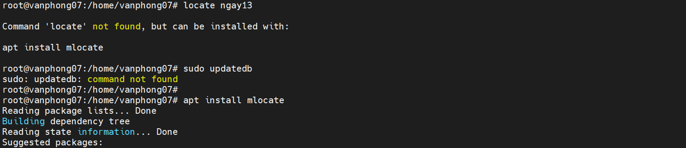
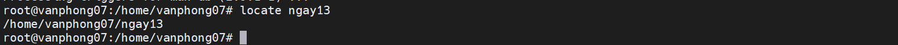

## ***Lệnh `mv`***
Còn việc di chuyển tệp từ vị trí này sang vị trí khác thì sao? Lệnh `mv` sẽ cho phép bạn di chuyển các tệp của mình. Ví dụ `mv ngay13 homnaylathu7` sẽ di chuyển tệp của bạn vào thư mục `homnaylathu7`.
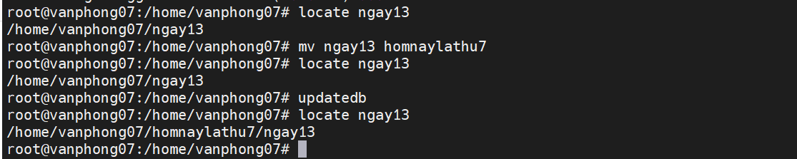
 Chúng ta có thể làm điều đó bằng lệnh mv một lần nữa... chúng ta chỉ cần sử dụng `mv ngay13 day13` , hãy sử dụng `ls` để kiểm tra lại.

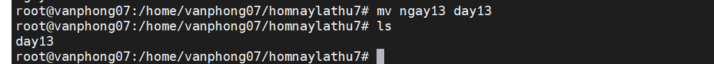

## ***Lệnh `rm`***
Đủ rồi, bây giờ hãy loại bỏ (xóa) tệp và thậm chí có thể là thư mục mà chúng ta đã tạo. Hãy dùng lệnh `rm`, chỉ cần `rm day13` sẽ xóa tệp `day13` trong thư mục hiện tại. Chúng ta cũng sẽ sử dụng khá nhiều `rm -R` sẽ chạy và sử dụng đệ quy thông qua một thư mục hoặc vị trí. Chúng ta cũng có thể sử dụng `rm -R -f` để xóa tất cả các tệp đó một cách bắt buộc (force). Spoiler nếu bạn chạy `rm -R -f /` và thêm `sudo` vào, bạn có thể nói lời tạm biệt với hệ thống của mình....!
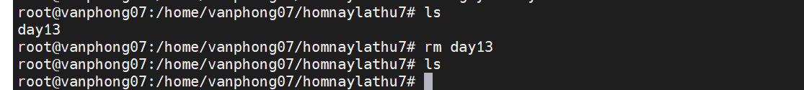

## ***Lệnh `echo`***
Chúng ta đã tạo các thư mục và tệp nhưng chưa đặt thêm bất cứ nội dung nào vào thư mục của mình, chúng ta có thể thêm nội dung theo một số cách nhưng một cách dễ dàng là `echo`. Chúng ta cũng có thể sử dụng `echo` để in ra nhiều thứ trong terminal của mình. Tôi sử dụng `echo` để in ra các biến hệ thống để biết liệu chúng có được cài đặt hay chưa. Chúng ta có thể sử dụng `echo "Xin chào #homnaylathu7" > day13` và thao tác này sẽ thêm nó vào tệp của chúng ta.

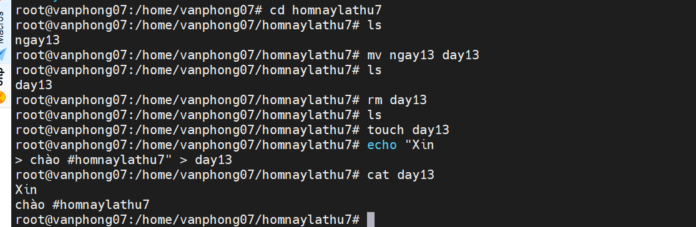

## ***Lệnh `cat`***
Một trong những lệnh mà bạn sẽ sử dụng rất nhiều! cat viết tắt của nối (concatenate). Chúng ta có thể sử dụng `cat day13` để xem nội dung bên trong tệp. Rất hữu ích khi bạn muốn đọc nhanh các tệp cấu hình.

## ***Lệnh `history`***
 chúng ta có thể sử dụng history để tìm ra tất cả các lệnh mà chúng ta đã chạy. `history -c` sẽ xóa lịch sử.

Khi bạn chạy `history` và muốn chọn một lệnh cụ thể, bạn có thể sử dụng `!3` để chọn lệnh thứ 3 trong danh sách.

Bạn cũng có thể sử dụng `history | grep "Command" `để tìm kiếm lệnh nào đó cụ thể.

Trên các máy chủ, để theo dõi thời điểm một lệnh được thực thi, việc thêm ngày và giờ vào từng lệnh trong tệp lịch sử có thể sẽ hữu ích.
## ***Lệnh `useradd`***
