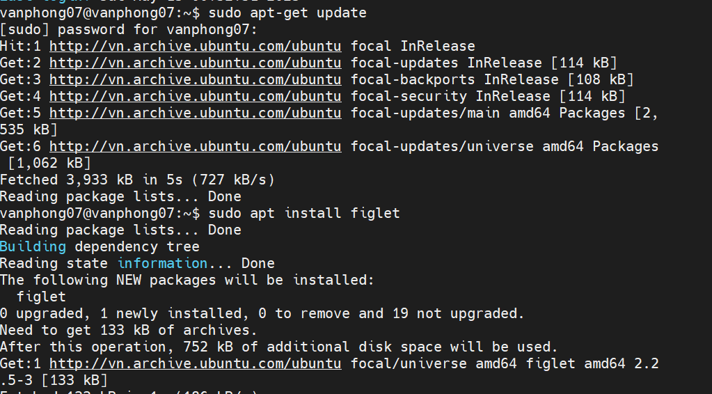
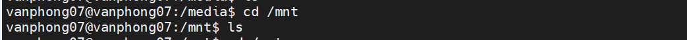
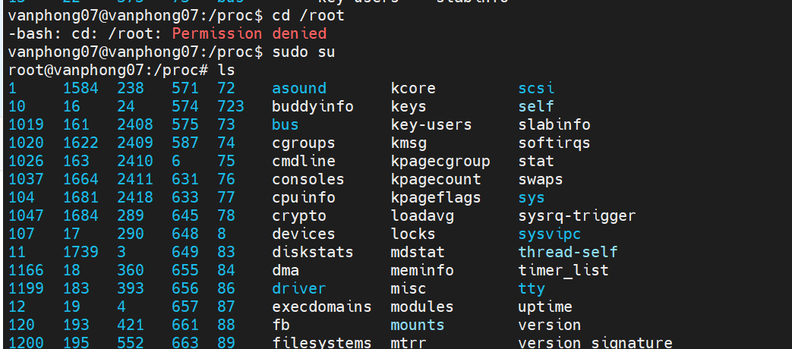

# ***Quản lý Ubuntu & Phần mềm***
Điều đầu tiên chúng ta sẽ xem xét cách cập nhật hệ điều hành của mình. Hầu hết các bạn đã quen với quy trình này với Windows và macOS, quy trình này sẽ hơi khác trên máy tính và máy chủ sử dụng Linux.

Chúng ta sẽ xem xét trình quản lý gói apt, nó sẽ sử dụng trên Ubuntu VM để cập nhật và cài đặt phần mềm.

Nói chung, ít nhất là trên các máy trạm của nhà phát triển, tôi chạy lệnh này để đảm bảo mình luôn có các bản cập nhật mới nhất vào thời điểm hiện tại từ các kho lưu trữ trung tâm (central repositories), trước khi cài đặt bất kỳ phần mềm nào.
`sudo apt-get update`

Hãy chọn `figlet` - một chương trình tạo biểu ngữ văn bản.
Điều này có thể thực hiện do trong kho lưu trữ mặc định có một chương trình gọi là figlet. Hãy thử `sudo apt install figlet`

Nếu chúng ta muốn xóa phần mềm đó hoặc bất kỳ cài đặt phần mềm nào của mình, chúng ta cũng có thể thực hiện việc đó thông qua trình quản lý gói apt.
`sudo apt remove figlet`

# ***Giải thích về hệ thống tệp***
Linux được tạo thành từ các tệp cấu hình, nếu bạn muốn thay đổi bất cứ điều gì thì bạn thay đổi các tệp cấu hình này.

Trên Windows, bạn có ổ C: và đó là thứ mà chúng ta coi là gốc. Trên Linux, chúng ta có `/` đây là nơi chúng ta sẽ tìm các thư mục quan trọng trên hệ thống Linux của mình.

- `/bin` - Viết tắt của binary, thư mục bin là nơi các tệp nhị phân mà hệ thống của bạn cần, các tệp thực thi và công cụ hầu như sẽ được tìm thấy ở đây.
  

- `/boot` - Tất cả các tệp mà hệ thống của bạn cần để khởi động. Làm thế nào để khởi động và khởi động từ ổ đĩa nào.
  

- `/dev` - Bạn có thể tìm thấy thông tin thiết bị tại đây, đây là nơi bạn sẽ tìm thấy các con trỏ tới các ổ đĩa của mình `sda` sẽ là ổ đĩa hệ điều hành chính của bạn.

- `/etc` Có thể là thư mục quan trọng nhất trên hệ thống Linux của bạn, đây là nơi chứa phần lớn các tệp cấu hình của bạn.
  

- `/home` - đây là nơi bạn sẽ tìm thấy các tệp và thư mục của người dùng. Chúng ta có thư mục vagrant của chúng ta. Đây là nơi bạn sẽ tìm thấy các thư mục Documents và Desktop mà chúng ta đã làm việc trong khi tìm hiểu các lệnh.
  

- `/lib` - Chúng tôi đã đề cập rằng `/bin` là nơi chứa các tệp nhị phân và tệp thực thi của chúng tôi, và `/lib` là nơi bạn sẽ tìm thấy các thư viện dùng chung cho các tệp đó.

- `/media` - Đây là nơi chúng tôi sẽ tìm thấy các thiết bị di động.

- `/mnt` - Đây là điểm gắn kết tạm thời. 

- `/opt` - Optional software packages (gói phần mềm tùy chọn). Bạn sẽ nhận thấy ở đây rằng chúng tôi có một số phần mềm virtual box và vagrant được lưu trữ ở đây.

- `/proc` - Kernel & thông tin về process, tương tự như /dev

- `/root` - Để có quyền truy cập, bạn cần sudo vào thư mục này. Thư mục home của root.

- `/run` - Placeholder cho trạng thái ứng dụng.

- `/sbin` - Sudo bin, tương tự như thư mục bin nhưng các công cụ này dành cho những người dùng có đặc quyền nâng cao trên hệ thống.

- `/tmp` - tệp tạm thời.

- `/usr` - Nếu chúng tôi với tư cách là người dùng đã cài đặt các gói phần mềm, gói phần mềm đó thường sẽ được cài đặt ở vị trí `/usr/bin`.

- `/var` - Các ứng dụng của chúng tôi được cài đặt trong thư mục `bin`. Chúng tôi cần một nơi nào đó để lưu trữ tất cả các tệp logs, đó chính là `/var`

