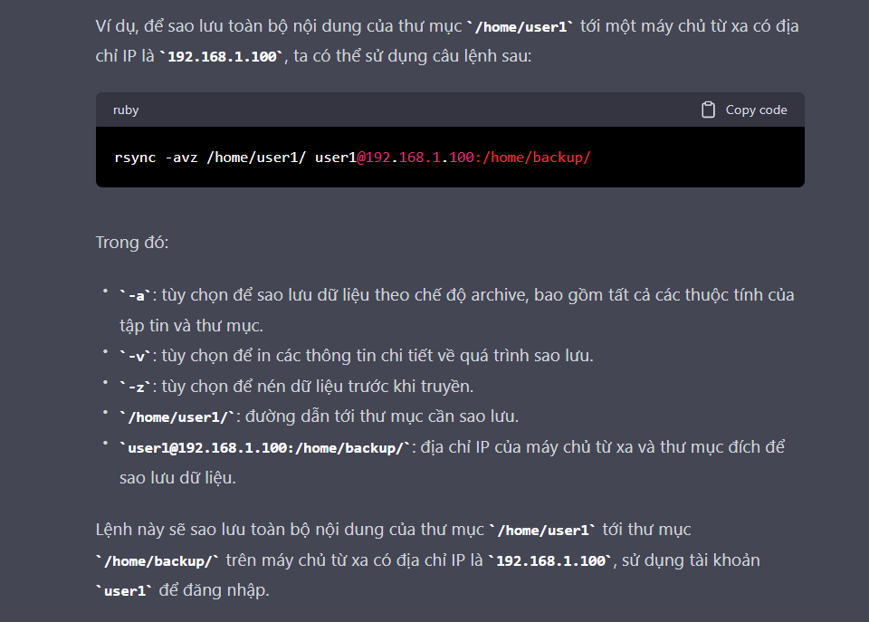
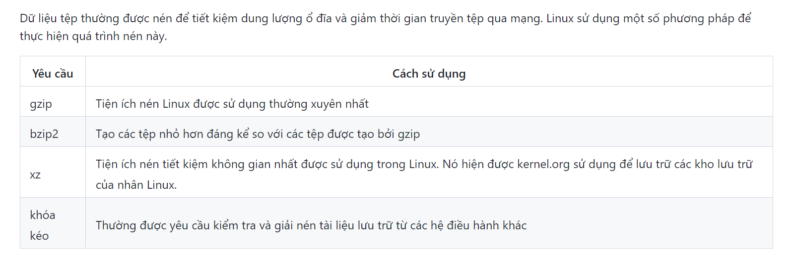
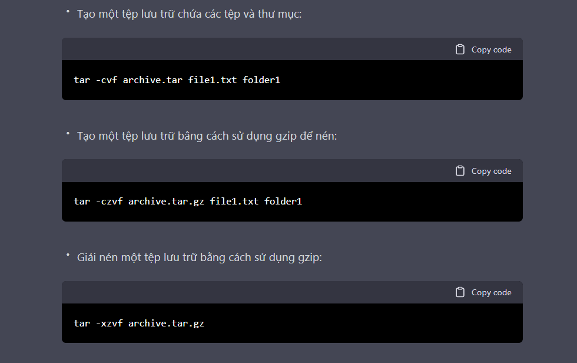
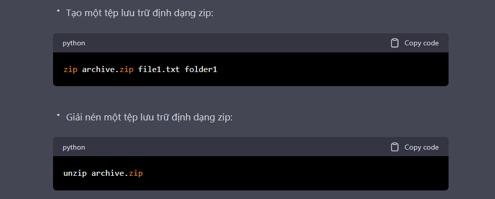
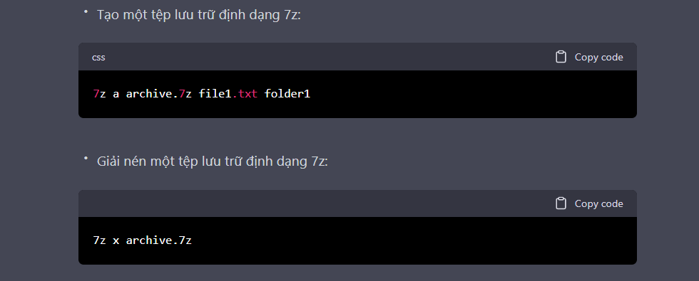
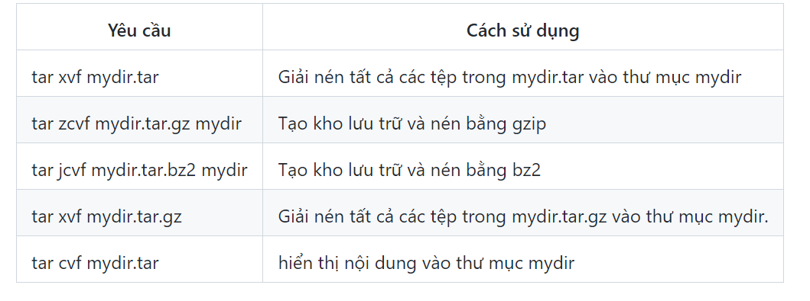

# ***Khái niệm***
Data backup trong Linux là quá trình tạo bản sao lưu (backup) các dữ liệu quan trọng trên hệ thống Linux để đảm bảo tính khả dụng và an toàn của chúng trong trường hợp xảy ra sự cố. Mục đích của việc tạo bản sao lưu là để đảm bảo rằng dữ liệu của bạn sẽ không bị mất hoặc bị hư hỏng khi có sự cố xảy ra, chẳng hạn như lỗi phần cứng, lỗi hệ điều hành, tấn công từ phía hacker, v.v.

Trong Linux, có nhiều công cụ để tạo bản sao lưu dữ liệu, bao gồm các lệnh dòng lệnh như `tar, cp, rsync`, và các công cụ đồ họa như `Back in Time, Duplicity`, v.v. Bạn cần chọn công cụ backup phù hợp với nhu cầu và yêu cầu của bạn.

Các bước thực hiện backup dữ liệu thường được thực hiện như sau:

Xác định các tập tin, thư mục, cơ sở dữ liệu hoặc hệ thống tệp tin bạn muốn backup.

Chọn phương pháp backup phù hợp, bao gồm các tùy chọn như tạo bản sao lưu toàn bộ hệ thống hoặc chỉ backup các tập tin mới nhất, thay đổi gần đây nhất.

Lựa chọn vị trí lưu trữ cho bản sao lưu. Các vị trí phổ biến bao gồm các thiết bị lưu trữ địa phương (ví dụ: ổ đĩa cứng ngoài), mạng lưu trữ (ví dụ: NAS), hoặc các dịch vụ lưu trữ đám mây.

Thực hiện quá trình backup. Việc này có thể được thực hiện bằng cách sử dụng các công cụ backup dòng lệnh hoặc các ứng dụng đồ họa.

Xác nhận rằng bản sao lưu được tạo thành công bằng cách kiểm tra nội dung của các tập tin backup hoặc thực hiện kiểm tra toàn vẹn dữ liệu.

Lưu ý rằng quá trình backup cần được thực hiện thường xuyên để đảm bảo tính khả dụng và an toàn của dữ liệu.
## ***Lệnh `rsync`***
- Lệnh `rsync`được sử dụng để đồng bộ hóa toàn bộ cây thư mục. Về cơ bản, nó sao chép tệp như lệnh `cp`. Ngoài ra, `rsync`hãy kiểm tra xem tệp đang được sao chép đã tồn tại chưa. Nếu tệp tồn tại và không có thay đổi về kích thước hoặc thời gian sửa đổi, `rsync`sẽ tránh được việc sao chép không cần thiết và tiết kiệm thời gian. Hơn nữa, vì `rsync` chỉ sao chép những phần của tệp đã thực sự thay đổi nên nó có thể rất nhanh.

- Điều này `rsync`rất hiệu quả khi sao chép đệ quy một cây thư mục qua mạng, bởi vì chỉ có sự khác biệt được truyền đi. Người ta thường đồng bộ hóa cây thư mục đích với gốc, sử dụng `rsync -r`tùy chọn để đi xuống cây thư mục một cách đệ quy, sao chép tất cả các tệp và thư mục bên dưới cái được liệt kê là nguồn.
- Lệnh `rsync` trong Linux được sử dụng để đồng bộ hóa và sao lưu dữ liệu từ một thư mục đến một thư mục khác trên cùng một máy tính hoặc giữa các máy tính khác nhau trong mạng. Điều này giúp cho việc sao lưu và phục hồi dữ liệu trở nên dễ dàng và nhanh chóng hơn. `rsync` sử dụng giao thức Samba hoặc SSH để truyền dữ liệu giữa các máy tính.

## ***Giải thích các câu lệnh***
`rsync -ravzh project_ABC /data/backups
sending incremental file list
project_ABC/
project_ABC/file1.txt
project_ABC/file2.txt
project_ABC/file3.txt
project_ABC/file4.txt
sent 636 bytes  received 92 bytes  1.46K bytes/sec
total size is 452  speedup is 0.62`

Các câu lệnh trên sử dụng `rsync` để sao lưu dữ liệu từ thư mục `project_ABC` tới thư mục `/data/backups`.

`rsync`: lệnh rsync
-`ravzh`: các tùy chọn được sử dụng khi sao lưu dữ liệu:
-`r`: sao lưu dữ liệu theo chế độ đệ quy (recursive).
-`a`: sao lưu dữ liệu theo chế độ archive, bao gồm tất cả các thuộc tính của tập tin và thư mục.
-`v`: hiển thị thông tin chi tiết về quá trình sao lưu.
-`z`: nén dữ liệu trước khi truyền.
-`h`: hiển thị thông tin về kích cỡ của các tập tin dưới dạng đơn vị có thể đọc được.
`project_ABC`: tên của thư mục cần sao lưu.
`/data/backups`: đường dẫn tới thư mục đích để sao lưu dữ liệu.
Kết quả trả về sau khi thực hiện lệnh:

`sending incremental file list`: hiển thị thông báo đang gửi danh sách các tập tin và thư mục cần sao lưu.
`project_ABC/`: hiển thị thông báo về thư mục project_ABC.
`project_ABC/file1.txt`: hiển thị thông báo về tập tin `file1.txt` trong thư mục `project_ABC`.
`project_ABC/file2.txt`: hiển thị thông báo về tập tin file2.txt trong thư mục project_ABC.
`project_ABC/file3.txt`: hiển thị thông báo về tập tin `file3.txt` trong thư mục `project_ABC`.
`project_ABC/file4.txt`: hiển thị thông báo về tập tin `file4.txt` trong thư mục `project_ABC`.
`sent 636 bytes received 92 bytes 1.46K bytes/sec`: hiển thị thông báo về lượng dữ liệu đã gửi đi và nhận về, tốc độ truyền dữ liệu.
`total size is 452 speedup is 0.62`: hiển thị thông tin về tổng kích thước của các tập tin và thư mục được sao lưu và tỷ lệ tăng tốc.
# ***Compress the data***
"Compress the data" là một khái niệm được sử dụng để chỉ việc nén các tập tin hoặc thư mục trên hệ thống Linux để tiết kiệm không gian đĩa. Linux có nhiều công cụ nén dữ liệu có sẵn như gzip, bzip2, xz, tar, và zip. Sau đây là một số công cụ nén dữ liệu phổ biến trong Linux:
- gzip: Là một công cụ nén dữ liệu đơn giản và phổ biến trong Linux. Nó sử dụng thuật toán nén Deflate để giảm kích thước tập tin. Ví dụ, để nén file "file.txt" thành file "file.txt.gz", ta có thể sử dụng lệnh sau: 
`gzip file.txt`
- bzip2: Tương tự như gzip, bzip2 là một công cụ nén dữ liệu. Tuy nhiên, nó sử dụng thuật toán nén Burrows-Wheeler để tối ưu hóa quá trình nén. Ví dụ, để nén file "file.txt" thành file "file.txt.bz2", ta có thể sử dụng lệnh sau:
`bzip2 file.txt`
- xz: Là một công cụ nén dữ liệu mạnh mẽ và hiệu quả. Nó sử dụng thuật toán LZMA để nén dữ liệu. Ví dụ, để nén file "file.txt" thành file "file.txt.xz", ta có thể sử dụng lệnh sau:
`xz file.txt`
- tar: Là công cụ được sử dụng để tạo một tập tin lưu trữ bao gồm nhiều tập tin hoặc thư mục. Sau đó, tập tin này có thể được nén bằng bất kỳ công cụ nén dữ liệu nào. Ví dụ, để tạo một tập tin nén bao gồm các tập tin và thư mục trong thư mục "folder", ta có thể sử dụng lệnh sau:
`tar -czvf folder.tar.gz folder/`
- zip: Là một công cụ nén dữ liệu được sử dụng phổ biến trên Windows, nhưng cũng có sẵn trên Linux. Nó sử dụng thuật toán nén Deflate để giảm kích thước tập tin. Ví dụ, để nén file "file.txt" thành file "file.zip", ta có thể sử dụng lệnh sau:
`zip file.zip file.txt`

Một lưu ý quan trọng là khi nén dữ liệu, ta cần cân nhắc giữa độ nén và tốc độ nén. Các công cụ nén dữ liệu mạnh mẽ như xz có thể giảm kích thước dữ liệu đáng kể, tuy nhiên nó cũng có thể tốn nhiều thời gian để thực hiện quá trình nén. Ngược lại, các công cụ nén dữ liệu đơn giản như gzip hoặc zip có thể nén nhanh hơn, nhưng không đạt được mức độ nén cao như các công cụ mạnh mẽ hơn. Do đó, ta cần cân nhắc giữa độ nén và tốc độ nén để đảm bảo đáp ứng được nhu cầu sử dụng.
# ***Archiving data***
Archiving là quá trình đóng gói nhiều tệp hoặc thư mục lại thành một tệp duy nhất, được gọi là "archive file". Các tệp và thư mục này được nén lại để tiết kiệm không gian đĩa hoặc để thuận tiện cho việc chia sẻ, sao lưu và chuyển tệp.

Trên Linux, có nhiều công cụ để tạo và quản lý các tập tin lưu trữ như tar, zip và 7zip.

**Tar**
Tar (tape archive) là công cụ phổ biến nhất để tạo và quản lý các tập tin lưu trữ trên Linux. Nó cho phép tạo các tệp lưu trữ với hoặc không nén bằng cách sử dụng các tùy chọn khác nhau. Ví dụ:
Tạo một tệp lưu trữ chứa các tệp và thư mục:

**Zip**
Zip là công cụ khác để tạo và quản lý các tệp lưu trữ. Nó hỗ trợ nén và giải nén tệp lưu trữ định dạng zip. Ví dụ:

**7zip**
7zip là một công cụ khác để tạo và quản lý các tệp lưu trữ. Nó hỗ trợ nén và giải nén các tệp lưu trữ định dạng 7z và các định dạng lưu trữ khác. Ví dụ:

Các công cụ này cung cấp cho người dùng Linux nhiều tùy chọn để quản lý và xử lý các tệp lưu trữ và giúp tiết kiệm không gian đĩa và tăng tính đảm bảo và dễ dàng trong việc sao lưu và chuyển tệp.
### ***tóm tắt***
Lệnh này tarcho phép bạn tạo hoặc trích xuất tệp từ tệp lưu trữ, thường được gọi là tarball. Đồng thời, bạn có thể tùy chọn nén trong khi tạo kho lưu trữ và giải nén trong khi trích xuất nội dung của nó.

Dưới đây là một số ví dụ về việc sử dụng tar:

# ***Copying disks***
Copying disks là quá trình sao chép toàn bộ dữ liệu trên một đĩa sang một đĩa khác. Trên Linux, có nhiều cách để sao chép đĩa, trong đó có hai phương pháp phổ biến là sử dụng lệnh dd và lệnh rsync.
**Sử dụng lệnh dd**
Lệnh dd (data duplicator) được sử dụng để sao chép toàn bộ dữ liệu từ một ổ đĩa sang một ổ đĩa khác. Lệnh này có thể được sử dụng để sao chép ổ đĩa cứng, ổ đĩa CD/DVD, USB và thẻ nhớ. Tuy nhiên, cần cẩn trọng khi sử dụng lệnh dd, bởi vì nó không yêu cầu xác nhận trước khi xóa hoặc ghi đè dữ liệu trên đĩa.
Cú pháp: dd if=`<source_device> of=<target_device>`
Ví dụ: Sao chép dữ liệu từ ổ đĩa /dev/sda sang ổ đĩa /dev/sdb:
`sudo dd if=/dev/sda of=/dev/sdb bs=4M status=progress`

- Lệnh  `dd`rất hữu ích để tạo các bản sao của không gian đĩa thô. Ví dụ: để sao lưu Bản ghi khởi động chính (MBR) (khu vực 512 byte đầu tiên trên đĩa chứa bảng mô tả các phân vùng trên đĩa đó), hãy sử dụng:

`dd if=/dev/sda of=sda.mbr bs=512 count=1`
- Để sử dụng dd tạo bản sao của đĩa này sang đĩa khác, xóa mọi thứ đã tồn tại trước đó trên đĩa thứ hai, hãy sử dụng:

`dd if=/dev/sda of=/dev/sdb`
- Một bản sao chính xác của thiết bị đĩa đầu tiên được tạo trên thiết bị đĩa thứ hai.
Lệnh này ddrất hữu ích để sao chép đĩa có thể khởi động dưới dạng thẻ Compact Flash, thẻ Micro SD hoặc khóa USB có thể khởi động. Đưa Thẻ CF cần sao chép vào hệ thống và tạo một bản sao
 `dd if=/dev/sdb of=./backup.img`
- Tháo Thẻ CF, lắp thẻ mới và tạo một bản sao mới

`dd if=./backup.img of=/dev/sdc`

**Sử dụng lệnh rsync**
Lệnh rsync là công cụ đồng bộ dữ liệu mạnh mẽ và linh hoạt. Nó cho phép sao chép toàn bộ thư mục hoặc tệp từ một vị trí đến vị trí khác trên cùng một máy tính hoặc giữa các máy tính khác nhau qua mạng. Nó cũng có thể được sử dụng để sao chép toàn bộ đĩa.
Cú pháp: `rsync -avh <source_path> <target_path>`
Ví dụ: Sao chép toàn bộ đĩa từ /dev/sda sang /dev/sdb:
`sudo rsync -avh /dev/sda /dev/sdb`

***Lưu ý***: Để sao chép toàn bộ đĩa, cần chắc chắn rằng các đĩa có cùng kích thước hoặc ổ đĩa đích lớn hơn ổ đĩa nguồn. Ngoài ra, cần lưu ý rằng, khi sao chép đĩa, toàn bộ các thông tin và dữ liệu sẽ được sao chép, bao gồm cả các thông tin về định dạng và phân vùng đĩa
