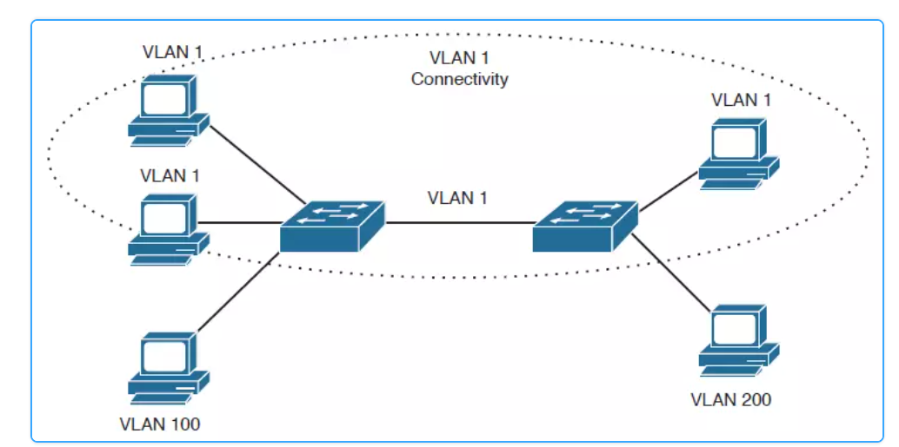
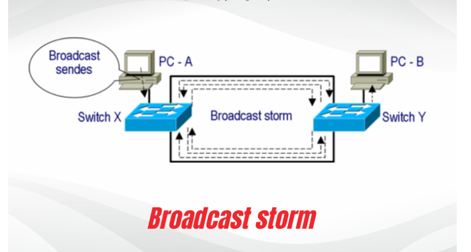
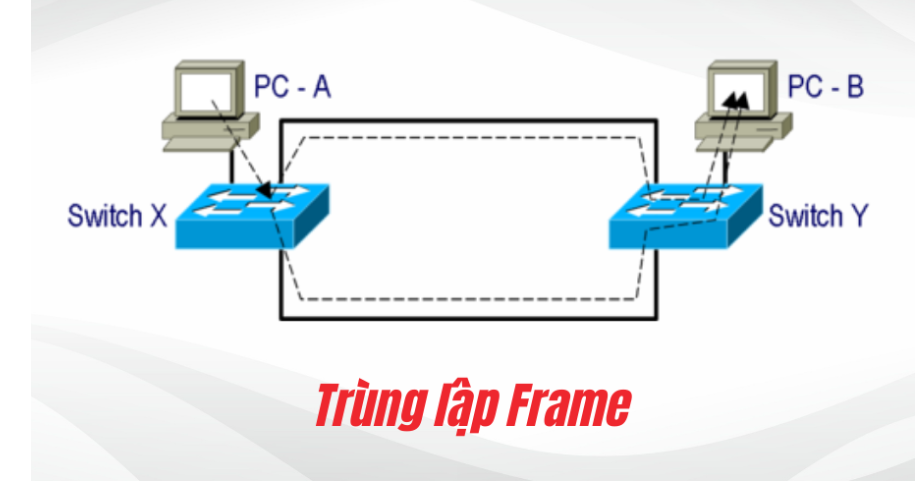
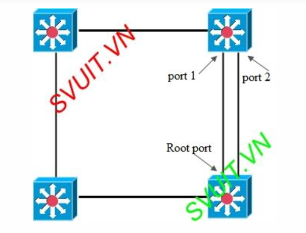
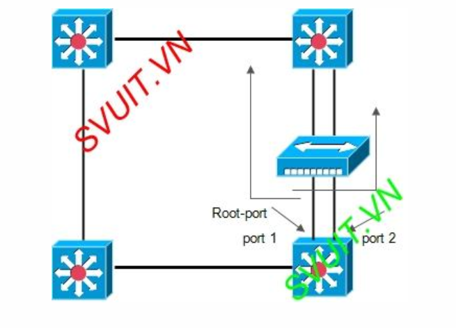
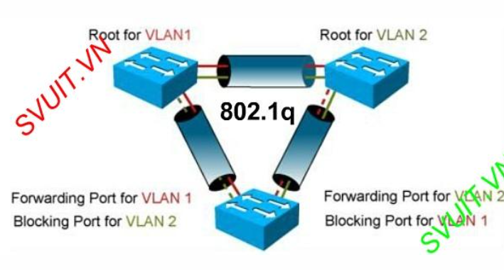

# ***VLAN là gì***
- VLAN là viết tắt của Virtual Local Area Network, là một công nghệ mạng được sử dụng để phân chia một mạng vật lý thành nhiều mạng ảo độc lập với nhau trên cùng một thiết bị chuyển mạch (switch).

Với VLAN, các thiết bị trên mạng vật lý được chia thành các nhóm khác nhau, có thể là theo địa chỉ IP, theo tên miền, theo chức năng hoặc theo bất kỳ tiêu chí nào khác. Các thiết bị trong cùng một VLAN có thể giao tiếp với nhau nhưng không thể truy cập vào các thiết bị của các VLAN khác. Điều này cung cấp tính bảo mật cho mạng và giúp giảm tải cho các thiết bị mạng.
- 
- Nếu không có mạng Virtual LAN, một broadcast được gửi từ host có thể dễ dàng đi đến mọi thiết bị mạng. Khi đó, tất cả thiết bị đều sẽ xử lý những frame đã nhận broadcast đó. Việc này sẽ làm tăng đáng kể chi phí cho CPU trên mỗi thiết bị, đồng thời làm giảm khả năng bảo mật của hệ thống.

- Nếu ta đặt các interface trên các switch ở những VLAN riêng biệt, một broadcast từ host A chỉ có thể đi đến các thiết bị khả dụng ở trong cùng một Virtual LAN. Các host của Virtual LAN sẽ không hề biết về cách thức giao tiếp.

# ***Phân loại Vlan***
## ***Static Vlan(Vlan tĩnh)
- Static VLAN là loại VLAN được tạo ra bằng cách gắn các cổng Switch vào một VLAN. Cách làm này tương tự như việc một thiết bị được kết nối vào mạng và nó tự mình công nhận bản thân là VLAN của cổng đó.

- Trong trường hợp người dùng cần thay đổi các cổng và có nhu cầu truy cập vào một VLAN chung, quản trị viên phải khai báo cổng cho VLAN trong lần kết nối tiếp theo.

## ***Dynamic Vlan(Vlan động)

- Được biết Dynamic VLAN là loại VLAN được tạo ra bằng cách sử dụng những phần mềm điển hình như Ciscowork 2000. Khi này người dùng sẽ sử dụng VLAN Management Policy Server (VMPS) để đăng ký các cổng Switch kết nối tới VLAN tự động. Quá trình kết nối được thực hiện dựa trên địa chỉ MAC nguồn của loại thiết bị được kết nối tới cổng.

- Tương tự như mô hình thiết bị mạng, Dynamic VLAN hoạt động truy vấn một cơ sở dữ liệu dựa trên VMPS của các VLAN thành viên còn lại.
# ***Cách hoạt động của VLAN***
- Các Virtual LAN ở trong mạng được xác định bằng một con số cụ thể
- Phạm vi giá trị hợp lệ là 1- 4094. Trên một switch VLAN, ta có thể chỉ định các cổng với số VLAN thích hợp.
- Tiếp đến, switch sẽ cho phép dữ liệu cần được gửi giữa các port khác nhau có cùng một Virtual LAN.
- Vì hầu hết các mạng đều có nhiều hơn là chỉ một switch duy nhất. Vì vậy, cần có một cách nào đó để có thể gửi lưu lượng giữa hai switch trong mạng. Cách đơn giản nhất chính là gán một port trên mỗi switch của Virtual LAN và chạy một cable giữa chúng.
# ***Ưu điểm của Vlan***
- Giảm tải mạng: Khi một địa chỉ broadcast được gửi trên mạng vật lý, nó sẽ ảnh hưởng đến tất cả các thiết bị trên mạng. Khi chia mạng vật lý thành các VLAN, các địa chỉ broadcast chỉ được gửi đến các thiết bị trong cùng VLAN, giảm tải cho các thiết bị không cần nhận địa chỉ broadcast.

- Tăng tính bảo mật: Với VLAN, các thiết bị trong cùng VLAN có thể giao tiếp với nhau nhưng không thể truy cập vào các thiết bị của các VLAN khác. Điều này giúp giảm khả năng bị tấn công mạng.

- Dễ dàng quản lý: Với VLAN, các thiết bị trên mạng vật lý có thể được chia thành các nhóm khác nhau, tùy thuộc vào các tiêu chí cụ thể. Điều này giúp cho việc quản lý mạng dễ dàng hơn.
# ***Nhược điểm của Vlan***
- Packet có thể bị rò rỉ giữa các VLAN
- Packet được inject có thể dẫn đến cyber attack
- Các mối đe dọa ở trong một hệ thống đơn lẻ có thể phát tán virus cho toàn bộ mạng
- Cần có một router bổ sung để kiểm soát workload trong những mạng lớn
- Khả năng tương tác có thể gặp vấn đề
Một VLAN không thể chuyển tiếp lưu lượng mạng sang những VLAN khác
# ***Ứng dụng Vlan***
- Tăng tính bảo mật: VLAN giúp tăng tính bảo mật cho mạng bằng cách phân chia mạng vật lý thành nhiều mạng ảo độc lập với nhau. Việc phân chia này giúp ngăn chặn các cuộc tấn công từ các thiết bị không được phép trong cùng một VLAN và giảm thiểu sự lan truyền của các thông tin bảo mật trên toàn mạng.

- Quản lý dễ dàng: VLAN giúp quản lý mạng dễ dàng hơn bằng cách phân chia mạng vật lý thành các mạng ảo độc lập với nhau tùy thuộc vào các tiêu chí nhất định. Việc này giúp cho việc quản lý mạng trở nên dễ dàng hơn.

- Giảm tải mạng: VLAN giúp giảm tải mạng bằng cách giảm lượng thông tin broadcast và multicast trên mạng. Khi một địa chỉ broadcast được gửi trên mạng vật lý, nó sẽ ảnh hưởng đến tất cả các thiết bị trên mạng. Khi chia mạng vật lý thành các VLAN, các địa chỉ broadcast chỉ được gửi đến các thiết bị trong cùng VLAN, giảm tải cho các thiết bị không cần nhận địa chỉ broadcast.

- Tăng cường hiệu suất: VLAN giúp tăng cường hiệu suất mạng bằng cách tối ưu hóa lưu lượng truyền thông giữa các thiết bị trong cùng VLAN. Việc tối ưu hóa này giúp giảm thời gian chờ đợi trong việc truyền thông giữa các thiết bị và tăng tốc độ truyền thông trên mạng.

- Phân tích lưu lượng mạng: VLAN giúp phân tích và quản lý lưu lượng truyền thông trên mạng. Việc này giúp người quản trị mạng có thể quản lý và giám sát lưu lượng mạng một cách hiệu quả hơn.

# ***Tìm hiểu VTP***
## ***Khái niệm***   
   - Giao thức đồng bộ thông tin VLAN giữa các thiết bị Switch. Khi một hệ thống lớn thì việc tạo, xóa, sửa VLAN trong các Switch trở nên cực kì khó khăn. Thiếu tính chính xác và mất nhiều thời gian.Giao thức VTP tiến hành đồng bộ thông tin và cấu hình VLAN giữa các Switch trong cùng một miền Domain.

## ***Một số lợi ích của VTP bao gồm:***

- Tiết kiệm thời gian và công sức của quản trị viên mạng khi cấu hình VLAN trên các thiết bị mạng.
- Đảm bảo tính nhất quán và đồng bộ hóa thông tin VLAN trên toàn bộ mạng.
## ***Tuy nhiên, VTP cũng có một số hạn chế và rủi ro, bao gồm:***

- Khả năng gây ra sự cố nếu thiết bị VTP Server bị lỗi và phát tán thông tin sai về các VLAN trên mạng.
- Không phù hợp cho các mô hình mạng phức tạp với nhiều VTP Domain.
- Không bảo mật trong việc phân phối thông tin VLAN, do đó cần thực hiện các biện pháp bảo mật bổ sung để đảm bảo tính an toàn và bảo mật của mạng.
## ***Cơ chế hoạt động của VTP***

### ***Chế độ sever của VTP***
- Một switch trong mạng sẽ được mặc 
định hoạt động ở chế độ Server. Nó sẽ 
tạo mới VLAN, sửa đổi VLAN, cũng có 
thể xóa VLAN. Bên cạnh đó, nó sẽ 
truyền, đồng bộ hóa thông tin VLAN 
đến các switch khác trong cùng domain 
và lưu cấu hình vào NVRAM.

### ***Chế độ client của VTP***
- Ở chế độ này, các switch chỉ truyền 
và nhận các thông tin quảng bá đến 
với nhau và tự động cập nhật cấu hình 
VLAN của nó. Các switch không có 
quyền xóa hay chỉnh sửa các VLAN. Các 
switch cũng không lưu cấu hình vào 
NVRAM như ở chế độ Server.

### ***Chế độ Transparent của VTP***
- Ở chế độ này, switch chỉ quảng bá 
thông tin Vtp nào nhận ra được cổng 
trunk của nó. Bởi vậy, nó không đồng 
bộ hóa thông tin của VLAN. Nó có thể 
tạo ra, chỉnh sửa và xóa VLAN trên 
local. Bên cạnh đó, ở chế độ này , 
các switch cũng lưu cấu hình vào 
NVRAM như ở chế độ Server
# ***Tìm hiểu STP***
## ***Khái niệm***
STP là viết tắt của "Spanning Tree Protocol". Đây là một giao thức mạng được sử dụng để đảm bảo tính tin cậy và tránh các vòng lặp trên mạng Ethernet. Khi một mạng Ethernet có nhiều đường kết nối, STP sẽ tính toán và chọn ra một đường kết nối duy nhất để truyền dữ liệu giữa các thiết bị, đồng thời ngăn chặn các vòng lặp trên mạng.

Khi được kích hoạt, STP sẽ xác định các đường kết nối trên mạng và xây dựng một cây cầu ảo (Virtual Bridge Network) bằng cách chọn ra một đường kết nối chính và các đường kết nối dự phòng để tránh các vòng lặp trên mạng. Các đường kết nối dự phòng sẽ được giữ trong trạng thái chờ đợi, sẵn sàng chuyển đổi vào khi đường kết nối chính gặp sự cố.

## ***Một số lợi ích của STP bao gồm:***

Đảm bảo tính tin cậy và ổn định của mạng Ethernet.
Ngăn chặn các vòng lặp trên mạng Ethernet.
Cho phép tối đa hóa băng thông sử dụng bằng cách sử dụng nhiều đường kết nối trên mạng.
## ***Tuy nhiên, STP cũng có một số hạn chế và rủi ro, bao gồm:***

Tốc độ hội tụ chậm khi đường kết nối chính gặp sự cố và phải chuyển đổi sang đường kết nối dự phòng.
Mất băng thông khi các đường kết nối dự phòng không được sử dụng.
Không bảo mật trong việc phát hiện và chọn ra đường kết nối chính trên mạng Ethernet, do đó cần thực hiện các biện pháp bảo mật bổ sung để đảm bảo tính an toàn và bảo mật của mạng.

## ***Những trường hợp xảy ra lỗi***
### ***Broadcast Storm***
- Giả sử Máy A triển khai gửi một broadcast frame vào mạng lưới hệ thống. Khi Switch X nhận được frame này nó sẽ đưa frame ra tổng thể những port đến Switch Y. Switch Y nhận được Broadcast Frame này lại liên tục gửi ra tổng thể những port trừ port nhận vào và quy trình frame này cứ chạy mãi một vòng giữa Switch X và Switch Y. Các Switch cứ nhân bản và flood broadcast frame này ra. Số lượng frame sẽ ngày càng lớn. Và khi Switch không còn năng lực giải quyết và xử lý nữa thì sẽ làm Switch bị treo .
- 
### ***Trùng lặp Frame***
- Frame Máy tính A gửi một unicast frame đến Máy tính B và địa chỉ MAC của B chưa được update vào bảng MAC của Switch thì Switch sẽ giải quyết và xử lý những frame này như một flood và broadcast frame ra tổng thể những port trừ port nhận vào. Và Switch X và Switch Y đều triển khai chuyển flood frame này ra nhiều port khiến Máy tính B phải giải quyết và xử lý frame này 2 lần .
Giao thức STP được sinh ra để xử lý triệt để trường hợp loop, single point of failure trên Layer 2. STP được IEEE chuẩn hóa IEEE 802.1 D .

## ***Tiến trình bầu và hoạt động của các giao thức Spanning tree***
### ***Chọn Root – Bridge của STP***
- Một khi STP được bật, những Switch sẽ gửi những gói tin BPDU ( Bridge Protocol Data Unit ) để trao đổi giữa những Switch với nhau. Trong tiến trình STP, BPDU là một gói tin quan trọng. BPDU chứa một thông tin quan trọng là Bridge – ID của những Switch. Với giá trị này dùng để định danh mỗi Switch khi nào tham gia tiến trình STP .

Bridge-ID dài 8 byte:

-  Số Priority ( 2 byte ) : có giá trị từ 0 – 65535 mặc định là 32768
- MAC address ( 6 byte )

Tiến trình bầu Root – Bridge được tiến hành:

- Trước tiên so sánh Switch nào có số Priority thấp nhất sẽ là Root – Bridge .
- Các Switch có số Priority bằng nhau thì qua tiến trình thứ 2 là so sánh MAC. Switch nào có MAC nhỏ nhất sẽ làm Root – Bridge. Có thể xem trên quốc tế MAC là địa chỉ duy nhất không xảy ra trùng lặp được .

- Sau khi đã bầu được Root – Bridge thì chỉ có Switch làm root mới gửi BPDU ra khỏi cổng để duy trì tiến trình STP (gửi 2s/lần). Các Switch con chỉ nhận, bổ xung thông tin BPDU và Forward thông tin BPDU này.

### ***Bầu Root – Port của STP***
- Sau khi đã bầu Root – bridge thì sẽ sang những Switch bầu chọn Root-Port. Root-Port là port có đường về Root – bridge có tổng cost tích góp nhỏ nhất .
Mỗi interface của Ethernet LAN đều được gán cho một giá trị. Giá trị đó gọi là cost dùng để triển khai đo lường và thống kê của STP .
Để xác lập được cost tích góp của một port đến Switch làm Root-bridge bạn thực thi tính ngược từ Root về cổng đó dựa theo chiều Viral BPDU theo quy tắc “ vào cộng ra không cộng ” .

### ***Lựa các Designated Port***

Tiếp theo STP ta triển khai bầu Designated Port. Designated Port là Port phân phối đường về root-bridge có tổng cost nhỏ nhất trên phân đoạn mạng bạn đang xét. Chỉ có một Designated port ứng với một link liên kết .

### ***Blocking các port còn lại của STP***

Bước ở đầu cuối trong STP là so với những port không có vai trò là Root hay Designated sẽ bị Block. Nó được gọi là Alternated port .

## ***Quá trình tìm Block Port Spanning tree***
### ***Root Switch:***
-  Khi các Sw được đấu nối khởi động nó sẽ gửi gói tin BPDU(bridge protocol data unit) trên các port của Switch.
- Thông số quyết định Sw nào được làm Root Sw là Bridge-ID(8 byte) gồm có các thông số :
priority(của switch):
dài 2 byte(9 -> 65535), default = 32768.
Sw nào có chỉ số priority có chỉ số nhỏ nhất sẽ được chọn làm Root-switch
MAC Address Switch:
dài 6 byte.
Xét từ trái sang phải từng giá trị hexa thì switch nào có MAC nhỏ nhất làm Root-switch
- Khi bầu xong Root-switch thì chỉ có Root-switch được gửi BPDU(2s/1 lần). Việc gửi đó để duy trì cây spanning tree đó không bị Loop
- Theo nguyên tắc đánh số MAC của nhà sản xuất thì khi bầu chọn root-switch nó sẽ chọn switch đời đầu làm root-switch => sw cùi cắp làm lãnh đạo. Nên trong thực tế ta ko bao giờ cho bầu chọn bằng MAC mà ta chỉnh priority

### ***Root port:***
 Là port cung cấp đường về Root-switch mà có tổng path-cost là nhỏ nhất
- Khi bầu chọn Root-port thì Root-Switch ko tham gia quá trình bầu chọn này
- Mỗi Root-switch chỉ có 1 Root-port
- Path-cost là giá trị cost trên từng cổng của Switch.

 Nguyên tắc tính tổng path-cost: tính từ switch đang muốn tính --> Root-switch
Đi ra: ko cộng
Đi vào: cộng cost
#### ***Luật Tie-Break:***
- Sender Bridge ID:
  - Cổng nào kết nối switch mà switch đó có bridge ID nhỏ nhất -> port đó sẽ được chọn làm Root-port.
  - Bridge ID của B nhỏ hơn C à port số 2 làm Root-port
- Sender Port ID:
  - Port ID của Switch bên kia thì port nào của switch bên kia có giá trị port-ID nhỏ hơn thì chọn port bên switch mình kết nối với port ID nhỏ hơn đó.
    - Priority của port: có giá trị từ 0 -> 255, default=128. Port nào có priority nhỏ hơn thì port đó có Port ID nhỏ hơn.
    - Vị trí của port: Xét theo hạng của số thứ tự của port. Port số 1 < port 2 -> port số 2 làm root-port

- Khi các luật trên không giải quyết được thì nó sẽ xét đến Port ID trên chính nó
  - Priority và vị trí của port
  - VD: Vì hub nó thực hiện flood ra tất cả các port nên frame từ port 1 của swD sẽ đi đến hub và đi cả 2 đường từ hub -> swC. Nên lúc này chúng ta không thể xác định bằng cách trên. Lúc này ta phải xet port-ID trên chính SwC

### ***Designated port***
Tất cả các port của Root-sw đều là Designated port
- Trên 1 phân đoạn nếu port đối diện là Root-port thì mình là Designated port(ko có ý nghĩa ngược lại).
- Là port cung cấp đường về Root-sw trên phân đoạn mạng đang xét mà có tổng path-cost là nhỏ nhất.
Vd: tính path-cost trên phân đoạn ta tính từ
Root-sw(cat 2) --> cat 1 --> cat 4 = 38

### ***Alternate port***
Khi 1 trong các phân đoạn khác bị đứt thì phân đoạn port lock sẽ được mở ra để chạy
- Khi phân đoạn trên có lại thì phân đoạn lock sẽ tiếp tục bị lock lại
- Tuy port lock không nhận được dữ liệu nhưng nó vẫn nhận gói tin BPDU từ Root-switch để duy trì cây spanning-tree. Nếu nó không nhận được gói BPDU thì nó sẽ mở port lock này ra à lúc này bị loop ráng chịu

### ***Peer PVST(peer Vlan Spanning tree)***
PriorityVlan n = PriorityVlan n + n​
- Lưu ý: Khi chỉnh sửa Priority thì số priority phải chia hết cho 4096
- Ví dụ: Vlan 1 à priority = 32768 + 1

### ***STP timer***
- Helo timer: 2(s) Thời gian gửi BPDU
- Forward timer: 15(s)
- Max-agetimes: 20(s) Nếu Root-Sw chết hay port lock không nhận được BPDU thì mất 20s nó mới hoạt động( tự mở lên hoặc bầu chọn lại Root-sw)

### ***STP state***
- Các trạng thái khi Sw khởi động
Disable: down
Blocking: nhận BDPU, ko gửi BPDU, ko học MAC, ko forward frame
Listening: _________, gửi BPDU, ___________________
Leaning: __________________, học MAC, _______________
Forwarding: _____________________________, forward frame
- Việc chuyển từ trạng thái: Blocking sang listening mất 20(s)
- Việc chuyển từ trạng thái: Listening sang Leaning mất 15(s)
- Việc chuyển từ trạng thái: Leaning sang Forwarding mất 15(s)
=> Vậy khi Sw khởi động xong or khi cắm dây vào port thì phải mất 30(s) đèn chuyển sang màu xanh
=> Mất 30+20+2 = 52(s) để STP port lock mới hoạt động
# ***Tài liệu tham khảo***
<https://vietnix.vn/vlan/#:~:text=VLAN%20%28Virtual%20Local%20Area%20Network%29%20l%C3%A0%20m%E1%BB%99t%20m%E1%BA%A1ng,l%C3%BD%20gi%E1%BB%91ng%20nh%C6%B0%20m%E1%BB%99t%20m%E1%BA%A1ng%20LAN%20v%E1%BA%ADt%20l%C3%BD.>

<https://itforvn.com/bai-6-vlan-trunking-vtp.html/>

<https://itforvn.com/tu-hoc-ccnax-bai-7-spanning-tree.html/>
<https://trogiupnhanh.com/vtp-la-gi-cong-dung-cua-vtp/>
<https://thegioimang.vn/dien-dan/threads/t%C3%ACm-hi%E1%BB%83u-giao-th%E1%BB%A9c-stp-spanning-tree-protocol-c%E1%BA%A5u-h%C3%ACnh-stp-tr%C3%AAn-switch-cisco.588/>
<https://securityzone.vn/t/bai-19-tim-hieu-giao-thuc-spanning-tree-protocol.163/>
<https://final-blade.com/spanning-tree-la-gi-1673583887>