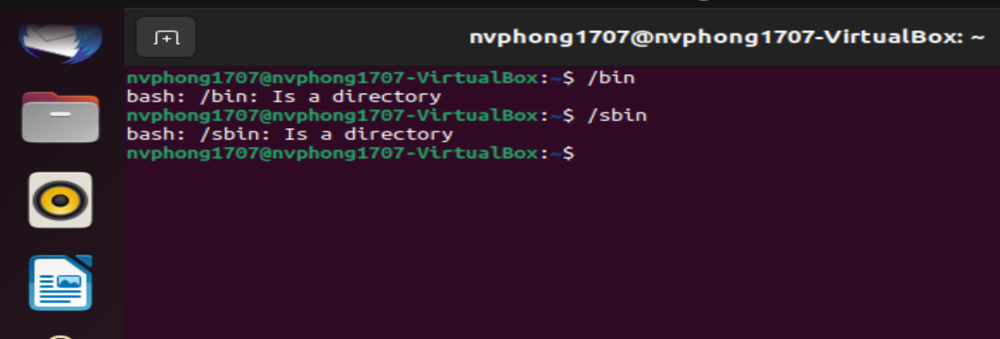
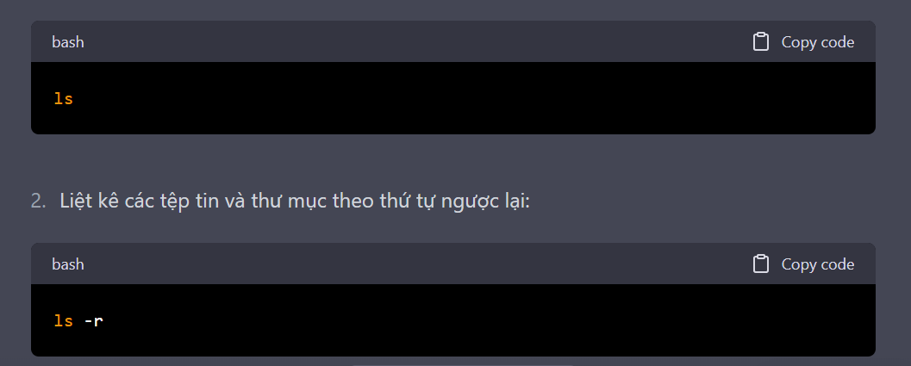
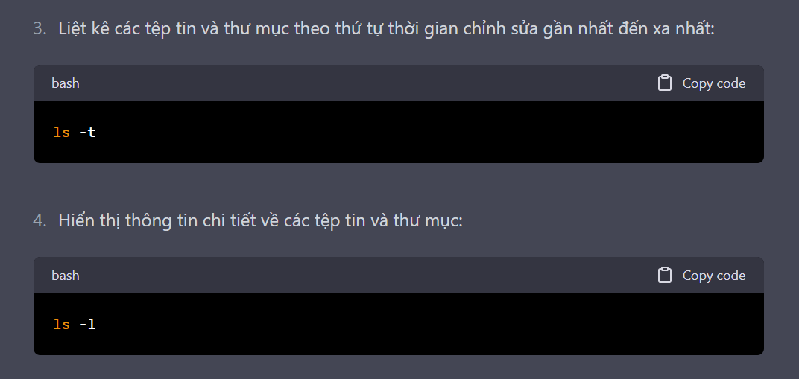
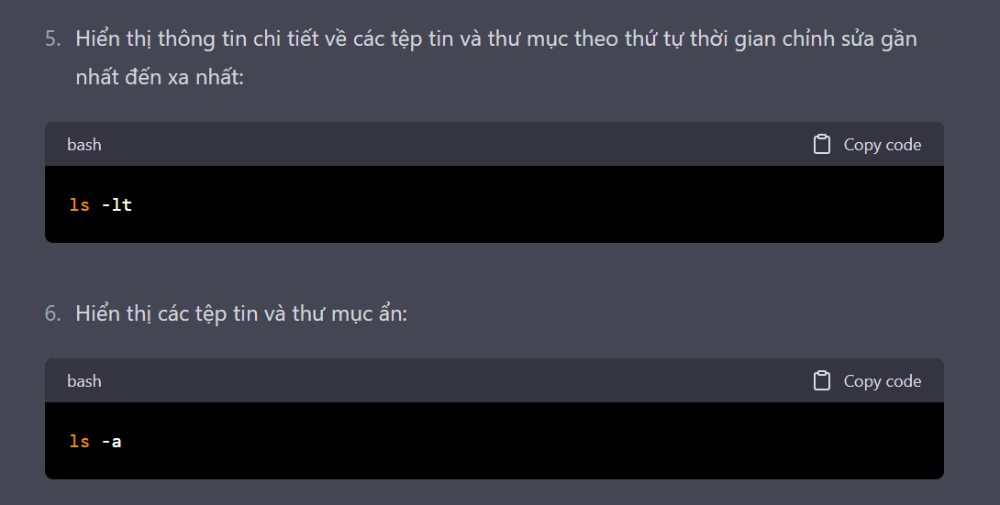
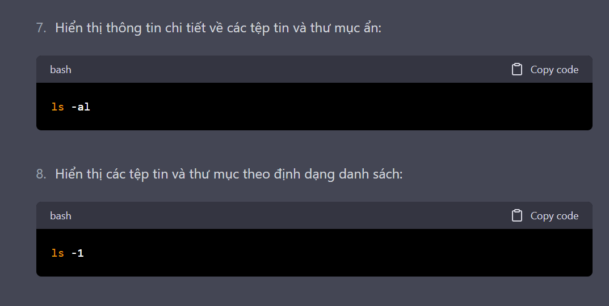
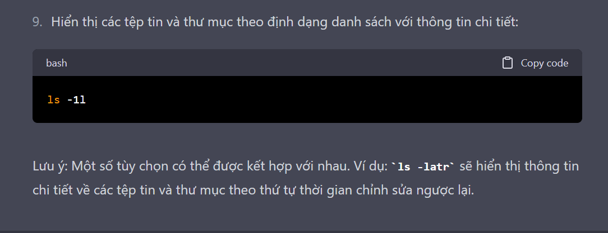

# ***Xác định vị trí***
- Trong hệ điều hành Linux, các chương trình được lưu trữ trong các thư mục được đặt tên là "bin" và "sbin". 
  - Thư mục "bin" chứa các chương trình thường được sử dụng bởi người dùng thông thường 
  - Thư mục "sbin" chứa các chương trình quản trị hệ thống, thường được sử dụng bởi quản trị viên.
    - 
  - Ngoài ra, nếu người dùng tạo ra các chương trình của riêng mình, họ có thể lưu trữ chúng trong bất kỳ thư mục nào trên hệ thống, nhưng thường là trong các thư mục được thiết lập để lưu trữ các tệp thực thi, chẳng hạn như /usr/local/bin.
  ## ***/usr là gì***
    - /usr là viết tắt của "Unix System Resources" (tài nguyên hệ thống Unix), đây là một trong những thư mục quan trọng nhất trên hệ thống Linux và các hệ thống tương tự. Thư mục này chứa các tài nguyên hệ thống như các tệp thực thi, thư viện, tài liệu và các thư mục khác mà các ứng dụng và người dùng có thể sử dụng.

Các thư mục con quan trọng của /usr bao gồm:

/usr/bin: Chứa các tệp thực thi cho các chương trình thường được sử dụng bởi người dùng.
/usr/sbin: Chứa các tệp thực thi cho các chương trình quản trị hệ thống, thường chỉ được sử dụng bởi quản trị viên hệ thống.
/usr/lib và /usr/lib64: Chứa các thư viện cho các chương trình.
/usr/share: Chứa các tài nguyên không thay đổi của hệ thống, chẳng hạn như các hình ảnh, biểu tượng và các tệp âm thanh.
/usr/local: Chứa các tệp thực thi, thư viện và các tài nguyên khác cho các ứng dụng được cài đặt cục bộ bởi người dùng hoặc quản trị viên hệ thống.
## ***Sự khác nhau giữa quản trị viên và người dùng thông thường***
Người dùng thông thường (regular user) và quản trị viên (administrator) là hai vai trò khác nhau trên hệ thống máy tính. Các khác biệt giữa hai vai trò này bao gồm:

- Quyền hạn: Quản trị viên có quyền hạn cao hơn người dùng thông thường trong việc sửa đổi và quản lý hệ thống. Quản trị viên có thể thực hiện các thao tác như cài đặt phần mềm, xóa tệp tin hệ thống, cấu hình mạng và các tác vụ quản trị hệ thống khác, trong khi người dùng thông thường có thể sử dụng các ứng dụng và tệp tin của họ.

- Tác vụ có thể thực hiện: Người dùng thông thường thường chỉ có thể thực hiện các tác vụ mà họ có quyền hạn để làm, trong khi quản trị viên có thể thực hiện nhiều tác vụ khác nhau trên hệ thống, kể cả các tác vụ mà không phải là người dùng thông thường không có quyền hạn.

- Đăng nhập và truy cập vào hệ thống: Người dùng thông thường đăng nhập vào hệ thống bằng tên đăng nhập và mật khẩu của riêng họ. Trong khi đó, quản trị viên có thể đăng nhập vào hệ thống bằng một tên đăng nhập và mật khẩu riêng, và có quyền hạn đặc biệt để truy cập vào các tài nguyên quản trị hệ thống.

Tóm lại, người dùng thông thường và quản trị viên có những khác biệt về quyền hạn, tác vụ có thể thực hiện và phạm vi truy cập vào hệ thống.
## ***/bin và /sbin khác nhau như thế nào mà khi thực hiện câu lệnh trên terminal đều cho ra kết quả giống nhau***
Thư mục /bin và /sbin là hai thư mục quan trọng trên hệ thống Linux, chứa các tệp thực thi được sử dụng để chạy các chương trình và dịch vụ trên hệ thống. Tuy nhiên, có sự khác biệt giữa hai thư mục này như sau:

/bin: Chứa các tệp thực thi cơ bản cho các lệnh thường được sử dụng bởi người dùng và các tiến trình hệ thống, như ls, cp, mv, rm, mkdir, rmdir, bash, cat, grep, và nhiều lệnh khác. Các tệp thực thi trong /bin được thiết kế để được sử dụng bởi cả người dùng thông thường và quản trị viên hệ thống.

/sbin: Chứa các tệp thực thi cơ bản cho các lệnh thường được sử dụng bởi quản trị viên hệ thống để quản lý hệ thống, như ifconfig, fdisk, mkfs, shutdown, reboot, và nhiều lệnh khác. Các tệp thực thi trong /sbin yêu cầu quyền hạn đặc biệt để thực thi và thường chỉ được sử dụng bởi quản trị viên hệ thống hoặc các tiến trình hệ thống.

Tuy nhiên, khi bạn gõ câu lệnh bin và sbin trên Linux, không có sự khác biệt rõ ràng giữa hai thư mục này vì các tệp thực thi trong cả hai thư mục đều có thể được gọi bởi người dùng thông thường hoặc quản trị viên hệ thống. Tuy nhiên, khi bạn sử dụng các lệnh quản trị hệ thống hoặc thao tác với các tệp hệ thống, bạn cần sử dụng các lệnh trong /sbin với quyền hạn đặc biệt để thực thi các tác vụ quản trị hệ thống.
## ***opt là gì***
/opt là một thư mục trên hệ thống tệp Linux được sử dụng để lưu trữ các ứng dụng phần mềm của bên thứ ba. Thư mục này là viết tắt của "optional" - tùy chọn, vì nó chứa các phần mềm không được cài đặt mặc định trên hệ thống và không thuộc các gói phần mềm chuẩn của bất kỳ bản phân phối Linux nào.

Các ứng dụng trong thư mục /opt thường được cài đặt bởi người quản trị hệ thống hoặc người dùng cuối, thay vì được cài đặt tự động bởi hệ thống hoặc gói phần mềm chuẩn. Thư mục /opt thường chứa các ứng dụng lớn, có kích thước lớn và phức tạp hơn, được sử dụng cho mục đích đặc biệt như phần mềm chuyên dụng, các ứng dụng thương mại và các ứng dụng mà không có sẵn trong kho phần mềm của hệ thống.

Các ứng dụng trong /opt thường được tổ chức thành các thư mục theo tên của nhà phát triển hoặc của ứng dụng. Ví dụ, /opt/google chứa các ứng dụng của Google và /opt/mozilla chứa các ứng dụng của Mozilla.

Tóm lại, thư mục /opt trong Linux là một vị trí chung để lưu trữ các ứng dụng phần mềm của bên thứ ba, được cài đặt thủ công và không thuộc các gói phần mềm chuẩn của hệ thống.
## ***Tìm kiếm chương trình trong Linux***
- Sử dụng lệnh ***which***: Lệnh which được sử dụng để hiển thị đường dẫn của chương trình được thực thi đầu tiên được tìm thấy trong *$PATH*. Ví dụ, nếu bạn muốn tìm đường dẫn của chương trình diff, bạn có thể sử dụng lệnh sau:
***which diff***
- Sử dụng lệnh whereis: Lệnh whereis được sử dụng để tìm kiếm các tệp liên quan đến một chương trình hoặc một tệp tin trên hệ thống. Ví dụ, nếu bạn muốn tìm kiếm các tệp liên quan đến chương trình diff, bạn có thể sử dụng lệnh sau: whereis diff

- Sử dụng lệnh locate: Lệnh locate sử dụng cơ sở dữ liệu tìm kiếm để tìm kiếm các tệp trên hệ thống. Trước khi sử dụng lệnh này, bạn cần đảm bảo rằng cơ sở dữ liệu đã được cập nhật bằng lệnh sudo updatedb. Ví dụ, nếu bạn muốn tìm kiếm tất cả các tệp tin liên quan đến chương trình diff, bạn có thể sử dụng lệnh sau:
***sudo updatedb
locate nano***

- Sử dụng giao diện đồ họa: Nếu bạn sử dụng một giao diện đồ họa trên Linux, bạn có thể sử dụng tính năng tìm kiếm để tìm kiếm các chương trình trên hệ thống. Chỉ cần mở trình quản lý tệp hoặc trình duyệt tệp và sử dụng tính năng tìm kiếm để tìm kiếm các tệp liên quan đến chương trình bạn muốn tìm kiếm.

# ***Thay đổi thư mục trong Linux***
Để thay đổi thư mục hiện tại trong Linux, bạn có thể sử dụng lệnh "cd" (chuyển thư mục).
Lệnh cd là một trong những lệnh cơ bản trong hệ thống Linux/Unix, được sử dụng để thay đổi thư mục hiện tại đang làm việc của người dùng.

Cú pháp: cd [đường dẫn]

Ví dụ:

- `cd /home/user/Documents`: Chuyển đến thư mục Documents trong thư mục /home/user
- `cd ..`: Chuyển đến thư mục cha của thư mục hiện tại
- `cd`: Chuyển đến thư mục home của người dùng
Các tùy chọn:

* `-`: Quay lại thư mục trước đó. Ví dụ: `cd -` sẽ quay lại thư mục trước đó mà bạn đã làm việc.
* `--`: Giúp cd phân biệt được giữa các tên thư mục bắt đầu bằng dấu -. Ví dụ: - `cd --` -folder sẽ chuyển đến thư mục có tên "-folder"
Lưu ý:

Khi sử dụng lệnh cd với đường dẫn tương đối, đường dẫn sẽ được tính từ thư mục hiện tại.
Nếu không có quyền truy cập vào một thư mục, lệnh `cd` sẽ không thực hiện được.
- Khi sử dụng lệnh cd với tên người dùng, ví dụ cd ~user, lệnh sẽ chuyển đến thư mục home của người dùng đó.
- `cd/: thay đổi thư mục hiện tại sang thư mục gốc.

# ***Tìm hiểu hệ thống tập tin***
## ***Khái niệm***
Hệ thống tập tin (File system) là một cách thức tổ chức, lưu trữ, quản lý và truy cập các tệp tin và thư mục trên một hệ thống máy tính. Các hệ điều hành (OS) sử dụng các loại hệ thống tập tin khác nhau để quản lý các tệp và thư mục trên ổ cứng và các thiết bị lưu trữ khác.

Một số khái niệm cơ bản trong hệ thống tập tin:

Tệp tin (File): là một tập hợp các dữ liệu có liên quan được lưu trữ trên thiết bị lưu trữ của máy tính.
Thư mục (Directory/Folder): là một đối tượng trong hệ thống tập tin được sử dụng để chứa các tệp tin và thư mục khác.
Đường dẫn (Path): là đường dẫn tới một tệp tin hoặc thư mục trong hệ thống tập tin. Có hai loại đường dẫn: đường dẫn tuyệt đối (Absolute path) và đường dẫn tương đối (Relative path).
Hệ thống tập tin được tổ chức thành các đơn vị lưu trữ, ví dụ như ổ đĩa (Disk), phân vùng (Partition), thẻ nhớ (Memory card), USB,...
## ***Các câu lệnh***
Một số lệnh liên quan đến hệ thống tập tin trên Linux:

- `ls`: Liệt kê các tệp tin và thư mục trong thư mục hiện tại.
- `pwd`: Hiển thị đường dẫn tuyệt đối của thư mục hiện tại.
- `cd`: Chuyển đổi thư mục hiện tại.
- `mkdir`: Tạo thư mục mới.
- `rm`: Xóa tệp tin hoặc thư mục.
- `cp`: Sao chép tệp tin hoặc thư mục.
- `mv`: Di chuyển hoặc đổi tên tệp tin hoặc thư mục.
- `chmod`: Thay đổi quyền truy cập của tệp tin hoặc thư mục.
### ***Lệnh ls***
Trong hệ điều hành Linux/Unix, các tệp tin và thư mục được tổ chức thành một hệ thống tập tin, với mỗi thư mục có thể chứa các tệp tin và thư mục con. Để khám phá và thao tác trên hệ thống tập tin này, người dùng có thể sử dụng một số lệnh dòng lệnh cơ bản.

Liệt kê các tệp tin và thư mục trong thư mục hiện tại:
Sử dụng lệnh `ls` để liệt kê các tệp tin và thư mục trong thư mục hiện tại.
Sử dụng tùy chọn -l để hiển thị thông tin chi tiết về các tệp tin và thư mục, bao gồm quyền truy cập, chủ sở hữu, kích thước và ngày tạo/sửa đổi.

### ***Lệnh pwd***
Hiển thị đường dẫn tuyệt đối của thư mục hiện tại:
Sử dụng lệnh `pwd` để hiển thị đường dẫn tuyệt đối của thư mục hiện tại.
### ***Lệnh xóa rm***
Xóa tệp tin hoặc thư mục:
Sử dụng lệnh `rm` để xóa tệp tin hoặc thư mục.
Để xóa một thư mục và các tệp tin và thư mục con, sử dụng tùy chọn -r
### ***Lệnh sao chép***
Sử dụng lệnh `cp` để sao chép tệp tin hoặc thư mục.
Nhập tên tệp tin hoặc thư mục cần sao chép sau lệnh cp, sau đó nhập đường dẫn đến vị trí sao chép sau cùng.
### ***Lệnh tree***
Lệnh "tree" trong Linux là một công cụ dòng lệnh giúp hiển thị cấu trúc thư mục dưới dạng cây thư mục. Nó được sử dụng để hiển thị một cách trực quan và có tổ chức các tệp và thư mục trong hệ thống tệp của Linux.

Cú pháp của lệnh "tree" như sau:
`tree [options] [directory]`

Trong đó:

`options`: là các tùy chọn để định dạng hiển thị, ví dụ như `-a` để hiển thị các tập tin ẩn, `-d` để chỉ hiển thị thư mục, `-f` để hiển thị đường dẫn tuyệt đối của tập tin, v.v.

`directory`: là thư mục bạn muốn hiển thị cây thư mục của nó. Nếu không có thư mục nào được cung cấp, lệnh "tree" sẽ hiển thị cây thư mục của thư mục hiện tại.
## ***Liên kết cứng(Hard link) và liên kết tượng trưng(symbolic link)***
Trong hệ thống Linux, có hai loại liên kết được sử dụng để kết nối hai tập tin hoặc thư mục với nhau: Hard Links và Symbolic Links.

### ***Hard Links:***
Hard link là một liên kết giữa hai tên tập tin khác nhau nhưng cùng trỏ đến cùng một vùng dữ liệu trên đĩa. Điều này có nghĩa là nếu bạn thay đổi tên hoặc nội dung của một tập tin được liên kết, tất cả các tập tin khác sẽ được thay đổi theo. Một số đặc điểm của hard link là:
Hard link không thể được tạo cho một thư mục.
Hard link chỉ có thể được tạo trên cùng một phân vùng.
Khi bạn xóa một tập tin được liên kết, tập tin gốc sẽ không bị xóa cho đến khi tất cả các liên kết của nó bị xóa.
### ***Symbolic Links:***
Symbolic link (hay còn gọi là soft link) là một tập tin mới mà trỏ đến một tập tin hoặc thư mục khác. Symbolic link tạo ra một đường dẫn mới đến tập tin hoặc thư mục gốc và cho phép người dùng dễ dàng truy cập đến đó. Khi bạn di chuyển hoặc đổi tên tập tin hoặc thư mục gốc, symbolic link vẫn trỏ đến vị trí ban đầu của nó, điều này có thể dẫn đến lỗi. Một số đặc điểm của symbolic link là:
Symbolic link có thể được tạo trên các phân vùng khác nhau.
Symbolic link có thể được tạo cho một thư mục.
Khi bạn xóa một tập tin hoặc thư mục được liên kết bởi symbolic link, symbolic link sẽ trở thành vô hiệu và không còn trỏ đến gì nữa.
- Để tạo hard link, bạn có thể sử dụng lệnh ln, cú pháp như sau:***
`ln file1 link1`
- Để tạo symbolic link, bạn có thể sử dụng lệnh ln với tham số -s, cú pháp như sau:
`ln -s file1 link1`

Một số thao tác khác liên quan đến Hard Links và Symbolic Links mà bạn có thể thực hiện trong Linux:

- Xác định liên kết của tập tin hoặc thư mục:
Bạn có thể sử dụng lệnh `ls` với tùy chọn `-l` để hiển thị thông tin chi tiết về tập tin hoặc thư mục, bao gồm số lượng liên kết. Ví dụ:
`ls -l file1`
- Xóa liên kết:
Bạn có thể sử dụng lệnh `rm` để xóa một liên kết. Nếu liên kết đó là hard link, nó chỉ xóa liên kết đó và tập tin hoặc thư mục gốc vẫn được giữ nguyên trên đĩa. Nếu liên kết đó là symbolic link, nó sẽ xóa symbolic link và không ảnh hưởng đến tập tin hoặc thư mục gốc. Ví dụ:`rm link1`
- Đổi tên liên kết:
Bạn có thể sử dụng lệnh `mv` để đổi tên một liên kết. Ví dụ:`mv link1 link2`
#### ***Lệnh ls -li***
Lệnh ls -li là một lệnh trong Linux để hiển thị danh sách các tập tin và thư mục trong một thư mục cụ thể, bao gồm số hiệu inode của chúng. Tùy chọn -i hiển thị số inode cho mỗi tập tin hoặc thư mục, trong khi tùy chọn -l hiển thị thông tin chi tiết về các tập tin và thư mục, bao gồm cả số inode, quyền truy cập, kích thước, ngày tạo và tên tập tin hoặc thư mục.

Số inode là một số định danh duy nhất được gán cho mỗi tập tin hoặc thư mục trong hệ thống tệp. Nó được sử dụng để theo dõi các tập tin và thư mục, và nó không bị thay đổi khi tên của tập tin hoặc thư mục thay đổi.

Ví dụ, để hiển thị danh sách các tập tin và thư mục trong thư mục hiện tại, bao gồm số hiệu inode của chúng, bạn có thể sử dụng lệnh ls -li . (dấu chấm ở đây đại diện cho thư mục hiện tại).
# ***kết luận***
- Liên kết tượng simbol không cần thêm không gian trên hệ thống tập tin. Chúng rất tiện dụng vì chúng có thể dễ dàng được sửa đổi để trỏ đến những nơi khác. Một cách dễ dàng để tạo một liên kết từ thư mục home của bạn đến các tên đường dài là tạo một liên kết tượng simbol.
- Khác với liên kết cứng, liên kết mềm có thể trỏ đến các đối tượng trên các hệ thống tập tin (hoặc phân vùng) khác nhau mà có thể hoặc không hiện có hoặc tồn tại. Trong trường hợp liên kết không trỏ đến một đối tượng hiện tại hoặc tồn tại, bạn sẽ nhận được một liên kết dang dở.
- Liên kết cứng rất hữu ích và tiết kiệm không gian, nhưng bạn phải cẩn thận khi sử dụng chúng, một cách đột biến nào đó. Ví dụ, nếu bạn xóa hoặc file1.txt hoặc file2.txt trong ví dụ, đối tượng inode sẽ vẫn còn, điều này có thể không mong muốn vì nó có thể dẫn đến các lỗi đột biến sau nếu bạn tạo lại một tập tin có tên đó. Nếu bạn chỉnh sửa một trong các tập tin, chính xác những gì xảy ra phụ thuộc vào trình chỉnh sửa của bạn; hầu hết trình chỉnh sửa, bao gồm vi và gedit, sẽ giữ liên kết theo mặc định nhưng có thể chỉnh sửa một trong các tên có thể phá vỡ liên kết và kết quả là tạo ra hai đối tượng.

# ***Ghi chú***
1. bin và sbin không thấy có sự khác biệt khi thực hiện.
2. Cách cài đặt opt 