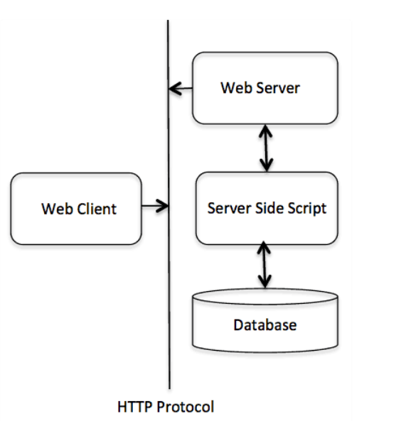
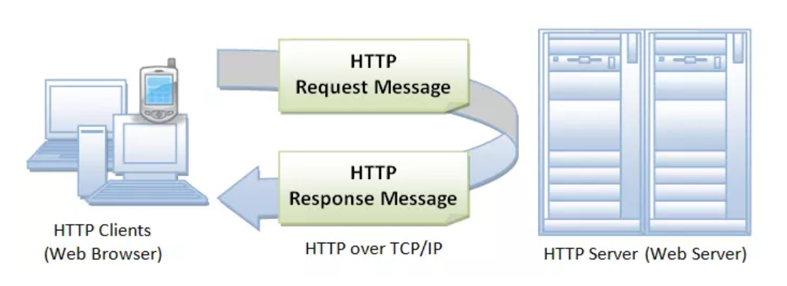
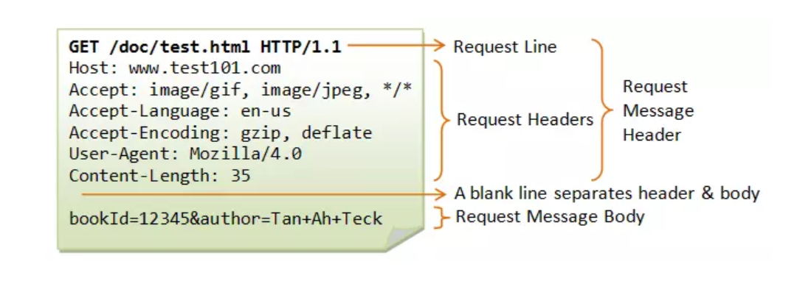
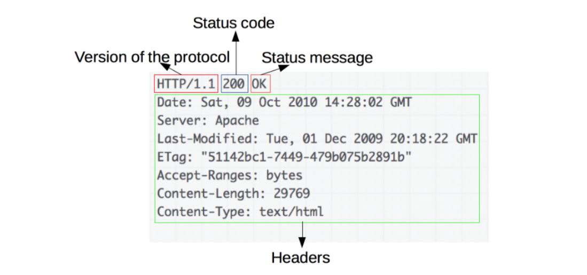

# ***Tìm hiểu về giao thức HTTP***
## ***HTTP là gì***

HTTP (Hypertext Transfer Protocol) là giao thức truyền tải siêu văn bản, là 1 trong các giao thức chuẩn của mạng Internet.

HTTP truyền tải thông tin cho dữ liệu giữa Web Server và Web Client trong mô hình Client/Server dùng cho World Wide Web(WWW). Nơi các tài liệu siêu văn bản(hypertext) bao gồm các siêu liên kết (hyperlinks) đến tài nguyên mà người dùng có thể dễ dàng truy cập.

HTTP là giao thức thuộc tầng ứng dụng, trên cơ sở TCP/IP. Cổng mặc định mà HTTP sử dụng là 80.
## ***Các đặc trưng cơ bản của HTTP***
- **HTTP là giao thức connectionless** (kết nối không liên tục) : ví dụ như HTTP Client khởi tạo 1 request, Client sẽ ngắt kết nối từ Server và đợi cho 1 phản hồi, Server xử lí request và thiết lập lại sự kết nối với Client để gửi phản hồi trở lại.
- **HTTP là một phương tiện độc lập** : Bất cứ loại dữ liệu nào cũng có thể được gửi bởi HTTP, miễn là Server và Client  biết cách kiểm soát nội dung dữ liệu. Nó được yêu cầu cho Client cũng như Server để xác định kiểu nội dung bởi sử dụng kiểu MIME (Multipurpose Internet Mail Extensions - Giao thức mở rộng thư điện tử Internet đa mục đích) thích hợp.
- **HTTP là stateless (không trạng thái)** : Request hiện tại không biết những gì đã hoàn thành trong request trước đó.

## ***Cấu trúc cơ bản của HTTP***
HTTP hoạt động dựa trên mô hình Client–Server. Trong mô hình này, các máy tính của người dùng sẽ đóng vai trò làm máy khách (Client). Sau một thao tác nào đó của người dùng, các máy khách sẽ gửi yêu cầu đến máy chủ (Server) và chờ đợi câu trả lời từ những máy chủ này.

**Client** gửi một yêu cầu tới Server theo mẫu của một phương thức yêu cầu, URI(Uniform Resource Identifier - định dạng tài nguyên thống nhất), và phiên bản giao thức, được theo bởi một thông báo MIME chứa các bộ chỉnh sửa yêu cầu, thông tin Client, và nội dung đối tượng có thể qua một kết nối TCP/IP.

**Server** phản hồi với một dòng trạng thái, bao gồm phiên bản giao thức của thông báo và một mã code trạng thái thành công hoặc lỗi, theo sau bởi một thông báo MIME chứa thông tin Server, thông tin thực thể đa phương tiện và nội dung đối tượng.


## ***URL***
URL được sử dụng để xác định duy nhất một tài nguyên trên web.

Cấu trúc URL
```
protocol://hostname:port/path-and-file-name
```

Trong đó:
- `protocol` : giao thức tầng ứng dụng được sử dụng bởi client và server. (http, https, ...)
- `hostname` : tên DNS domain
- `port` : cổng TCP để Server lắng nghe REQUEST từ Client
- `path-and-file-name` : tên và vị trí của tài nguyên

## ***Session***
Trong giao thức HTTP, mỗi session bao gồm 3 giai đoạn(bắt tay 3 bước TCP)
- Client thiết lập kết nối TCP tới Server (hoặc 1 kết nối thích hợp khác nếu tầng vận chuyển không sử dụng TCP)
- Client gửi request và đợi phản hồi
- Server nhận được request sẽ phản hồi lại cho Client cung cấp status code và dữ liệu phù hợp.

Session được lưu trên máy Server. Nó chứa dữ liệu người sử dụng web vào 1 file trên server.
## ***Proxy***

Giữa client và server có rất nhiều các thực thể, nó gọi là các Proxy. Nó thực hiện các hoạt động khác nhau như:
- `caching`(lưu trữ) : cache có thể là công khai hoặc riêng tư, giống bộ đệm trình duyệt
- `filtering`(lọc) : như quét virus hoặc kiểm soát
- `load balancing` (cân bằng tải) : cho phép nhiều máy chủ phục vụ các yêu cầu khác nhau
- `authentication`(xác thực) : kiểm soát truy cập các tài nguyên khác nhau
- `logging` (đăng nhập) : cho phép lưu trữ thông tin đăng nhập

## ***HTTP Message***
Là cách để trao đổi dữ liệu giữa client và server.

HTTP messeges gồm 3 phần là :Start line , Header, Body

HTTP Message có 2 loại:

- REQUESTS
- RESPONSES
## ***Request & Response***

### ***REQUEST (Yêu cầu)***
#### **Request bao gồm các yếu tố sau:**

##### - HTTP Method: Thao tác mà Client muốn thực hiện
- `GET`: Dùng để truy xuất dữ liệu từ Server
- `POST`: Đẩy dữ liệu lên Server
- `HEAD`: Lấy phần Header của `Response`
- `PUT`: Tạo một tài nguyên mới hoặc thay thế tài nguyên đích
- `DELETE`: Xóa tài nguyên chỉ định
- `TRACE`: Thực hiện 1 vòng lặp kiểm tra message theo đường dẫn tới tài nguyên đích, cung cấp cơ chế debug hữu ích
- `CONNECT`: Được sử dụng để bảo proxy thiết lập một kết nối tới một host khác với nội dung trao đổi đơn giản, không cần phải cố gắng phân tích hay cache nó. Nó thường được dùng để thực hiện kết nối SSL thông qua proxy.
- `OPTION`: Dùng để mô tả các tùy chọn để giao tiếp với tài nguyên đích. Client có thể chỉ định URL cho phương thức OPTION hoặc dấu hoa thị (*) để chỉ toàn bộ máy chủ
- `PATCH`: Dùng để sửa đổi một phần cho một tài nguyên.
### ***RESPONSE (Phản hồi)***
Ví dụ về HTTP Response:


#### **Response gồm các yếu tố sau**
##### - Version of the protocol: Phiên bản giao thức HTTP mà nó tuân theo.
##### - Status code: Mô tả trạng thái của Request

- `1XX` (100-101): (Informatinal-Thông tin) Yêu cầu được chấp nhận hoặc quá trình đang tiếp tục
- `2XX` (200-206): (Success-Thành công) Requests đã được phía server tiếp nhận, hiểu và xử lý thành công
- `3XX` (300-307): (Redirection-Chuyển hướng) Mã này cho biết client cần có thêm action để hoàn thành requests
- `4XX` (400-417): (Client Error-Lỗi trên Client) Requests chứa cú pháp không chính xác hoặc không thể thực hiện
- `5XX` (500-505): (Server Error-Lỗi trên Server) Server thất bại với việc thực hiện một requests
##### - Status message: Mô tả của Status Code
##### - Header: Tiêu đề của Response
##### - Body : Chứa tài nguyên


