# ***Vòng lặp Python***
Python có hai lệnh vòng lặp nguyên thủy:

1. vòng lặp while
2. vòng lặp for
# ***Vòng lặp `while`***
Với vòng lặp while , chúng ta có thể thực thi một tập hợp các câu lệnh miễn là điều kiện còn đúng.
VD
```
i = 1
while i < 6:
  print(i)
  i += 1
```
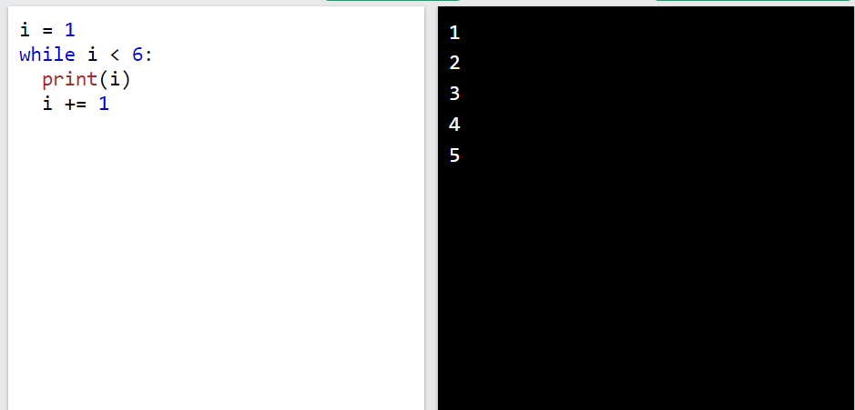
## ***Lệnh `break`***
Với câu lệnh break chúng ta có thể dừng vòng lặp ngay cả khi điều kiện while đúng:

VD: Thoát khỏi vòng lặp khi i lên 3:
``` 

i = 1
while i < 6:
  print(i)
  if i == 3:
    break
  i += 1
```
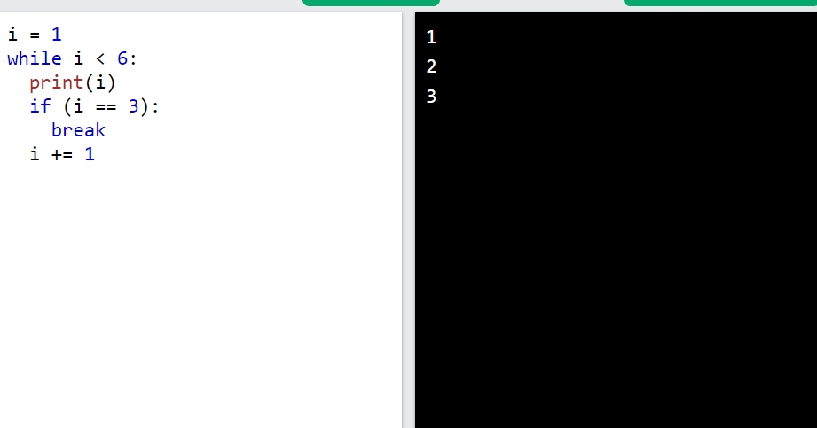
## ***Lệnh `continue`***
Với câu lệnh continue , chúng ta có thể dừng lần lặp hiện tại và tiếp tục với lần lặp tiếp theo:
VD: Tiếp tục bước lặp tiếp theo nếu i là 3:
```
i = 0
while i < 6:
  i += 1
  if i == 3:
    continue
  print(i)
```
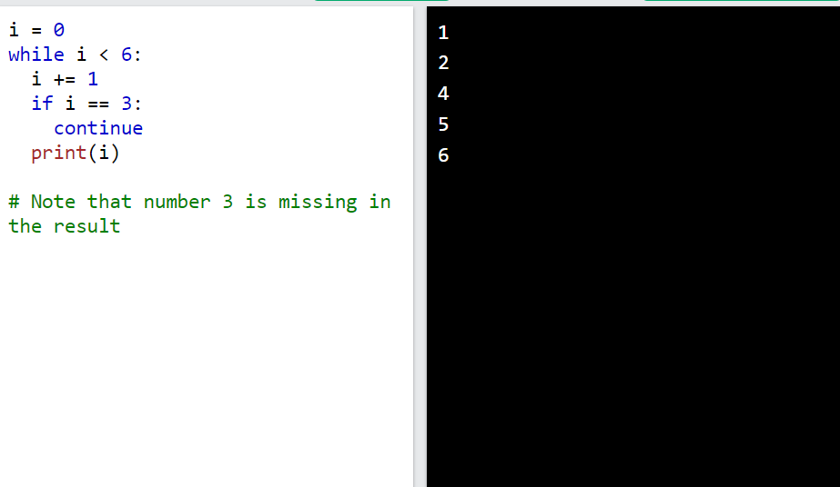
## ***Với lệnh `else`***
Với câu lệnh else chúng ta có thể chạy một khối mã một lần khi điều kiện không còn đúng nữa:

VD: In thông báo khi điều kiện sai:
```
i = 1
while i < 6:
  print(i)
  i += 1
else:
  print("i is no longer less than 6")
```
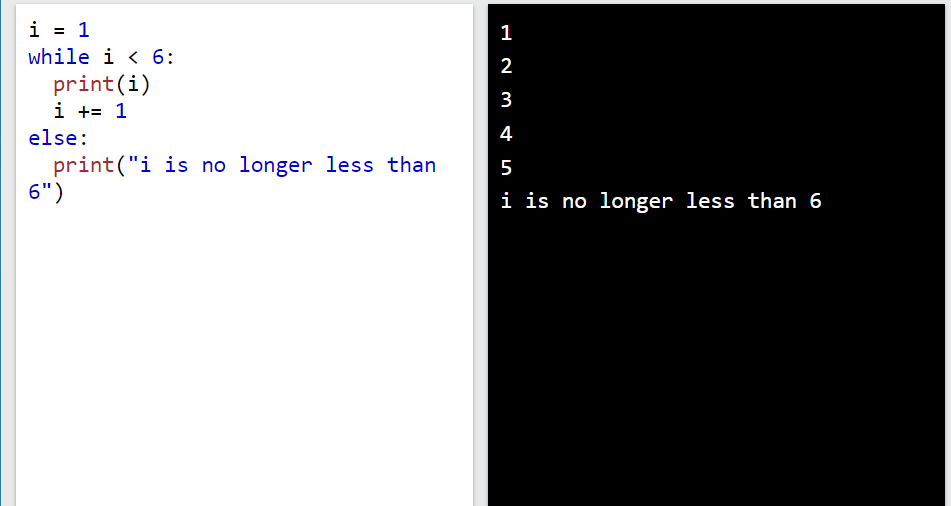

# ***Vòng lặp `for`***
Vòng lặp for được sử dụng để lặp lại một chuỗi (đó là danh sách, bộ dữ liệu, từ điển, tập hợp hoặc chuỗi).

Điều này ít giống với từ khóa for trong các ngôn ngữ lập trình khác và hoạt động giống một phương thức lặp hơn như được tìm thấy trong các ngôn ngữ lập trình hướng đối tượng khác.

Với vòng lặp for , chúng ta có thể thực thi một tập hợp các câu lệnh, một lần cho mỗi mục trong danh sách, bộ dữ liệu, tập hợp, v.v.
VD: In từng loại trái cây trong danh sách trái cây:

```
fruits = ["apple", "banana", "cherry"]
for x in fruits:
  print(x)
```
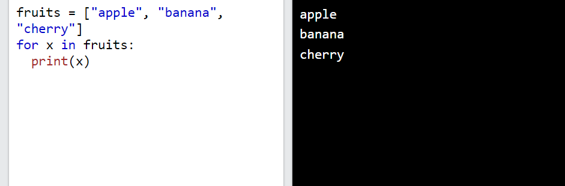

## ***Vòng lặp qua chuỗi***
Ngay cả các chuỗi cũng là các đối tượng có thể lặp lại, chúng chứa một chuỗi ký tự:
VD: Lặp lại các chữ cái trong từ "banana":
```
for x in "banana":
  print(x) 
```
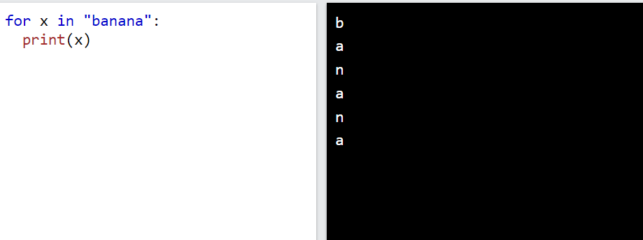

## ***Lệnh `break`***
Với câu lệnh break , chúng ta có thể dừng vòng lặp trước khi nó lặp qua tất cả các mục:
VD: Thoát khỏi vòng lặp khi xlà "banana":
```
fruits = ["apple", "banana", "cherry"]
for x in fruits:
  print(x)
  if x == "banana":
    break
```
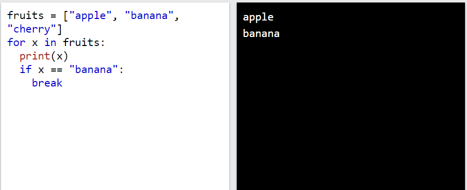

VD: Thoát khỏi vòng lặp khi xlà "banana", nhưng lần này dấu ngắt xuất hiện trước khi in:
```
fruits = ["apple", "banana", "cherry"]
for x in fruits:
  if x == "banana":
    break
  print(x)
```
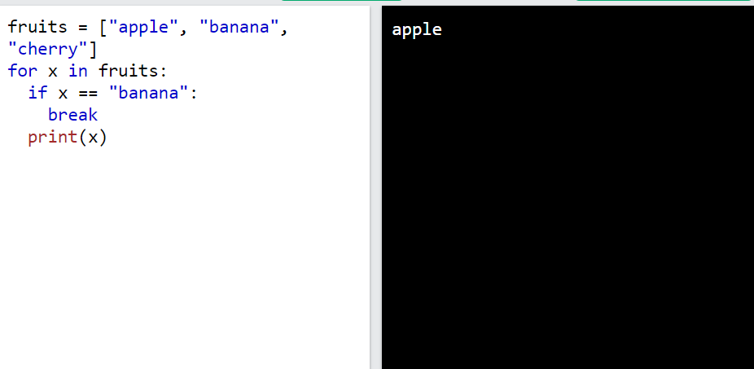
## ***Lệnh `continue`***
Với câu lệnh continue , chúng ta có thể dừng vòng lặp hiện tại và tiếp tục với vòng lặp tiếp theo:

VD
```
fruits = ["apple", "banana", "cherry"]
for x in fruits:
  if x == "banana":
    continue
  print(x)
```
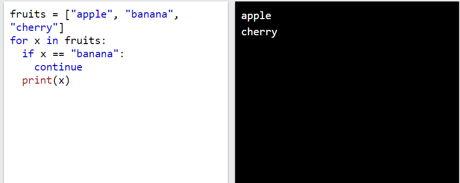

## ***Hàm `range()`***
Để lặp qua một bộ mã với số lần xác định, chúng ta có thể sử dụng hàm range() ,
Hàm range() trả về một chuỗi số, bắt đầu từ 0 theo mặc định và tăng dần thêm 1 (theo mặc định) và kết thúc ở một số được chỉ định.

VD
```
for x in range(6):
  print(x)
```
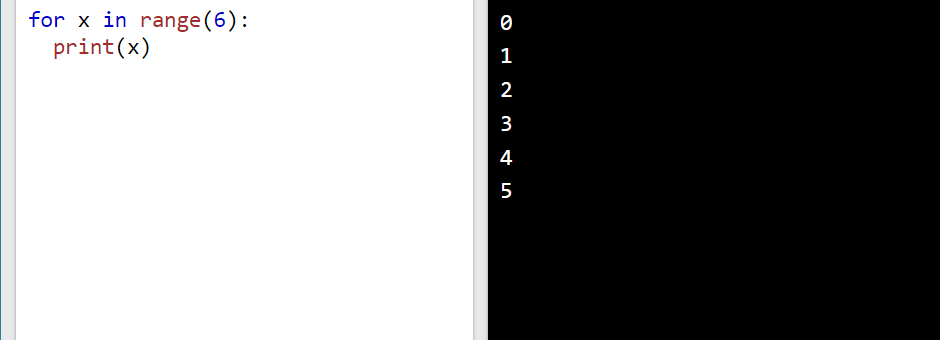
Hàm range() mặc định là 0 làm giá trị bắt đầu, tuy nhiên có thể chỉ định giá trị bắt đầu bằng cách thêm tham số: range(2, 6) , nghĩa là các giá trị từ 2 đến 6 (nhưng không bao gồm 6):
VD
```
for x in range(2, 30, 3):
  print(x)
```
Hàm range() mặc định tăng chuỗi lên 1, tuy nhiên có thể chỉ định giá trị tăng bằng cách thêm tham số thứ ba: range(2, 30, 3 ) :
VD
```
for x in range(2, 30, 3):
  print(x)
```
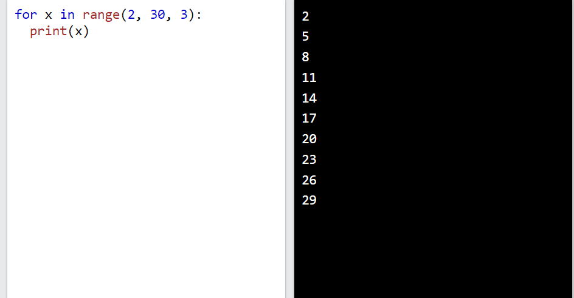

## ***else trong vòng lặp `for`***
Từ khóa `else` trong vòng lặp `for` chỉ định khối mã sẽ được thực thi khi vòng lặp kết thúc:
VD: In tất cả các số từ 0 đến 5 và in thông báo khi vòng lặp kết thúc:

```
for x in range(6):
  print(x)
else:
  print("Finally finished!")
```
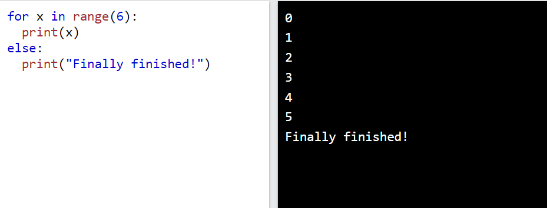
## ***Vòng lặp lồng nhau***
Vòng lặp lồng nhau là vòng lặp bên trong vòng lặp.

"Vòng lặp bên trong" sẽ được thực thi một lần cho mỗi lần lặp của "vòng lặp bên ngoài":
VD: In mỗi tính từ cho mỗi loại trái cây:
```
adj = ["red", "big", "tasty"]
fruits = ["apple", "banana", "cherry"]

for x in adj:
  for y in fruits:
    print(x, y)
```
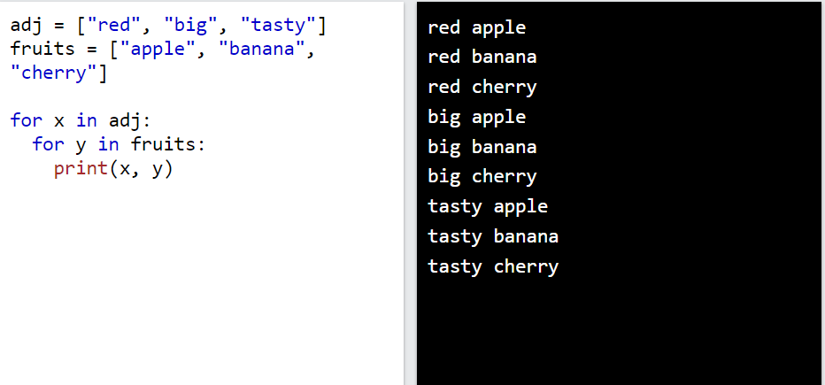

## ***Lệnh `pass`
 Các vòng lặp `for` không thể trống, nhưng nếu vì lý do nào đó bạn có một vòng lặp `for `không có nội dung, hãy đưa vào câu lệnh `pass` để tránh gặp lỗi.
 VD
 ```
 for x in [0, 1, 2]:
  pass
 ```