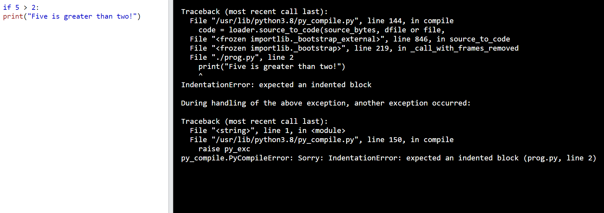
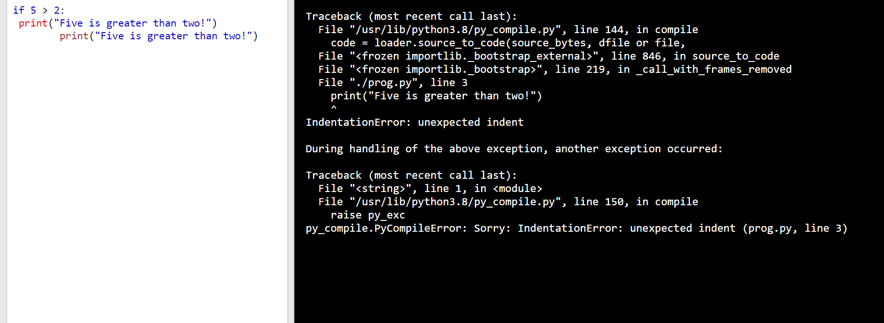

# ***Thực thi cú pháp python***

Cú pháp python được thực thi bằng cách viết trực tiếp vào dòng lệnh
```
>>> print("Hello, World!")
Hello, World!
```
Hoặc có thể tạo tệp python và chạy  tệp đó

# ***Thụt lề python***

Thụt lề đề cập đến khoảng trắng ở đầu dòng mã. 
Trong khi các ngôn ngữ lập trình khác việc thụt lề trong mã chỉ nhằm mục đích dễ đọc thì việc thụt lề trong python rất quan trọng
Python sử dụng thụt lề để biểu thị một khối mã 
```if 5 > 2:
  print("Five is greater than two!")

```

Python sẽ báo lỗi nếu bạn bỏ qua phần thụt đầu dòng
```
if 5 > 2:
print("Five is greater than two!")
```

Số lượng khoảng trắng tùy thuộc vào bạn, cách sử dụng phổ biến nhất là bốn, nhưng ít nhất phải có một
```
if 5 > 2:
 print("Five is greater than two!") 
if 5 > 2:
        print("Five is greater than two!") 
```
Phải sử dụng cùng số khoảng trắng trong cùng một khối mã nếu không python sẽ báo lỗi 

```
if 5 > 2:
 print("Five is greater than two!")
        print("Five is greater than two!")
```


# ***Biến Python***
Trong python, các biến được tạo khi bạn gán giá trị cho nó
```
x = 5
y = "Hello, World!"
```
Python không có lệnh khai báo biến

# ***Comment trong python***
Nhận xét bắt đầu bằng `#` và python sẽ hiển thị phần còn lại của dòng dưới dạng nhận xét 
```
#This is a comment.
print("Hello, World!")
```
# ***Tài liệu tham khảo***
<https://www.w3schools.com/python/python_syntax.asp>
