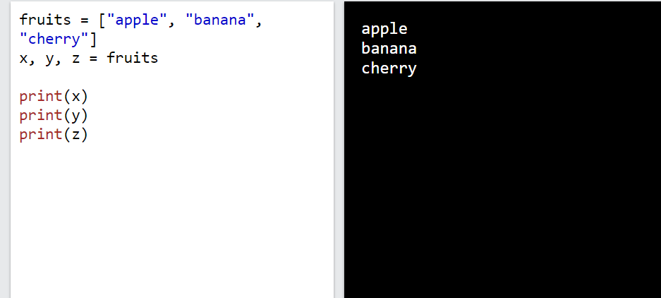
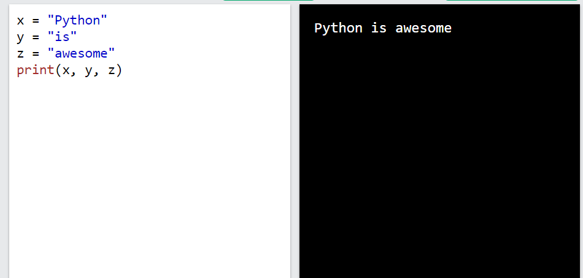
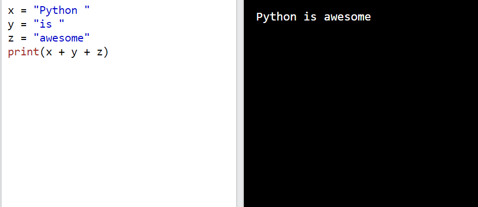
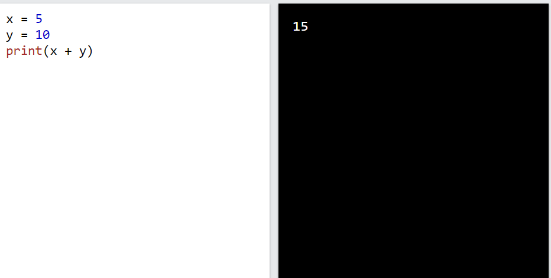
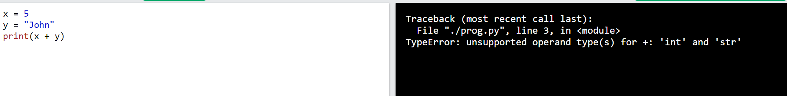
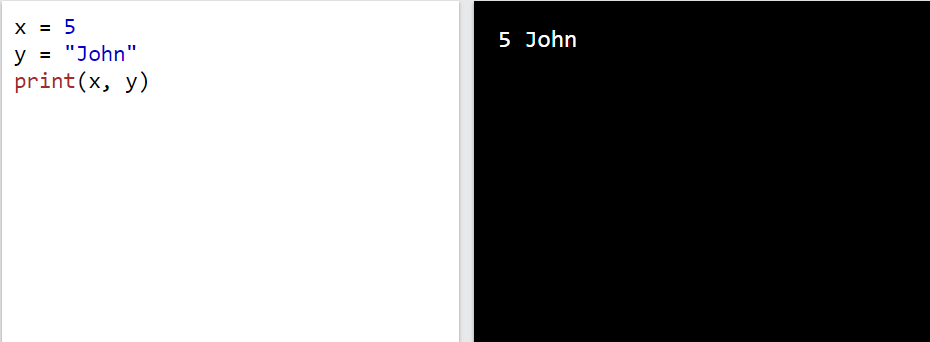
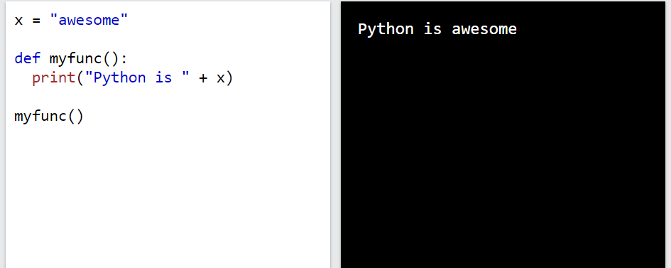
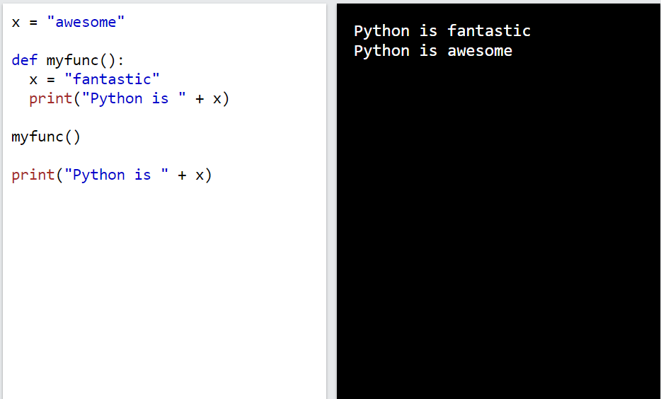
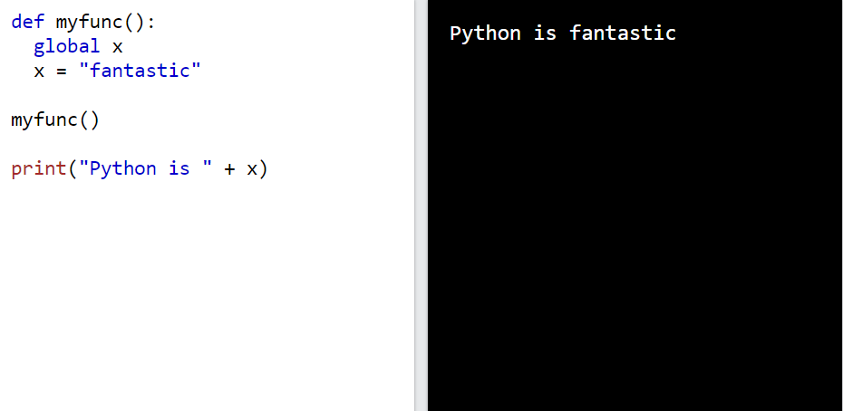
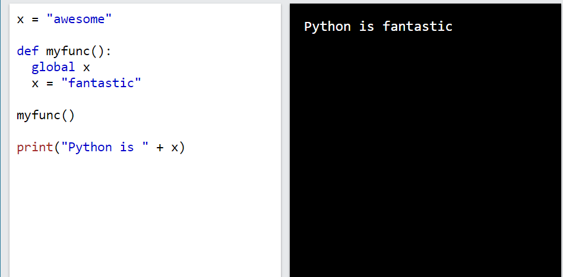

# ***Biến***
Biến là nơi chứa các giá trị dữ liệu

# ***Tạo biến***
1. Python không có lệnh khai báo biến
Một biến được tạo vào thời điểm gán giá trị cho nó
VD
```
x = 5
y = "John"
print(x)
print(y)
```
2. Các biến không cần phải khai báo với bất kỳ loại cụ thể nào và có thể thay đổi loại sau khi chúng được đặt

VD
```
x = 4       # x is of type int
x = "Sally" # x is now of type str
print(x)
```
## ***Casting***
Nếu bạn muốn chỉ định kiểu dữ liệu cho một biến, bạn có thể thực hiện bằng cách truyền 
VD
```
x = str(3)    # x will be '3'
y = int(3)    # y will be 3
z = float(3)  # z will be 3.0
```
## ***Lấy thông tin về kiểu dữ liệu của biến***
Bạn có thể lấy thông tin kiểu dữ liệu cho biến bằng hàm `type()`
VD
```
x = 5
y = "John"
print(type(x))
print(type(y))
```
## ***Single or Double Quotes***
Biến chuỗi có thể được khai báo bằng dấu ngoặc đơn hoặc dấu ngoặc kép
VD
```
x = "John"
# is the same as
x = 'John'
```

## ***Case-Sensitive***
Tên biến có phân biệt chữ hoa chữ thường 
VD
```
a = 4
A = "Sally"
#A will not overwrite a
```


# ***Tên biến***
Một biến có thể có tên ngắn(x,y) hoặc tên mang tính chất mô tả hơn(age, name, total_volume...). Quy tắc biến trong Python
1. Tên biến phải bắt đầu bằng một chữ cái hoặc dấu gạch dưới
2. Tên biến không thể bắt đầu bằng số
3. Tên biến chỉ có thể chứa các ký tự chữ, số và dấu gạch dưới
4. Tên biến có phân biệt chữ hoa, chữ thường
5. Tên biến không phải là bất kỳ từ khóa nào trong python
VD
Cách đặt tên đúng
```
myvar = "John"
my_var = "John"
_my_var = "John"
myVar = "John"
MYVAR = "John"
myvar2 = "John"
```

Cách đặt tên không đúng
```
2myvar = "John"
my-var = "John"
my var = "John"

#This example will produce an error in the result
```
## ***Tên biến nhiều từ***
Tên biến có thể có nhiều hơn một từ có thể khó đọc
Có một số kỹ thuật có thể sử dụng để làm cho chúng dễ đọc hơn
### ***Camel Case***
Mỗi từ ngoại trừ từ đầu tiên bắt đầu bằng chũ in hoa
VD
```
myVariableName = "John"
```

### ***Pascal Case***
Mỗi từ bắt đầu bằng một chữ in hoa
VD
```
MyVariableName = "John"
```
### ***Snake Case***

Mỗi từ được phân cách bằng dấu gạch dưới
VD
```
my_variable_name = "John"
```

## ***Gán nhiều giá trị python***

### ***Gán nhiều giá trị cho nhiều biến***

Python cho phép gán nhiều giá trị cho nhiều biến trên một dòng

VD
```
x, y, z = "Orange", "Banana", "Cherry"
print(x)
print(y)
print(z)
```
### ***Gán một giá trị cho nhiều biến***
VD
```
x = y = z = "Orange"
print(x)
print(y)
print(z)
```

### ***Unpack a Collection***
Nếu bạn có một tập hợp các giá trị trong một danh sách, bộ dữ liệu, v.v. Python cho phép bạn trích xuất các giá trị thành các biến. Điều này được gọi là Unpack.
VD
```
fruits = ["apple", "banana", "cherry"]
x, y, z = fruits
print(x)
print(y)
print(z)
```

## ***Output Variables***

1. Hàm `print()` của python được sử dụng để xuất các biến


VD
```
x = "Python is awesome"
print(x)
```

2. Trong hàm `print()` xuất ra nhiều biến được phân tách bằng dấu phẩy 

VD
```
x = "Python"
y = "is"
z = "awesome"
print(x, y, z)
```


3. Có thể sử dụng toán tử `+` để xuất nhiều biến

VD
```
x = "Python "
y = "is "
z = "awesome"
print(x + y + z)
```

```Lưu ý ký tự khoảng trắng sau "Python " và "is ", nếu không có chúng thì kết quả sẽ là "Pythonisawesome"```

4. Đối với số kí tự `+` hoạt động như một toán tử toán học 

VD
```
x = 5
y = 10
print(x + y)
```

5. Trong hàm print(), khi bạn cố gắng kết hợp một chuỗi và một số bằng toán tử +, Python sẽ báo lỗi:

VD
```
x = 5
y = "John"
print(x + y)
```

6. Cách tốt nhất để xuất nhiều biến trong hàm print() là phân tách chúng bằng dấu phẩy, thậm chí dấu phẩy này còn hỗ trợ các loại dữ liệu khác nhau:

VD
```
x = 5
y = "John"
print(x, y)
```


## ***Global Variables***
Các biến được tạo bên ngoài hàm (như trong tất cả các ví dụ trên) được gọi là biến toàn cục.

Mọi người đều có thể sử dụng biến toàn cục, cả bên trong và bên ngoài hàm.

VD
```
x = "awesome"

def myfunc():
  print("Python is " + x)

myfunc()

```

2. Nếu bạn tạo một biến có cùng tên bên trong hàm, biến này sẽ là biến cục bộ và chỉ có thể được sử dụng bên trong hàm. Biến toàn cục có cùng tên sẽ giữ nguyên, toàn cục và có giá trị ban đầu.

VD
```
x = "awesome"

def myfunc():
  x = "fantastic"
  print("Python is " + x)

myfunc()

print("Python is " + x)
```

### ***The global Keyword***

Thông thường, khi bạn tạo một biến bên trong hàm, biến đó là biến cục bộ và chỉ có thể được sử dụng bên trong hàm đó.

1. Để tạo biến toàn cục bên trong hàm, bạn có thể sử dụng từ khóa `global`.

VD
```
def myfunc():
  global x
  x = "fantastic"

myfunc()

print("Python is " + x)
```

2. Để thay đổi giá trị của biến toàn cục bên trong hàm, hãy tham chiếu biến đó bằng cách sử dụng từ khóa `global`:

VD
```
x = "awesome"

def myfunc():
  global x
  x = "fantastic"

myfunc()

print("Python is " + x)

```



# ***Tài liệu tham khảo***

<https://www.w3schools.com/python/python_variables.asp>

