# ***Built-in Data Types***

Trong lập trình, kiểu dữ liệu là một khái niệm quan trọng.

Các biến có thể lưu trữ dữ liệu thuộc nhiều loại khác nhau và các loại khác nhau có thể thực hiện những việc khác nhau.

Theo mặc định, Python có các kiểu dữ liệu sau được tích hợp sẵn, thuộc các danh mục sau:

```
Text Type:	str
Numeric Types:	int, float, complex
Sequence Types:	list, tuple, range
Mapping Type:	dict
Set Types:	set, frozenset
Boolean Type:	bool
Binary Types:	bytes, bytearray, memoryview
None Type:	NoneType
```

# ***Lấy kiểu dữ liệu***
Bạn có thể lấy kiểu dữ liệu của bất kì đối tượng nào bằng hàm `type()`
VD
```
x = 5
print(type(x))
```
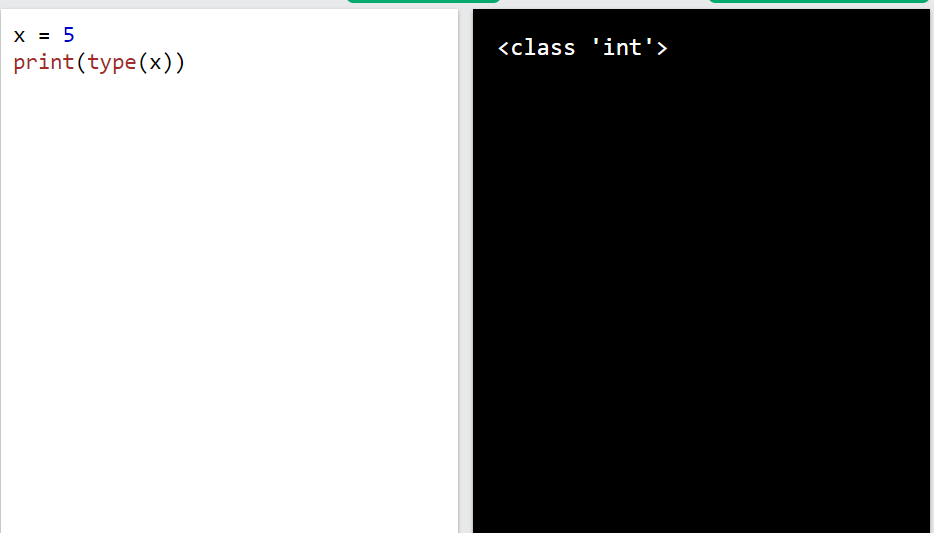
# ***Setting the Data Type***
Trong Python, kiểu dữ liệu được đặt khi bạn gán giá trị cho một biến:
VD
1. Kiểu dữ liệu `str`
```
x = "Hello World"

#display x:
print(x)

#display the data type of x:
print(type(x)) 
```
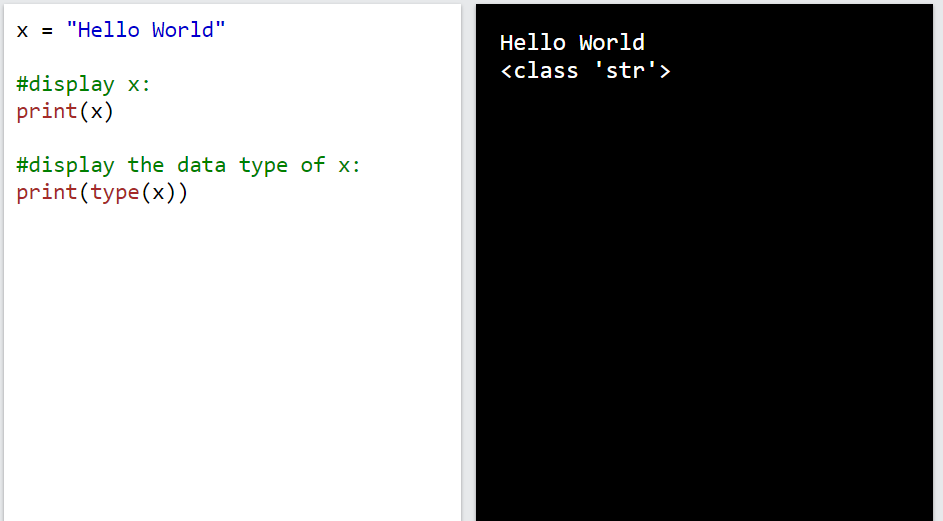
2. Kiểu dữ liệu `int`
```
x = 20

#display x:
print(x)

#display the data type of x:
print(type(x)) 
```
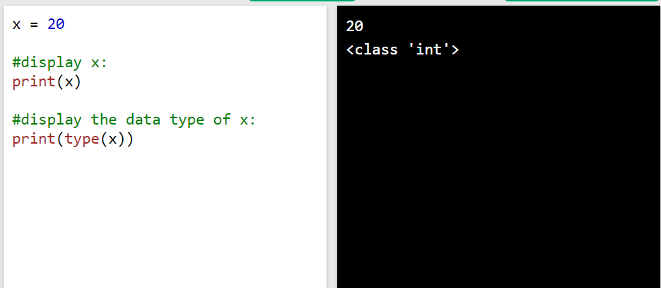
3. Kiểu dữ liệu `float`
```
x = 20.5

#display x:
print(x)

#display the data type of x:
print(type(x)) 

```
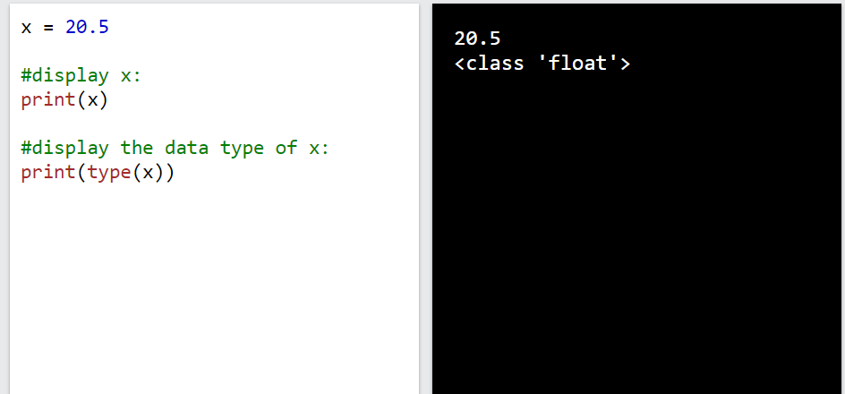
4. Kiểu dữ liệu `complex`


```
x = 1j

#display x:
print(x)

#display the data type of x:
print(type(x)) 
```
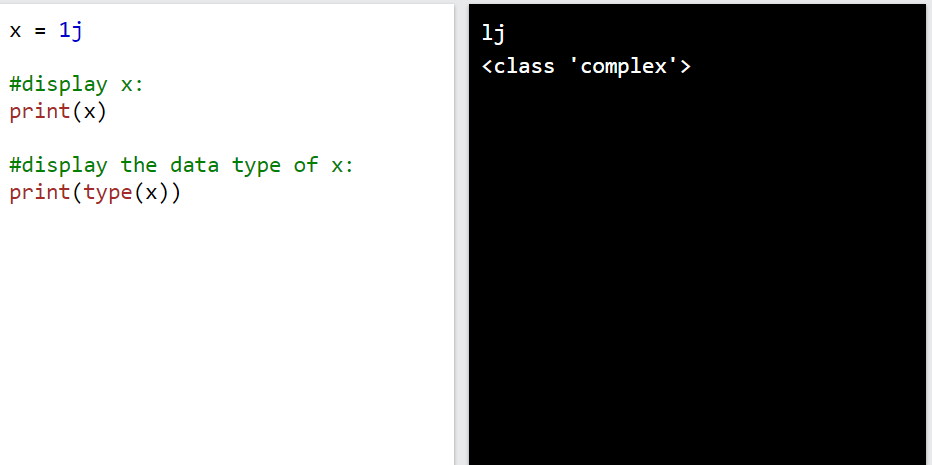
5. Kiểu dữ liệu `list`
```
x = ["apple", "banana", "cherry"]

#display x:
print(x)

#display the data type of x:
print(type(x)) 

```
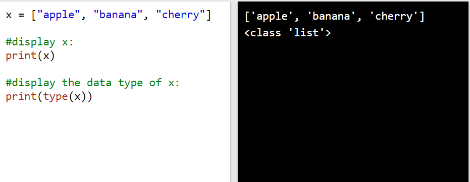
6. Kiểu dữ liệu `tuple`
```
x = ("apple", "banana", "cherry")

#display x:
print(x)

#display the data type of x:
print(type(x)) 

```
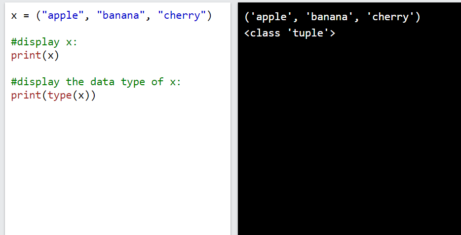
7. Kiểu dữ liệu `range`
```
x = range(6)

#display x:
print(x)

#display the data type of x:
print(type(x)) 

```
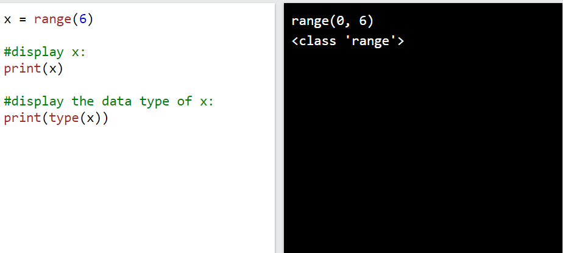
8. Kiểu dữ liệu `dict`
```
x = {"name" : "John", "age" : 36}

#display x:
print(x)

#display the data type of x:
print(type(x)) 

```
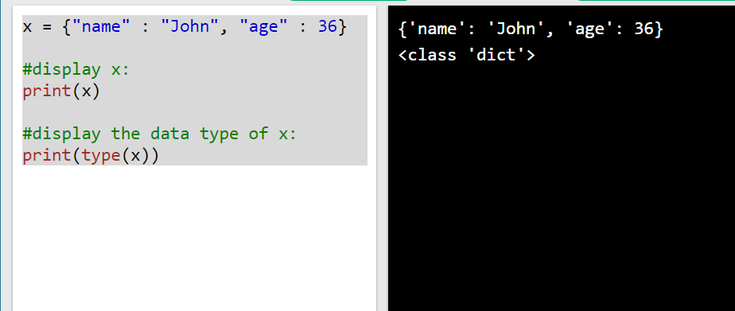
9. Kiểu dữ liệu `set`
```
x = {"apple", "banana", "cherry"}

#display x:
print(x)

#display the data type of x:
print(type(x)) 

```
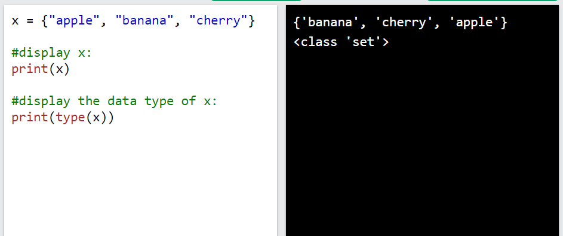
10. Kiểu dữ liệu `frozenset`
```
x = frozenset({"apple", "banana", "cherry"})

#display x:
print(x)

#display the data type of x:
print(type(x)) 

```
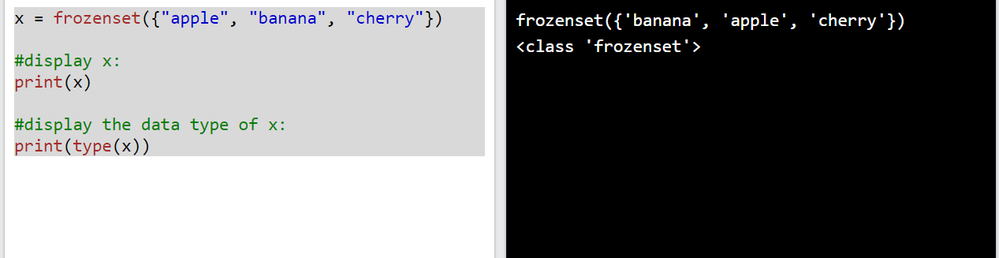
11. Kiểu dữ liệu `bool`
```
x = True

#display x:
print(x)

#display the data type of x:
print(type(x)) 

```
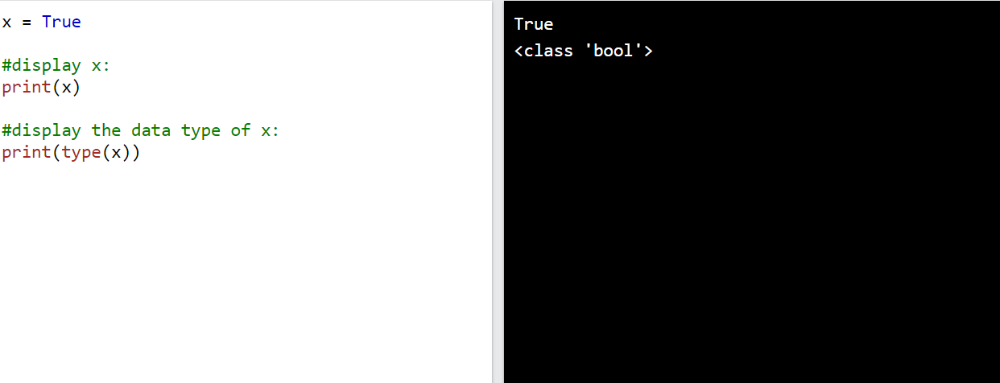
12. Kiểu dữ liệu `bytes`
```
x = b"Hello"

#display x:
print(x)

#display the data type of x:
print(type(x)) 

```
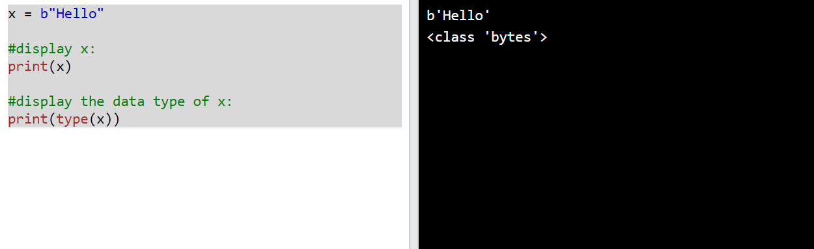
13. Kiểu dữ liệu `bytearray`
```
x = bytearray(5)

#display x:
print(x)

#display the data type of x:
print(type(x)) 

```
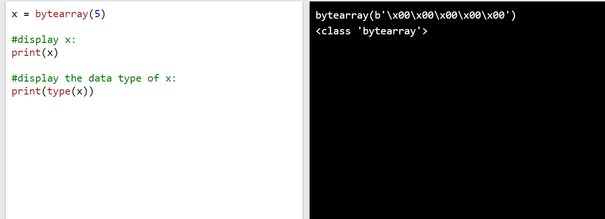
14. Kiểu dữ liệu `memoryview`
```
x = memoryview(bytes(5))

#display x:
print(x)

#display the data type of x:
print(type(x)) 
```
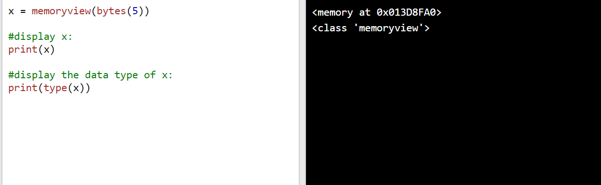
15. Kiểu dữ liệu `NoneType`
```
x = None

#display x:
print(x)

#display the data type of x:
print(type(x)) 

```
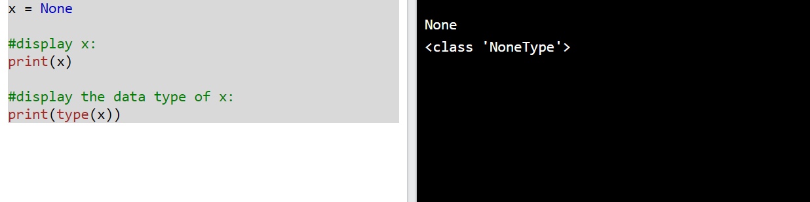

# ***Setting the Specific Data Type***
Nếu bạn muốn chỉ định kiểu dữ liệu, bạn có thể sử dụng các hàm tạo sau:
VD
```
1. Kiểu str
x = str("Hello World")
2. kiểu int
x = int(20)
3. Kiểu float
x = float(20.5)
4. Kiểu complex
x = complex(1j)
5. Kiểu list
x = list(("apple", "banana", "cherry"))
6. Kiểu tuple
x = tuple(("apple", "banana", "cherry"))
7. Kiểu range
x = range(6)
8. Kiểu dict
x = dict(name="John", age=36)
9. kiểu set
x = set(("apple", "banana", "cherry"))
10. Kiểu frozenset
x = frozenset(("apple", "banana", "cherry"))
11. kiểu bool
x = bool(5)
13. Kiểu bytes
x = bytes(5)
14. Kiểu bytearray
x = bytearray(5)
15. kiểu memoryview
x = memoryview(bytes(5))

```


## ***Kiểu dữ liệu số***
Có ba loại số trong Python:
```
int
float
complex
```
VD
```
x = 1    # int
y = 2.8  # float
z = 1j   # complex
```

Để xác minh loại của bất kỳ đối tượng nào trong Python, hãy sử dụng type()hàm:
VD
```
print(type(x))
print(type(y))
print(type(z))
```

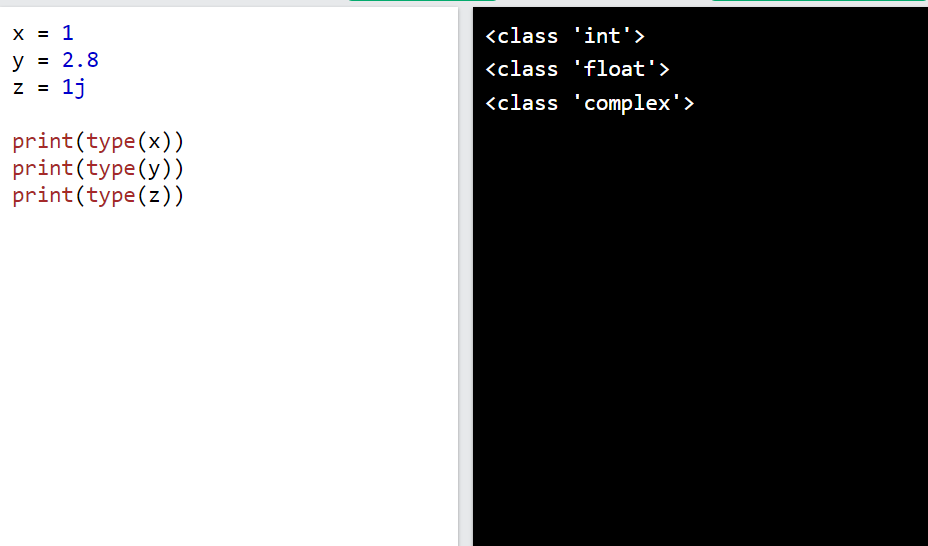
### ***Kiểu dữ liệu`int`***
`int` hoặc số nguyên là số nguyên, dương hoặc âm, không có số thập phân, có độ dài không giới hạn.
VD
```
x = 1
y = 35656222554887711
z = -3255522

print(type(x))
print(type(y))
print(type(z))
```

### ***Kiểu số liệu thực***
Số thực hoặc "số dấu phẩy động" là một số, dương hoặc âm, chứa một hoặc nhiều số thập phân.

VD
```
x = 1.10
y = 1.0
z = -35.59

print(type(x))
print(type(y))
print(type(z))
```
Số float cũng có thể là số khoa học có chữ "e" biểu thị lũy thừa của 10.

VD
```
x = 35e3
y = 12E4
z = -87.7e100

print(type(x))
print(type(y))
print(type(z))
```
### ***Kiểu dữ liệu phức***
Số phức được viết bằng chữ "j" là phần ảo:
VD
```
x = 3+5j
y = 5j
z = -5j

print(type(x))
print(type(y))
print(type(z))
```
### ***Chuyển đổi loại dữ liệu***
Bạn có thể chuyển đổi từ loại này sang loại khác bằng các phương thức `int(), float()và complex()`:

VD
```
x = 1    # int
y = 2.8  # float
z = 1j   # complex

#convert from int to float:
a = float(x)

#convert from float to int:
b = int(y)

#convert from int to complex:
c = complex(x)

print(a)
print(b)
print(c)

print(type(a))
print(type(b))
print(type(c))
```
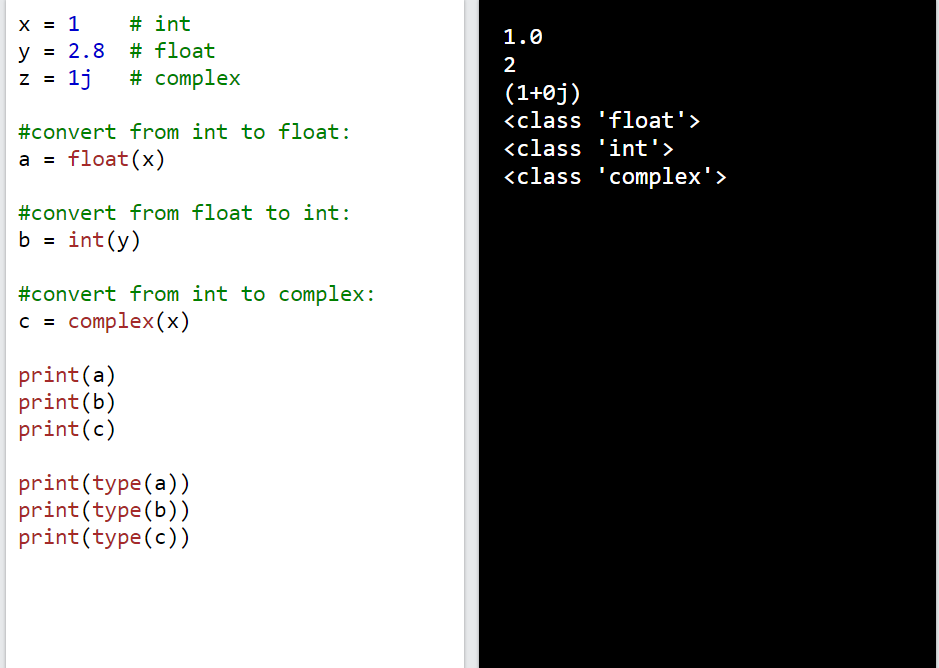

### ***Số ngẫu nhiên***
Python không có random()chức năng tạo số ngẫu nhiên, nhưng Python có một mô-đun tích hợp được gọi randomlà có thể được sử dụng để tạo số ngẫu nhiên:
VD
```
import random

print(random.randrange(1, 10))
```
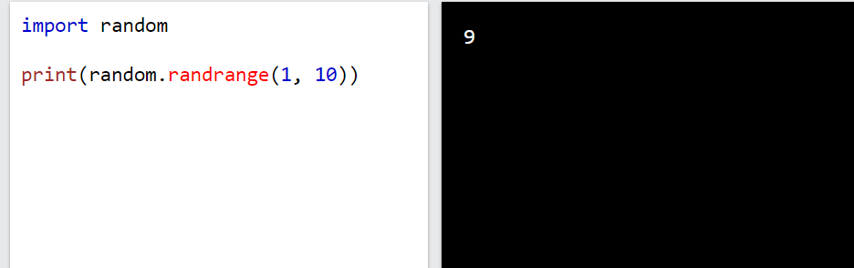

## ***Chỉ định kiểu dữ liệu***
1. `int()` - xây dựng một số nguyên từ một số nguyên, một số thực (bằng cách loại bỏ tất cả các số thập phân) hoặc một chuỗi ký tự (cung cấp chuỗi đại diện cho một số nguyên)
2. `float()` - xây dựng một số float từ một số nguyên, một số float hoặc một chuỗi ký tự (cung cấp chuỗi biểu thị một số float hoặc một số nguyên)
3. `str()` - xây dựng một chuỗi từ nhiều loại dữ liệu khác nhau, bao gồm chuỗi, ký tự nguyên và ký tự float

### ***Ví dụ***
1. Số nguyên

```
x = int(1)   # x will be 1
y = int(2.8) # y will be 2
z = int("3") # z will be 3
```
2. Số thực

```
x = float(1)     # x will be 1.0
y = float(2.8)   # y will be 2.8
z = float("3")   # z will be 3.0
w = float("4.2") # w will be 4.2
```
3. Kiểu chuỗi

```
x = str("s1") # x will be 's1'
y = str(2)    # y will be '2'
z = str(3.0)  # z will be '3.0'
```

## ***Kiểu dữ liệu chuỗi***
Các chuỗi trong python được bao quanh bởi dấu ngoặc đơn hoặc dấu ngoặc kép.

'xin chào' cũng giống như "xin chào" .

Bạn có thể hiển thị một chuỗi ký tự bằng hàm print():
VD
```
print("Hello")
print('Hello')
```

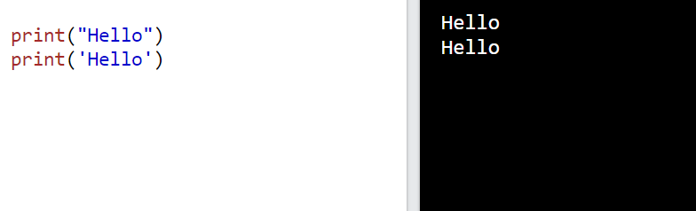

### ***Gán chuỗi cho một biến***
Việc gán một chuỗi cho một biến được thực hiện bằng tên biến theo sau là dấu bằng và chuỗi:
VD
```
a = "Hello"
print(a)
```

### ***Chuỗi nhiều dòng***
Bạn có thể gán một chuỗi nhiều dòng cho một biến bằng cách sử dụng ba dấu ngoặc kép:
VD
```
a = """Lorem ipsum dolor sit amet,
consectetur adipiscing elit,
sed do eiusmod tempor incididunt
ut labore et dolore magna aliqua."""
print(a)
```
Hoặc 3 dấu ngoặc đơn
VD
```
a = '''Lorem ipsum dolor sit amet,
consectetur adipiscing elit,
sed do eiusmod tempor incididunt
ut labore et dolore magna aliqua.'''
print(a)
```
### ***Chuỗi là mảng***
Giống như nhiều ngôn ngữ lập trình phổ biến khác, chuỗi trong Python là mảng byte biểu thị các ký tự unicode.

Tuy nhiên, Python không có kiểu dữ liệu ký tự, một ký tự đơn giản chỉ là một chuỗi có độ dài bằng 1.

Dấu ngoặc vuông có thể được sử dụng để truy cập các phần tử của chuỗi.

VD
```
a = "Hello, World!"
print(a[1])
```
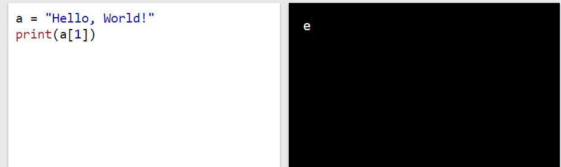

### ***Vòng lặp cho chuỗi***
Vì chuỗi là mảng nên chúng ta có thể lặp qua các ký tự trong chuỗi bằng vòng `for`lặp.
VD
```
for x in "banana":
  print(x)

```
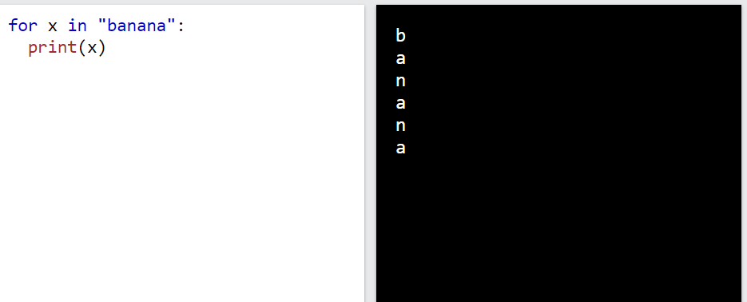

### ***Chiều dài chuỗi***
Để lấy độ dài của chuỗi, hãy sử dụng hàm len()
VD
```
a = "Hello, World!"
print(len(a))
```
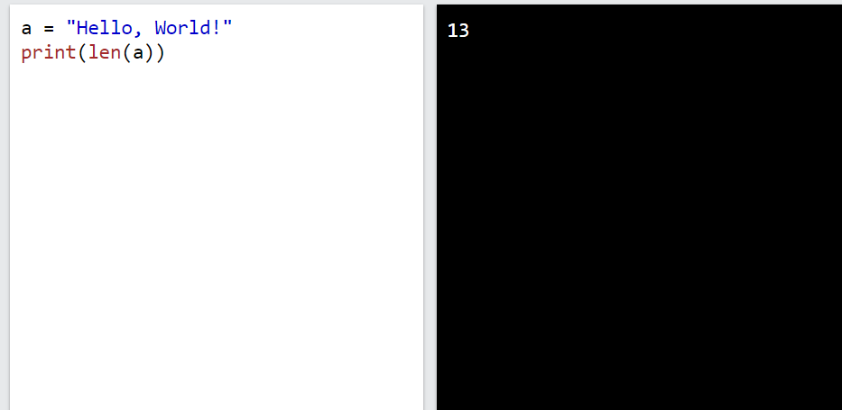

### ***Kiểm tra chuỗi***
Để kiểm tra xem một cụm từ hoặc ký tự nhất định có trong chuỗi hay không, chúng ta có thể sử dụng từ khóa `in`.
### ***Kiểm tra có***
VD
```
txt = "The best things in life are free!"
print("free" in txt)
```
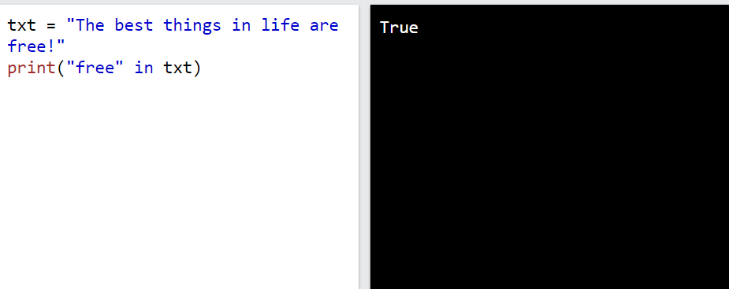
Sử dụng `if` để thông báo
VD
```
txt = "The best things in life are free!"
if "free" in txt:
  print("Yes, 'free' is present.")
```
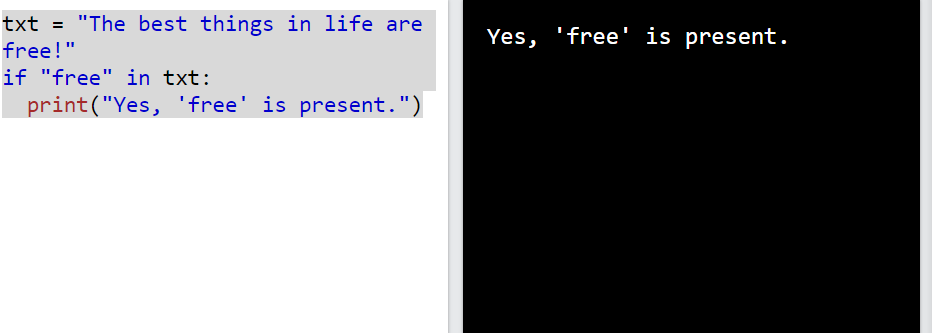

#### ***Kiểm tra không***
Để kiểm tra xem một cụm từ hoặc ký tự nhất định KHÔNG có trong chuỗi hay không, chúng ta có thể sử dụng từ khóa `not in`.
VD
```
txt = "The best things in life are free!"
print("expensive" not in txt)
```
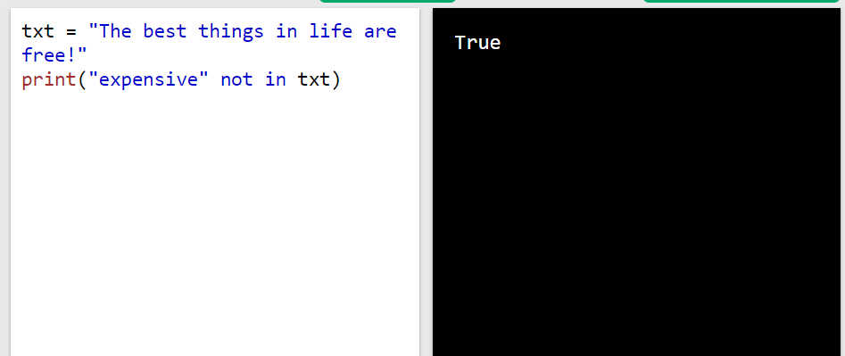

Sử dụng `if` để thông báo
VD
```
txt = "The best things in life are free!"
if "expensive" not in txt:
  print("No, 'expensive' is NOT present.")
```
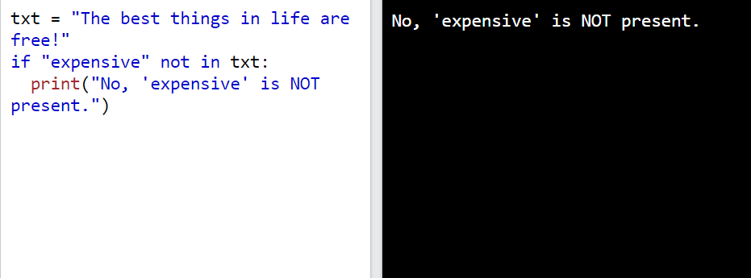

### ***(Slicing Strings)Trả về chuỗi theo phần chỉ định***
Bạn có thể trả về một phạm vi ký tự bằng cách sử dụng cú pháp chỉ định.

Chỉ định chỉ mục bắt đầu và chỉ mục kết thúc, cách nhau bằng dấu hai chấm, để trả về một phần của chuỗi.
VD
```
b = "Hello, World!"
print(b[2:5])
```
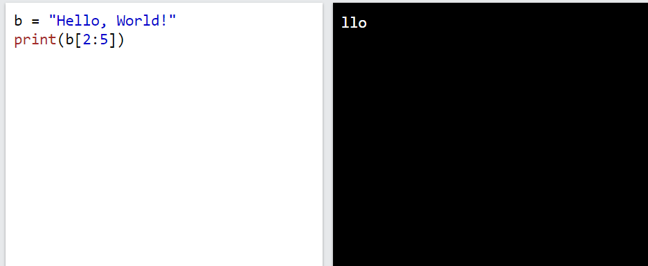
#### ***Lấy giá trị từ đầu***
Bằng cách bỏ chỉ mục bắt đầu, phạm vi sẽ bắt đầu ở ký tự đầu tiên:
VD
```
b = "Hello, World!"
print(b[:5])
```
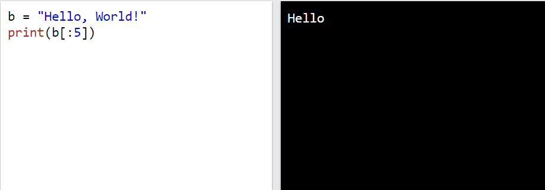

#### ***Lấy giá trị đến cuối***
Bằng cách bỏ chỉ mục cuối , phạm vi sẽ đi đến cuối:
VD
```
b = "Hello, World!"
print(b[2:])
```
