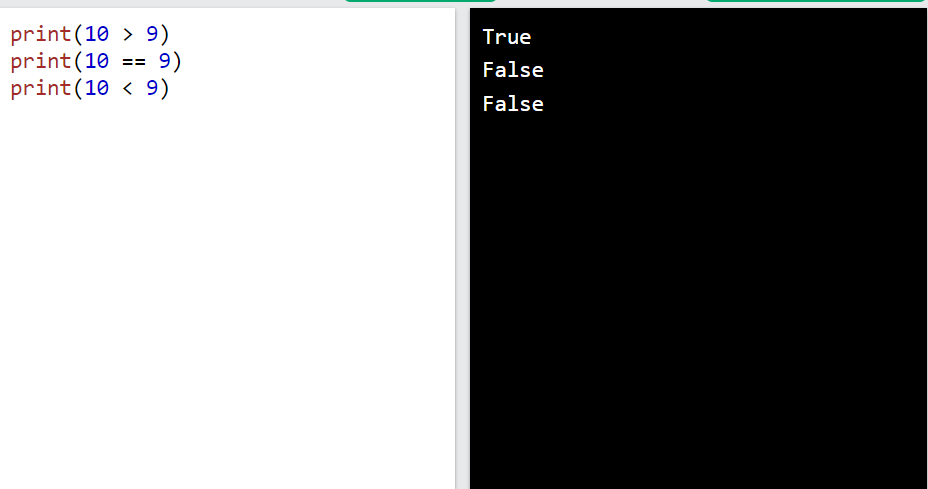
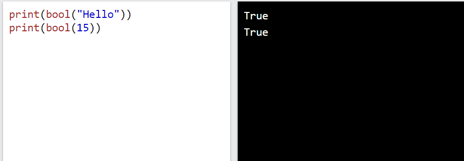
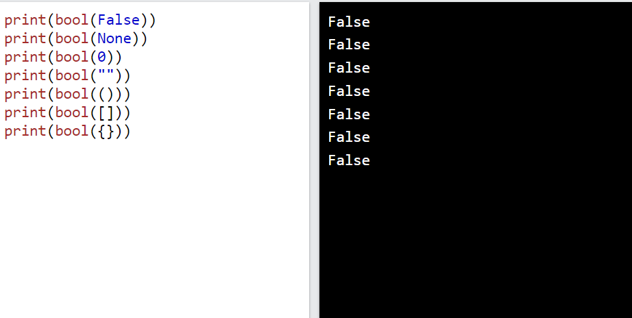
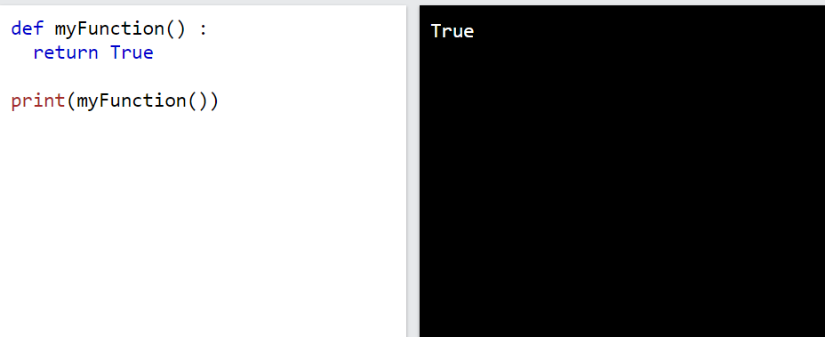
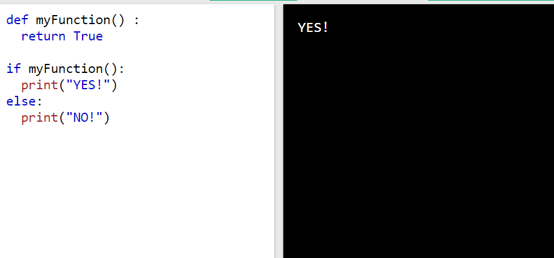
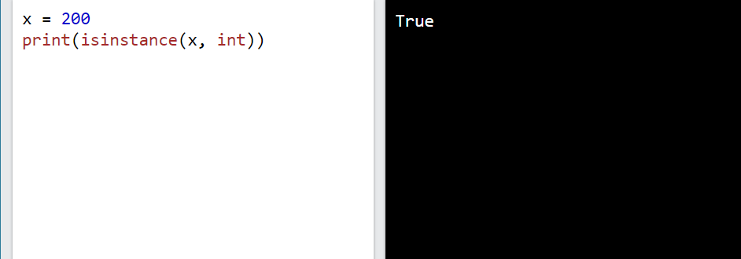

Booleans đại diện cho một trong hai giá trị: `True` hoặc `False`.
# ***Giá trị `boolean`***
Trong lập trình, bạn thường cần biết một biểu thức là Truehay False.

Bạn có thể đánh giá bất kỳ biểu thức nào trong Python và nhận được một trong hai câu trả lời Truehoặc False.

Khi bạn so sánh hai giá trị, biểu thức sẽ được đánh giá và Python trả về câu trả lời Boolean:
VD
```
print(10 > 9)
print(10 == 9)
print(10 < 9)
```


Khi bạn chạy một điều kiện trong câu lệnh if, Python trả về True or False:
VD
```
a = 200
b = 33

if b > a:
  print("b is greater than a")
else:
  print("b is not greater than a")
```

# ***Đánh giá giá trị và biến***
Hàm `bool()`cho phép bạn đánh giá bất kỳ giá trị nào và trả lại cho bạn `True` hoặc `False`
VD
```
print(bool("Hello"))
print(bool(15))
```

Đánh giá hai biến:
VD
```
x = "Hello"
y = 15

print(bool(x))
print(bool(y))
```
### ***Giá trị`True`***
Hầu hết mọi giá trị đều được đánh giá True nếu nó có một số loại nội dung.

Bất kỳ chuỗi nào đều là True, ngoại trừ chuỗi trống.

Mọi số đều là True, ngoại trừ 0.

Mọi danh sách, bộ, tập hợp và từ điển đều là True, ngoại trừ những danh sách trống.
VD trả về `true`
```
bool("abc")
bool(123)
bool(["apple", "cherry", "banana"])
```
### ***Giá trị `False`***
Trong thực tế, không có nhiều giá trị đánh giá False, ngoại trừ các giá trị trống, chẳng hạn như `(), [], {}, "", số 0và giá trị None`. Và tất nhiên giá trị `False` ước tính là False.

VD
```
bool(False)
bool(None)
bool(0)
bool("")
bool(())
bool([])
bool({})
```

### ***Các hàm có thể trả về một `boolean`***
VD
```
def myFunction() :
  return True

print(myFunction())
```


VD
```
def myFunction() :
  return True

if myFunction():
  print("YES!")
else:
  print("NO!")
```


Python cũng có nhiều hàm dựng sẵn trả về giá trị boolean, giống như hàm isinstance() , có thể được sử dụng để xác định xem một đối tượng có thuộc một kiểu dữ liệu nhất định hay không:
VD: Kiểm tra xem một đối tượng có phải là số nguyên hay không:
```
x = 200
print(isinstance(x, int))
```
