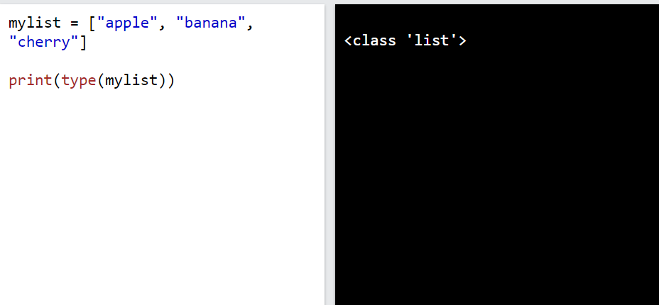

# ***Danh sách***
Danh sách được sử dụng để lưu trữ nhiều mục trong một biến duy nhất.

Danh sách là một trong 4 loại dữ liệu có sẵn trong Python dùng để lưu trữ các bộ sưu tập dữ liệu, 3 loại còn lại là Tuple , Set và Directory , tất cả đều có chất lượng và cách sử dụng khác nhau.

Danh sách được tạo bằng dấu ngoặc vuông:
VD
```
thislist = ["apple", "banana", "cherry"]
print(thislist)
```


Các mục trong danh sách được sắp xếp theo thứ tự, có thể thay đổi và cho phép các giá trị trùng lặp.

Các mục trong danh sách được lập chỉ mục, mục đầu tiên có chỉ mục [0], mục thứ hai có chỉ mục, [1]v.v.
## ***Cho phép trùng lặp***
Vì danh sách được lập chỉ mục nên danh sách có thể có các mục có cùng giá trị:
VD
```
thislist = ["apple", "banana", "cherry", "apple", "cherry"]
print(thislist)
```
## ***Độ dài danh sách***

Để xác định danh sách có bao nhiêu mục, hãy sử dụng hàm `len()`:
VD
```
thislist = ["apple", "banana", "cherry"]
print(len(thislist))
```

## ***Kiểu dữ liệu danh sách***
Các mục danh sách có thể thuộc bất kỳ loại dữ liệu nào:
```
list1 = ["apple", "banana", "cherry"]
list2 = [1, 5, 7, 9, 3]
list3 = [True, False, False]
```
Một danh sách có thể chứa các loại dữ liệu khác nhau:
VD
```
list1 = ["abc", 34, True, 40, "male"]
```
Từ quan điểm của Python, danh sách được định nghĩa là các đối tượng có kiểu dữ liệu 'danh sách':`<class 'list'>`
VD
```
mylist = ["apple", "banana", "cherry"]
print(type(mylist))
```


## ***Hàm tạo danh sách***
Cũng có thể sử dụng hàm tạo list() khi tạo danh sách mới.

VD
```
thislist = list(("apple", "banana", "cherry")) # note the double round-brackets
print(thislist)
```

