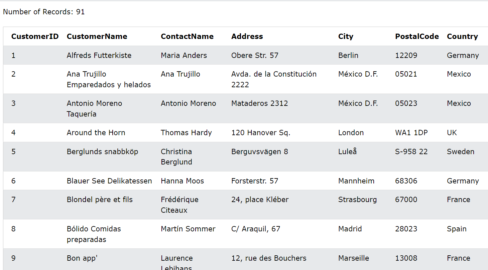

# ***SQL là gì***
- SQL là viết tắt của Structured Query Language(ngôn ngữ truy vấn có cấu trúc)
- SQL cho phép bạn truy cập và thao tác cơ sở dữ liệu
- SQL trở thành tiêu chuẩn của Viện Tiêu chuẩn Quốc gia Hoa Kỳ(ANSI) năm 1986 và của tổ chức Tiêu chuẩn hóa Quốc tế(ISO) năm 1987

# ***SQL có thể làm gì***
1. SQL có thể thực thi các truy vấn đối với cơ sở dữ liệu
2. SQL có thể lấy dữ liệu từ cơ sở dữ liệu
3. SQL có thể chèn các bản ghi trong cơ sở dữ liệu
4. SQL thể xóa các bản ghi khỏi cơ sở dữ liệu
5. SQL có thể tạo cơ sở dữ liệu mới
6. SQL có thể tạo bảng mới trong cơ sở dữ liệu
7. SQL có thể tạo các thủ tục lưu trữ trong cơ sở dữ liệu
8. SQL có thể tạo các khung nhìn trong cơ sở dữ liệu
9. SQL có thể đặt quyền trên bảng, thủ tục và dạng xem

# ***SQL là một tiêu chuẩn - NHƯNG***
Mặc dù SQL là tiêu chuẩn ANSI/ISO nhưng có nhiều phiên bản khác nhau của ngôn ngữ SQL.

Tuy nhiên, để tuân thủ tiêu chuẩn ANSI, tất cả chúng đều hỗ trợ ít nhất các lệnh chính (chẳng hạn như `SELECT, UPDATE, DELETE`, ) theo cách tương tự.`INSERT WHERE`
# ***Sử dụng SQL trong trang web của bạn***
Để xây dựng một trang web hiển thị dữ liệu từ cơ sở dữ liệu, bạn sẽ cần:

- Một chương trình cơ sở dữ liệu RDBMS (tức là MS Access, SQL Server, MySQL)
- Để sử dụng ngôn ngữ kịch bản phía máy chủ, như PHP hoặc ASP
- Để sử dụng SQL để lấy dữ liệu bạn muốn
- Để sử dụng HTML/CSS để tạo kiểu cho trang

# ***RDBMS***
RDBMS là viết tắt của Hệ thống quản lý cơ sở dữ liệu quan hệ.

RDBMS là nền tảng cho SQL và cho tất cả các hệ thống cơ sở dữ liệu hiện đại như MS SQL Server, IBM DB2, Oracle, MySQL và Microsoft Access.

Dữ liệu trong RDBMS được lưu trữ trong các đối tượng cơ sở dữ liệu được gọi là bảng. Bảng là một tập hợp các mục dữ liệu có liên quan và nó bao gồm các cột và hàng.

VD: Nhìn vào bảng "Khách hàng":
```
SELECT * FROM Customers;
```


Mỗi bảng được chia thành các thực thể nhỏ hơn gọi là trường. Các trường trong bảng Khách hàng bao gồm ID khách hàng, Tên khách hàng, Tên liên hệ, Địa chỉ, Thành phố, Mã bưu chính và Quốc gia. Trường là một cột trong bảng được thiết kế để duy trì thông tin cụ thể về mọi bản ghi trong bảng.

Một bản ghi, còn được gọi là hàng, là mỗi mục riêng lẻ tồn tại trong một bảng. Ví dụ: có 91 bản ghi trong bảng Khách hàng ở trên. Bản ghi là một thực thể nằm ngang trong một bảng.

Cột là một thực thể dọc trong bảng chứa tất cả thông tin liên quan đến một trường cụ thể trong bảng.

