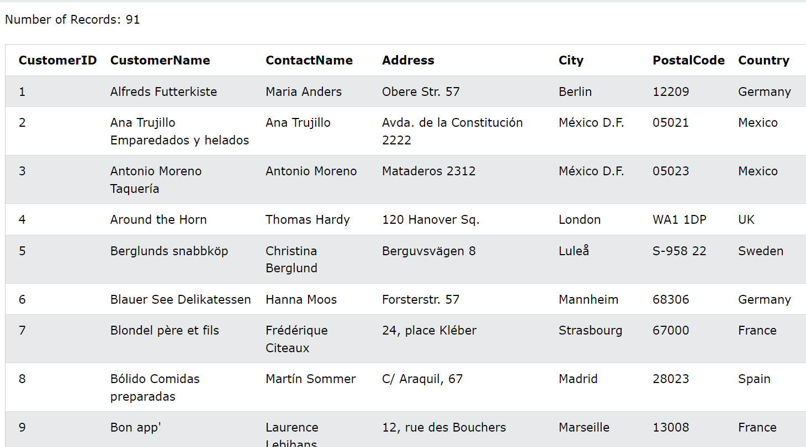

# ***Câu lệnh SQL***
Hầu hết các hành động bạn cần thực hiện trên cơ sở dữ liệu đều được thực hiện bằng câu lệnh SQL.

Câu lệnh SQL bao gồm các từ khóa dễ hiểu.

Câu lệnh SQL sau đây trả về tất cả các bản ghi từ bảng có tên "Khách hàng":
VD: Chọn tất cả các bản ghi từ bảng Khách hàng:
```
SELECT * FROM Customers;
```


# ***Bảng cơ sở dữ liệu***
Cơ sở dữ liệu thường chứa một hoặc nhiều bảng. Mỗi bảng được xác định bằng một tên (ví dụ: "Khách hàng" hoặc "Đơn hàng") và chứa các bản ghi (hàng) có dữ liệu.

Trong hướng dẫn này, chúng ta sẽ sử dụng cơ sở dữ liệu mẫu Northwind nổi tiếng (có trong MS Access và MS SQL Server).

Bảng trên chứa năm bản ghi (một bản ghi cho mỗi khách hàng) và bảy cột (ID khách hàng, Tên khách hàng, Tên liên hệ, Địa chỉ, Thành phố, Mã bưu điện và Quốc gia).

## ***Lưu ý***
Từ khóa SQL KHÔNG phân biệt chữ hoa chữ thường: `select` giống như `SELECT`
# ***Dấu chấm phẩy sau câu lệnh SQL***
Một số hệ thống cơ sở dữ liệu yêu cầu dấu chấm phẩy ở cuối mỗi câu lệnh SQL.

Dấu chấm phẩy là cách tiêu chuẩn để phân tách từng câu lệnh SQL trong các hệ thống cơ sở dữ liệu cho phép thực thi nhiều câu lệnh SQL trong cùng một lệnh gọi tới máy chủ.

# ***Một số lệnh SQL quan trọng nhất***
```
SELECT- trích xuất dữ liệu từ cơ sở dữ liệu
UPDATE- cập nhật dữ liệu vào cơ sở dữ liệu
DELETE- xóa dữ liệu khỏi cơ sở dữ liệu
INSERT INTO- chèn dữ liệu mới vào cơ sở dữ liệu
CREATE DATABASE- tạo cơ sở dữ liệu mới
ALTER DATABASE- sửa đổi cơ sở dữ liệu
CREATE TABLE- tạo một bảng mới
ALTER TABLE- sửa đổi một bảng
DROP TABLE- xóa một bảng
CREATE INDEX- tạo chỉ mục (khóa tìm kiếm)
DROP INDEX- xóa một chỉ mục
```