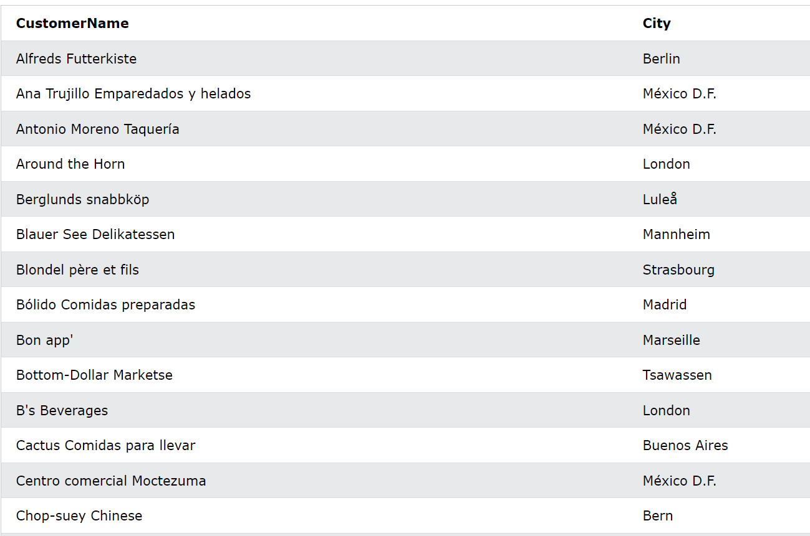
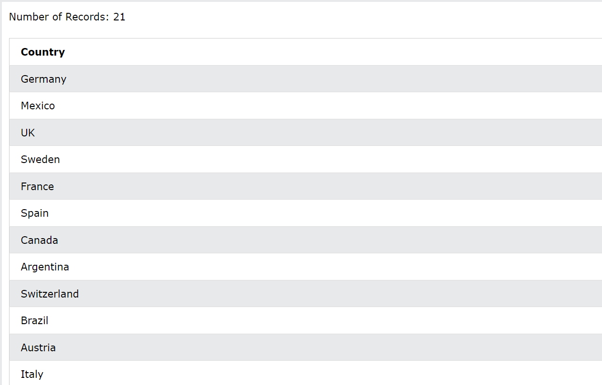
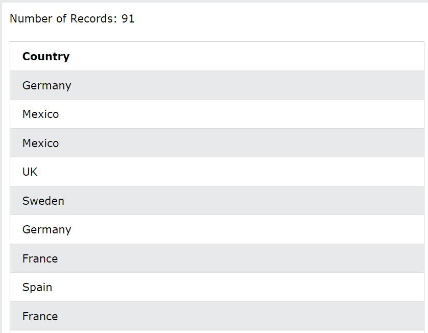
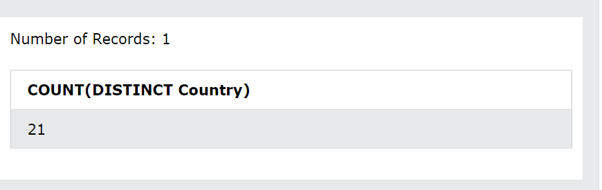

# ***Câu lệnh select SQL***
Câu `SELECT` lệnh được sử dụng để chọn dữ liệu từ cơ sở dữ liệu.
VD: Trả về dữ liệu từ bảng Khách hàng:

```
SELECT CustomerName, City FROM Customers;
```

## ***Cú pháp***
```
SELECT column1, column2, ...
FROM table_name;
```
Ở đây, cột1, cột2, ... là tên trường của bảng mà bạn muốn chọn dữ liệu.

table_name đại diện cho tên của bảng mà bạn muốn chọn dữ liệu.
### ***Chọn tất cả các cột***
Nếu bạn muốn trả về tất cả các cột mà không chỉ định từng tên cột, bạn có thể sử dụng `SELECT *`cú pháp:

VD: Trả về tất cả các cột từ bảng Khách hàng:
```
SELECT * FROM Customers;
```


## ***Câu lệnh SELECT DISTINCT trong SQL***
Câu `SELECT DISTINCT`lệnh chỉ được sử dụng để trả về các giá trị riêng biệt (khác nhau).
VD: Chọn tất cả các quốc gia khác nhau từ bảng "Khách hàng":
```
SELECT DISTINCT Country FROM Customers;
```

Bên trong một bảng, một cột thường chứa nhiều giá trị trùng lặp; và đôi khi bạn chỉ muốn liệt kê các giá trị (riêng biệt) khác nhau.
### ***Cú pháp***
```
SELECT DISTINCT column1, column2, ...
FROM table_name;
```
### ***CHỌN ví dụ không có DISTINCT***
Nếu bạn bỏ qua từ khóa `DISTINCT`  câu lệnh SQL sẽ trả về giá trị "Country" từ tất cả các bản ghi của bảng "Khách hàng":

VD
```
SELECT Country FROM Customers;
```

### ***Đếm riêng biệt***
Bằng cách sử dụng `DISTINCT`từ khóa trong hàm có tên `COUNT`, chúng ta có thể trả về số lượng quốc gia khác nhau.
VD
```
SELECT COUNT(DISTINCT Country) FROM Customers;
```
