# ***Mệnh đề WHERE trong SQL***
Mệnh đề này `WHERE`được sử dụng để lọc các bản ghi.

Nó được sử dụng để chỉ trích xuất những bản ghi đáp ứng một điều kiện cụ thể.
VD: Chọn tất cả khách hàng từ Mexico:
```
SELECT * FROM Customers
WHERE Country='Mexico';
```
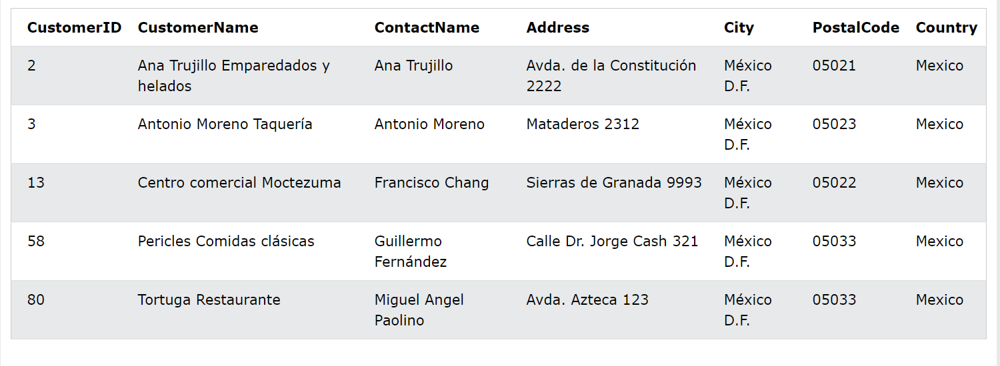
# ***Cú pháp***
```
SELECT column1, column2, ...
FROM table_name
WHERE condition;
```
## ***Trường văn bản so với trường số***
SQL yêu cầu dấu ngoặc đơn xung quanh các giá trị văn bản (hầu hết các hệ thống cơ sở dữ liệu cũng sẽ cho phép dấu ngoặc kép).

Tuy nhiên, các trường số không được đặt trong dấu ngoặc kép
VD:
```
SELECT * FROM Customers
WHERE CustomerID=1;
```
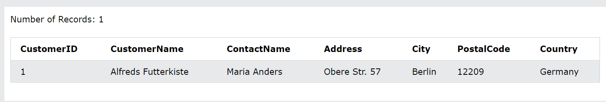
## ***Các toán tử trong mệnh đề where***
Bạn có thể sử dụng các toán tử khác ngoài ``=`` toán tử để lọc tìm kiếm.
VD: Chọn tất cả khách hàng có CustomerID lớn hơn 80:

```
SELECT * FROM Customers
WHERE CustomerID > 80;
```
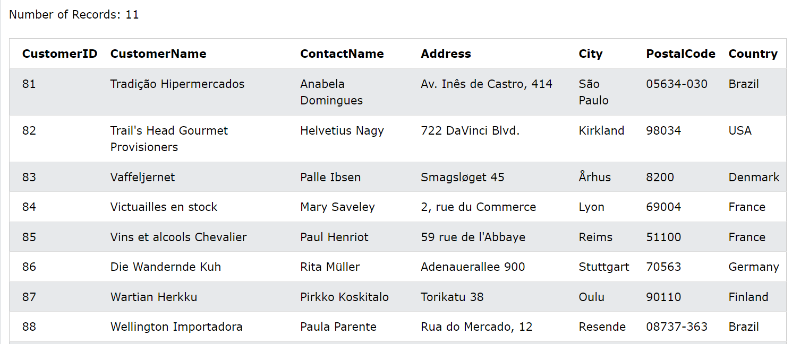
### ***Các toán tử sử dụng trong mệnh đề where***
1. Toán tử bằng

VD
```
SELECT * FROM Products
WHERE Price = 18;
```
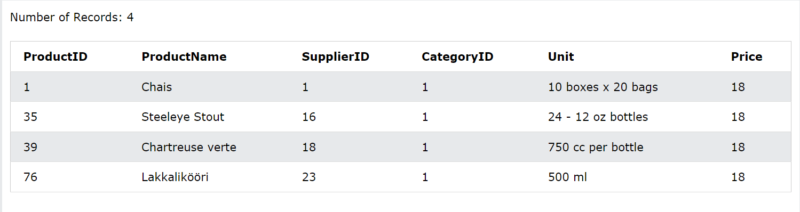
2. Toán tử lớn hơn

VD
```
SELECT * FROM Products
WHERE Price > 30;
```
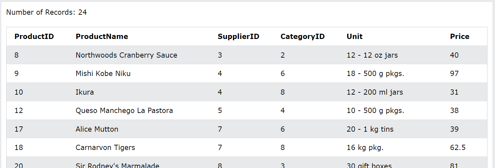
3. toán tử nhỏ hơn
VD
```
SELECT * FROM Products
WHERE Price < 30;
```
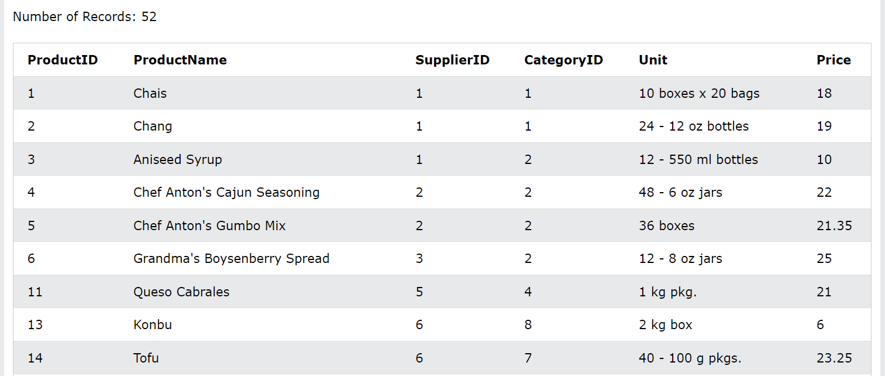
4. Toán tử lớn hơn hoặc bằng
VD
```
SELECT * FROM Products
WHERE Price >= 30;
```
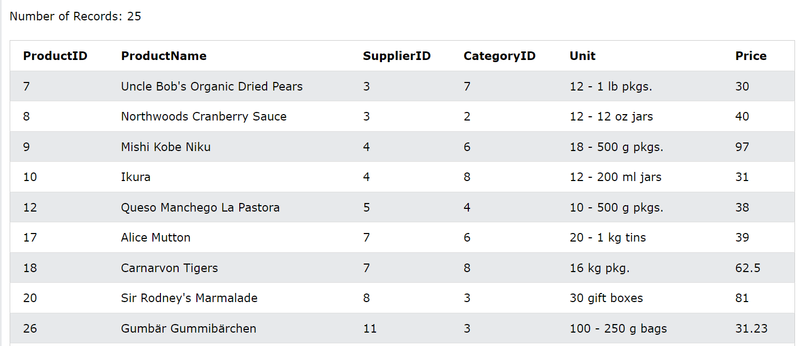
5. Toán tử nhỏ hơn hoặc bằng
VD
```
SELECT * FROM Products
WHERE Price <= 30;
```
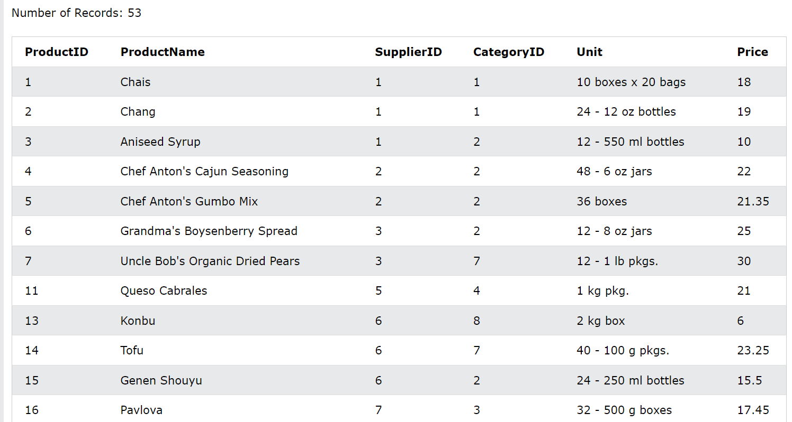
6. Toán tử khác
VD
```
SELECT * FROM Products
WHERE Price <> 18;
```
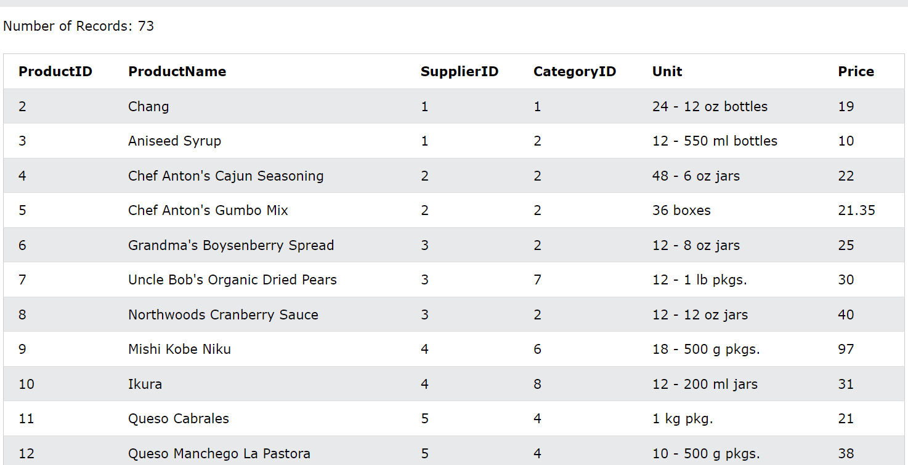
7. Toán tử between(Giữa một phạm vi nhất định)

VD
```
SELECT * FROM Products
WHERE Price BETWEEN 50 AND 60;
```

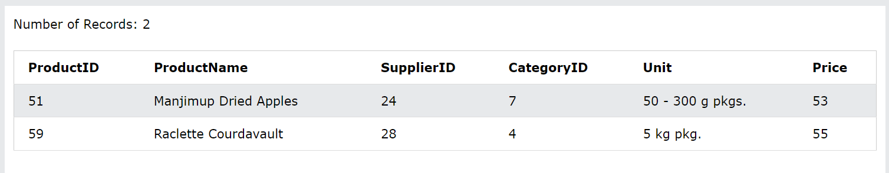
8. Toán tử like(Tìm kiếm một mẫu)
VD
```
SELECT * FROM Customers
WHERE City LIKE 's%';
```
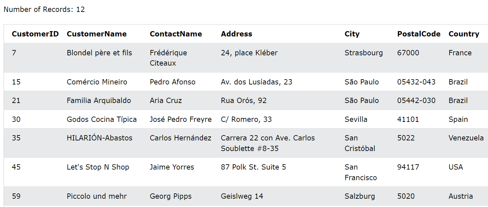
9.  Toán tử in(Để chỉ định nhiều giá trị có thể có cho một cột)
VD
```
SELECT * FROM Customers
WHERE City IN ('Paris','London');
```
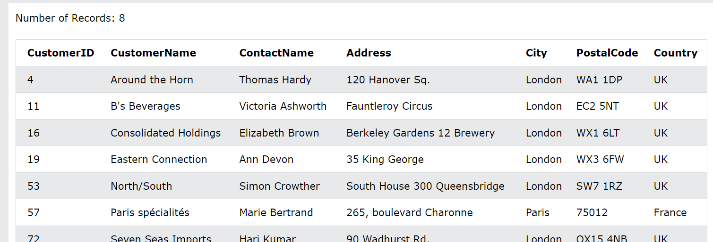

