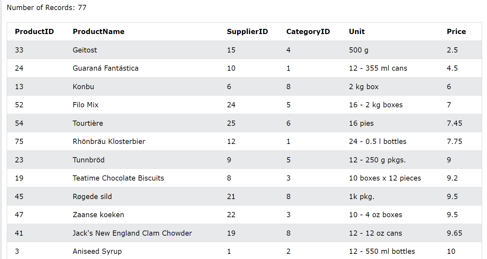
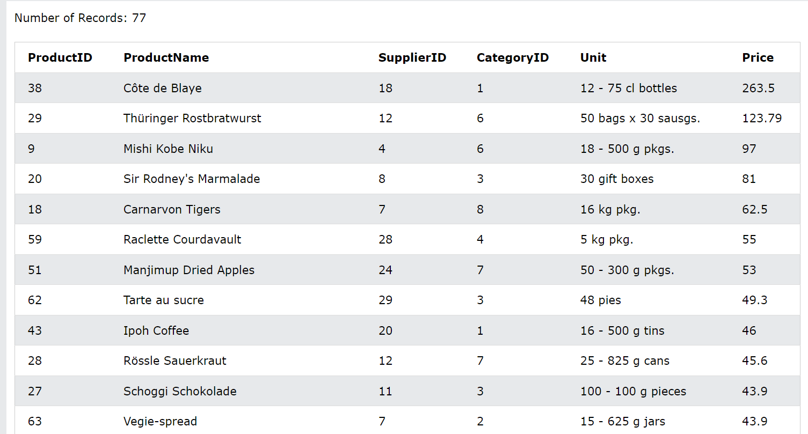
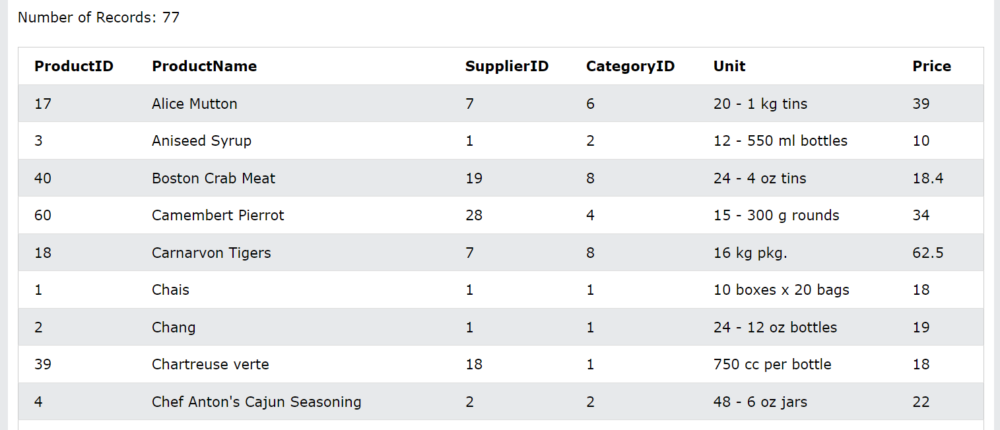
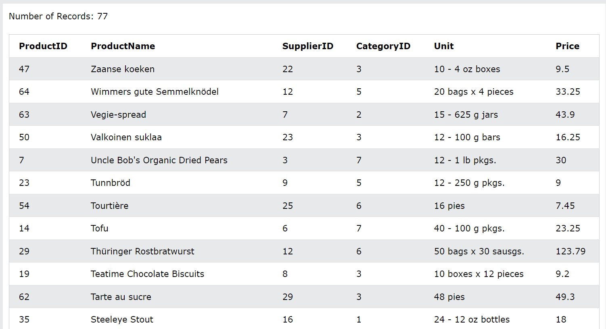
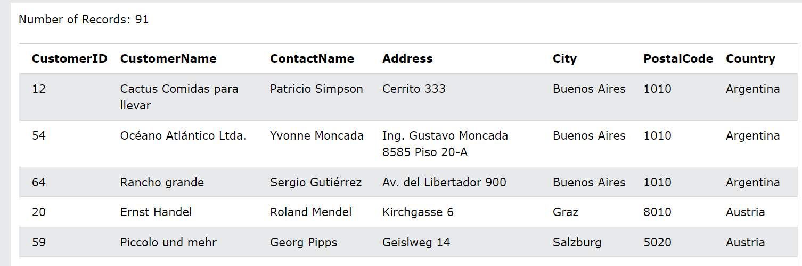
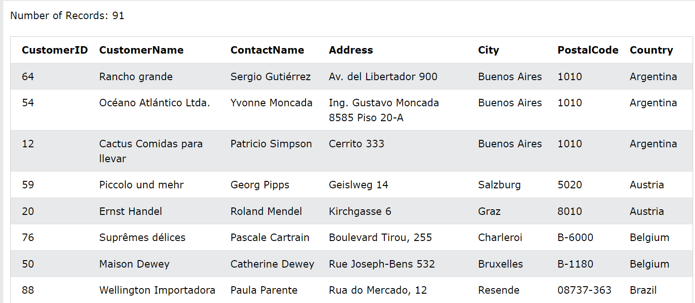

# ***Câu lệnh ORDER BY***
Từ khóa `ORDER BY` được sử dụng để sắp xếp tập kết quả theo thứ tự tăng dần hoặc giảm dần.
VD: Sắp xếp sản phẩm theo giá:

```
SELECT * FROM Products
ORDER BY Price;
```


## ***Cú pháp***
```
SELECT column1, column2, ...
FROM table_name
ORDER BY column1, column2, ... ASC|DESC;
```
### ***Từ khóa `DESC`***
Từ khóa `ORDER BY` sắp xếp các bản ghi theo thứ tự tăng dần theo mặc định. Để sắp xếp các bản ghi theo thứ tự giảm dần, hãy sử dụng từ khóa `DESC`.
VD: Sắp xếp sản phẩm theo thứ tự giá cao nhất đến thấp nhất:
```
SELECT * FROM Products
ORDER BY Price DESC;
```


## ***Sắp xếp theo thứ tự bảng chữ cái***
Đối với các giá trị chuỗi, từ khóa ORDER BY sẽ sắp xếp theo thứ tự bảng chữ cái:

VD: Sắp xếp sản phẩm theo thứ tự bảng chữ cái theo Tên sản phẩm
```
SELECT * FROM Products
ORDER BY ProductName;
```

### ***Sắp xếp bảng chữ cái dùng từ khóa DESC***
Để sắp xếp bảng ngược theo thứ tự bảng chữ cái, hãy sử dụng từ khóa DESC:
VD: Sắp xếp sản phẩm theo ProductName theo thứ tự ngược lại

```
SELECT * FROM Products
ORDER BY ProductName DESC;
```


## ***ORDER BY với một số cột***
Câu lệnh SQL sau đây chọn tất cả khách hàng từ bảng "Khách hàng", được sắp xếp theo cột "Quốc gia" và cột "Tên khách hàng". Điều này có nghĩa là nó đặt hàng theo Quốc gia, nhưng nếu một số hàng có cùng Quốc gia, nó sẽ sắp xếp chúng theo Tên khách hàng:

VD: 
```
SELECT * FROM Customers
ORDER BY Country, CustomerName;
```

## ***Sử dụng cả ASC và DESC***
Câu lệnh SQL sau đây chọn tất cả khách hàng từ bảng "Khách hàng", được sắp xếp tăng dần theo "Quốc gia" và giảm dần theo cột "Tên khách hàng":
VD:
```
SELECT * FROM Customers
ORDER BY Country ASC, CustomerName DESC;
```
