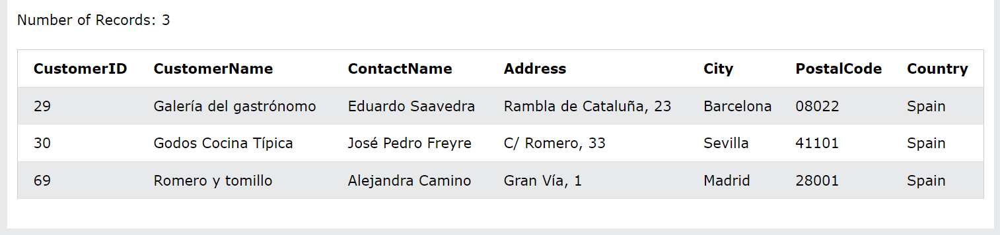

# ***Toán tử AND***
Mệnh `WHERE`đề có thể chứa một hoặc nhiều ANDtoán tử.

Toán tử `AND` được sử dụng để lọc các bản ghi dựa trên nhiều điều kiện, chẳng hạn như nếu bạn muốn trả lại tất cả khách hàng từ Tây Ban Nha bắt đầu bằng chữ 'G':
VD: Chọn tất cả khách hàng từ Tây Ban Nha bắt đầu bằng chữ 'G':
```
SELECT *
FROM Customers
WHERE Country = 'Spain' AND CustomerName LIKE 'G%';
```

## ***Cú pháp***
```
SELECT column1, column2, ...
FROM table_name
WHERE condition1 AND condition2 AND condition3 ...;
```
## ***Toán tử AND với OR***
Toán tử `AND` hiển thị một bản ghi nếu tất cả các điều kiện là TRUE.

Toán tử `OR` hiển thị một bản ghi nếu bất kỳ điều kiện nào là TRUE.
### ***Tất cả điều kiện phải đúng***
Câu lệnh SQL sau đây chọn tất cả các trường từ Customers" CountryĐức" VÀ Citylà "Berlin" VÀ PostalCodecao hơn 12000:
VD
```
SELECT * FROM Customers
WHERE Country = 'Germany'
AND City = 'Berlin'
AND PostalCode > 12000;
```

### ***Kết hợp AND với OR***
Bạn có thể kết hợp các toán tử ANDvà OR.

Câu lệnh SQL sau đây chọn tất cả khách hàng từ Tây Ban Nha bắt đầu bằng "G" hoặc "R".

Hãy chắc chắn rằng bạn sử dụng dấu ngoặc đơn để có được kết quả chính xác.
VD: 
```
SELECT * FROM Customers
WHERE Country = 'Spain' AND (CustomerName LIKE 'G%' OR CustomerName LIKE 'R%');
```
